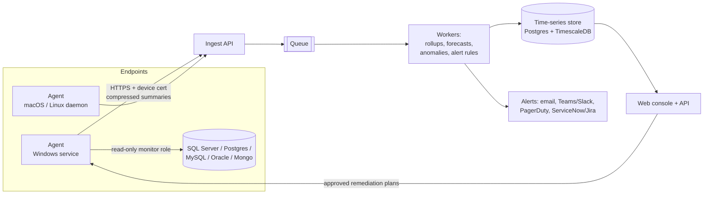

# Neural Storage Matrix: Current Build and Product Roadmap

## Status update

Phases 1-3 below are complete, including NTFS MFT fast scan (Turbo Scan),
except a handful of items explicitly scoped out along the way —
ransomware-style extension tracking, duplicate-count history, an in-app
auto-undo. Phase 4 is partially done: everything buildable without a
purchased certificate is in place; actual code-signing is still blocked on
you obtaining one.

Turbo Scan (item 1 below) went from "not started" to fully built, unit- and
integration-tested, and validated across several real-hardware sessions —
correctness bugs (fragmented `$MFT`, hard-link dedup scope, `alloc_size`
rounding, non-resident `$ATTRIBUTE_LIST`, a chunk-cache perf bug, cloud-
placeholder false positives, a reparse-point-as-root gap), a persistent
cache with NTFS USN Journal incremental refresh, and a progress-reporting
bug caught by a real user report after initial release. It ships off by
default behind a "Turbo Scan (Experimental)" toggle — see the item's own
section below for current status and what's still open.

The app also gained a Linux port during this work (scan, Trash-based
delete, and its own elevated-scan flow — same three-platform pattern as
Windows/macOS), and a "Data Tools" menu (Compress CSV to Parquet, Convert
CSV to Excel), shipped only in a separate Windows "Data build" — see the
CSV-to-Parquet section near the end of this doc.

Gaps flagged in earlier passes here are now closed:
- **Naming consistency.** The in-app window title now reads "Storage
  Scanner" (matching the repo, README, and executable name) instead of
  the old "Neural Storage Matrix" — the P1 naming-consistency item below
  is fully resolved.
- **CI gates on tests.** `build.yml`'s `test` job (on `windows-latest`,
  since several tests exercise Windows-only code paths) now runs `ruff`,
  `black --check`, `mypy`, and `pytest` with a coverage floor, and the
  `build`/release jobs depend on it via `needs: test` — a lint, format,
  type or coverage regression now blocks the release. See item 10 below.
- **Dependency and secret scanning.** `.github/workflows/security.yml`
  adds CodeQL, `pip-audit`, and gitleaks (full history) on every push/PR
  and weekly; `.github/dependabot.yml` keeps the toolchain and the pinned
  Action SHAs current. See item 9 below.
- **16 correctness bugs across delete safety, Turbo Scan data integrity,
  and forecast/anomaly UI labels**, found via a full-codebase review and
  fixed with regression tests (2026-09-19) — see the git history around
  that date for the full list; several were silent data-loss/corruption
  risks (e.g. the Windows protected-path guard never actually matching,
  and a hardcoded sector size silently corrupting Turbo Scan on native
  4Kn drives).

See the phase checklists further down for what's done vs. not, item by item.

## Executive assessment

The project is already beyond a basic disk-usage viewer. It combines concurrent scanning, sortable storage analysis, duplicate detection, safe deletion, historical snapshots, growth comparison, capacity forecasting, a custom Tkinter interface, standalone Windows packaging, and automated GitHub releases.

The uncomfortable truth is that feature count alone will not beat mature tools. The winning direction is **faster scans, safer cleanup decisions, clearer visual exploration, and IT-grade automation**. The product should help users decide what is safe and valuable to remove, not merely show large files.

## What has been built

### Core storage engine

- Recursive scanning of drives, folders, and individual files.
- A shared work queue with multiple background worker threads for directory enumeration.
- Cancellation support through thread events.
- Iterative post-order rollup of directory sizes and file counts, avoiding recursion-depth failures on deep folder trees.
- Error tracking for unreadable or protected paths.
- Automatic drive discovery for available Windows drive letters.
- Human-readable file size formatting from bytes through terabytes.

### Main interface

- Dark cyber-terminal visual theme.
- Animated header with scan-line grid, neon text treatment, and radar animation.
- Drive and folder selection.
- Scan and cancel controls.
- Sortable columns for name, size, parent percentage, and file count.
- Lazy population of child rows so large result trees are not rendered all at once.
- Percentage bars and heat coloring to make large consumers stand out.
- Alternating row colors and distinct directory, file, warning, and placeholder treatments.
- Status messages and indeterminate/determinate progress modes.
- Keyboard shortcuts including F5 to rescan and Delete to recycle a selected item.

### File operations

- Open directories and reveal files in Windows Explorer.
- Copy a selected path to the clipboard.
- Send selected items to the Recycle Bin rather than permanently deleting them.
- Update in-memory size totals after deletion.
- Confirmation and error dialogs around destructive actions.

### Analysis tools

- Largest-files view with configurable top 25, 50, or 100 results.
- File-type aggregation by extension with total size, percentage, and file count.
- Duplicate detection using a staged pipeline:
  1. Group candidates by exact file size.
  2. Hash the first and last 1 MB with BLAKE2b.
  3. For survivors larger than 2 MB, hash the middle 1 MB (centered on the file's midpoint). A file over 3 MB is never read in full.
  4. Group matches on (size, first+last digest, middle digest) and rank groups by potential recoverable space.
- Tradeoff: files up to 3 MB are fully covered by the three windows, so those matches are byte-exact. Above 3 MB a match is sampled: files identical in size and in those three windows are grouped even if they differ elsewhere. The Duplicate Files window counts such groups and explains each such row; Cleanup Recommendations rates them medium rather than low risk. Window offsets come from the size the scan recorded, so a file whose size has changed since is left out rather than compared on the wrong windows.
- Parallel head/tail and middle hashing.
- Default exclusions for sensitive or low-value Windows/system paths.
- Duplicate-scan statistics for checked, skipped, head/tail-hashed, and middle-hashed files.
- Multi-selection deletion from duplicate results.

### Historical intelligence

- SQLite-backed scan history.
- Scan records containing path, total size, drive capacity, file count, folder count, and timestamp.
- Folder snapshots with indexes for scan and path lookup.
- Comparison with the previous scan of the same normalized path.
- Folder growth in bytes and percentage.
- Growing, shrinking, unchanged, and newly observed folder classification.
- Summary metrics for current and previous sizes and file counts.
- Largest growth and shrink identification.
- Estimated days until full based on historical growth.
- Optional history chart generation through Matplotlib.
- Background persistence so the interface remains responsive while history is saved.

### Packaging and delivery

- Custom PNG-to-ICO generation with multiple embedded Windows icon sizes.
- PyInstaller one-file, windowed executable packaging.
- Bundled application icon for executable and Tkinter windows.
- GitHub Actions workflow that builds on pushes and manual runs.
- Build artifact upload for testing.
- Version-tag-triggered GitHub Release creation and EXE attachment.
- Semantic-style version tags such as `v1.1.0`.

## Important defects and technical debt to fix first

All four P0 items below are resolved (see Phase 1 checklist further down)
— kept here for historical context on what the original problems were.

### P0: Correct duplicate root insertion — ✅ done

`_finish_scan()` currently inserts and populates the root node twice. Remove the repeated block. This can create duplicate rows, unnecessary UI work, and confusing state.

### P0: Fix persistent database location — ✅ done

`history.py` places `storage_history.db` beside `__file__`. In a PyInstaller one-file build, application resources are extracted to a temporary directory. Store writable user data under `%LOCALAPPDATA%\\NeuralStorageMatrix\\` instead. Add a schema version and migrations.

### P0: Fix `print_growth_report()` — ✅ done

`percent_text` is calculated before `growth_percent` exists and is then reused for every row. Calculate it inside the loop and handle `None` for new folders.

### P0: Stop swallowing icon and runtime errors silently — ✅ done

Several broad `except Exception: pass` blocks hide packaging and UI failures. Log diagnostic details to a rotating file in `%LOCALAPPDATA%` while keeping user-facing messages concise.

### P1: Resolve naming consistency — ✅ done (as "Storage Scanner", not "Neural Storage Matrix")

Use one canonical entry point and product name everywhere. Recommended:

- Source entry point: `storage_scanner.py`
- Executable: `NeuralStorageMatrix.exe` or `StorageScanner.exe`
- Display name: `Neural Storage Matrix`

Update module docstrings, build scripts, workflow commands, README instructions, icon metadata, and release names together.

The project settled on **"Storage Scanner"** as the canonical name instead —
repo, README, executable (`StorageScanner.exe`), and now the in-app window
title all agree. "Neural Storage Matrix" survives only as this document's
own title/filename, a relic of the earlier "cyber terminal" theme this app
no longer has.

### P1: Split the monolith

The main source file is carrying scanning, hashing, Windows shell operations, state, persistence orchestration, and multiple UI windows. Refactor toward:

```text
storage_scanner/
  app.py
  models.py
  scanner.py
  duplicates.py
  history.py
  file_ops.py
  settings.py
  ui/
    main_window.py
    duplicate_window.py
    history_window.py
    visualizations.py
```

This will make testing and performance work much easier.

### P1: Improve scan correctness — ✅ mostly done

- ✅ Symbolic links, junctions, and mount points — recorded as leaves, never traversed.
- ✅ Sparse files and compressed files — allocated size tracked separately from logical size.
- ✅ Logical size versus allocated size.
- ✅ Hard links — deduplicated so a file linked into multiple folders counts once.
- ✅ Inaccessible folders — flagged (`Node.error`), and as of 2026-09-19 the
  flag propagates to every ancestor too, so a permission-denied subfolder
  no longer leaves a parent's total silently understated with no indicator.
- ⏭️ Long paths (beyond `MAX_PATH`) — not explicitly handled; not yet
  reported as an issue.
- ⏭️ Files changing or disappearing mid-scan — a vanishing file is caught
  (`OSError` → `Node.error`), but there's no detection of a file that's
  merely *modified* between being enumerated and being acted on later. A
  narrower version of this — a file changing between being reviewed in a
  Cleanup/Duplicates list and actually being deleted — was closed on
  2026-09-19 (`audit.recycle_and_log` now refuses to delete a file whose
  size no longer matches what was scanned).

## Market-leading product roadmap

### 1. Add an NTFS Master File Table fast path — ✅ done, ships as "Turbo Scan (Experimental)"

Built as originally scoped: two engines — **Turbo Scan** (raw MFT parsing,
NTFS-only, `storage_scanner/mft_*.py`/`turbo_scan.py`) with automatic
fallback to **Compatible Scan** (the existing directory-walking engine) for
network shares, removable media, non-NTFS filesystems, or any Turbo Scan
failure. A persistent on-disk cache plus NTFS USN Journal incremental
refresh (`turbo_cache.py`/`usn_journal.py`) means a repeat scan of an
unchanged volume reaches parity with Compatible's own speed instead of
re-reading the whole MFT every time.

**✅ Done: scan details strip.** After every scan, a strip above the status
bar shows the engine that ran (including "Turbo Scan fell back"), elapsed
time, throughput in files/s, the unreadable-path count with a **View**
button, and a Complete/Incomplete result (`turbo_scan.scan_indicators`).
It stays until the next scan starts. The status bar alone couldn't do this:
the history save overwrites it about a second after the scan finishes. A
Turbo Scan never returns a partial tree, so unreadable paths are the only
thing that marks a finished scan incomplete. macOS/Linux elevated-helper
scans return no timing, so they show "—" for elapsed and throughput.

**✅ Done (2026-09-24): how a Turbo Scan read the MFT.** The strip now adds
an **MFT read** field after a Turbo Scan: "Incremental (USN journal)" when
the cache was refreshed from the journal, or "Full (…)" with why, such as
first scan of this drive, USN journal wrapped since last scan, USN journal
was recreated, cache was corrupt, or cache unavailable. That makes a slow
repeat scan explainable at a glance. `turbo_read.scan_subtree_using_cache`
returns `(node, MftRead)`, `ScanReport.mft_read` carries it, and the elevated
helper's `--output` JSON is now `{"node": …, "mft_read": …}`, so it crosses
the process boundary too. The helper is always the same build as the GUI
that launches it, so there's no older format to support. The reasons are
fixed short phrases, and the underlying exception text still goes to the
log. The strip is now two rows, how the scan ran and then what it found:
one row already needed 989 px against the 960 px default window whenever
the View button showed, which clipped the Result field. The widest case
now measures 774 px. Verified by unit tests for every full-read reason, the
helper envelope from both sides, the real cache/USN orchestration on a
faked NTFS volume (first scan full, second incremental), and headless
measurement of the real strip widgets. Not verified: a Turbo Scan on real
hardware showing the field, which needs admin rights and a UAC prompt.

Off by default behind a "Turbo Scan (Experimental)" toggle (Tools ▸
Settings) pending more real-world mileage before it's recommended broadly —
see the "Status update" section above for what's been validated so far. The
small-folder rescan performance follow-up that used to be open here is done;
see "Scale benchmarks and folder rescans from the cache" at the end.

### 2. Build a synchronized treemap and sunburst explorer

Add an interactive treemap where rectangle area represents allocated size and color represents file type, age, growth, or cleanup confidence. Synchronize selection among the treemap, folder tree, and details panel. Add breadcrumb navigation, zoom, hover details, keyboard navigation, and image export.

A second sunburst or radial hierarchy view would differentiate the product visually, but the treemap should come first because it is immediately understandable.

### 3. Create a review-first cleanup system

Do not market automatic deletion as intelligence. Build explainable recommendations with categories such as:

- Safe candidate: old installer already represented by a newer version.
- Review candidate: large, old media file with no recent access.
- Duplicate candidate: content match (byte-exact up to 3 MB, sampled above) with a clearly identified keeper.
- Protected: operating-system, application, cloud-placeholder, or policy-sensitive content.

Every recommendation should show **why it was flagged**, estimated recoverable space, risk level, dependencies, and proposed action. Default to review queues, Recycle Bin, quarantine, or archive. Never silently delete user content.

**✅ Done: persist recommendations across restarts.** Cleanup Recommendations now shows full cold-start recall: `storage_scanner/cleanup_cache.py` persists the last *computed* set of Protected/Review/Duplicate recommendations to SQLite (`cleanup_cache.db`, same `%LOCALAPPDATA%` convention as `history.py`/`turbo_cache.py`), keyed by scan path, each save fully replacing the previous one. Opening the app fresh and going straight to Tools ▸ Clean Up ▸ Cleanup Recommendations — with zero scans this session — shows the most recently cached run immediately, labeled with when it was computed and for which path, plus a **Rescan** button to refresh it for real. Deleting or archiving a row updates the persisted cache too, so a stale row for an already-removed file doesn't linger into the next cold start. Simpler than originally scoped here: rather than persisting the full per-file metadata needed to recompute recommendations from scratch, it persists the already-computed recommendation rows themselves — smaller, and a more direct match for "show me what I found last time," with Rescan covering the "get a truly fresh answer" case.

**✅ Done: Orphaned install category (Windows).** A fourth recommendation category flags folders that exactly match an `InstallLocation` this app previously saw registered in the uninstall registry (HKLM native + WOW6432Node, HKCU; `storage_scanner/installed_apps.py`) whose owning app is no longer installed. `history.py`'s `known_install_locations` table keeps the snapshot across runs, since a single registry read can only say what's installed *now*. Exact path match only — no fuzzy/name heuristics — so the first run on a machine only learns (the window says so) and finds nothing until a later run sees an app disappear. Anything nested under an orphan folder is dropped from the list so the same bytes aren't counted twice. Risk is Medium: an uninstalled app's folder can still hold user data.

**✅ Done: Cleanup Cart.** A cross-window queue (`storage_scanner/cart.py`, `ui/cart_window.py`): add items from the main tree, Duplicate Files, or Cleanup Recommendations, review them in one place (toolbar shows count + reclaimable size), and send them to the Recycle Bin in one batch. Items nested under another cart item collapse into it. Each item still goes through `audit.recycle_and_log`, and anything refused (e.g. the file changed size since the scan, via `audit.check_stale`) is listed with its reason. Session-only by design: cleared on every rescan, since cart entries point at nodes in the replaced tree.

### 4. Make duplicate cleanup genuinely safer

Improve duplicate handling with:

- Automatic keeper recommendations based on path, modification time, naming conventions, and protected folders.
- A rule that prevents deletion of every copy in a group.
- Preview support for images and documents where practical.
- Side-by-side metadata comparison.
- Hard-link replacement as an advanced, opt-in space-saving action.
- Ignore rules and saved decisions.
- An undo ledger recording every move, recycle, archive, or hard-link action.

### 5. Turn history into anomaly detection

The existing SQLite foundation can become a major differentiator:

- Multi-point charts instead of only previous-versus-current comparison.
- Folder-level growth velocity and acceleration.
- Confidence bands for capacity forecasts.
- Anomaly alerts for sudden spikes, mass deletions, ransomware-like extension growth, or unexpected duplicate explosions.
- Calendar heatmaps and change timelines.
- Snapshot labels before and after upgrades, migrations, and cleanups.
- Compare any two snapshots, not only the latest two.

Forecasting should require adequate data and display uncertainty. A single straight-line estimate should never be presented as certainty.

### 6. Add enterprise and technician mode

A clear IT-focused edition could support:

- UNC and network-share scanning with credential-safe access.
- Remote inventory through an optional signed agent.
- Scheduled headless scans.
- CLI and PowerShell-friendly JSON output.
- CSV, JSON, HTML, and PDF reports.
- Exit codes for automation.
- Centralized policy files for exclusions and retention rules.
- Machine comparison dashboards.
- Audit logs, role separation, and exportable remediation evidence.

This direction aligns especially well with real help-desk and endpoint-management workflows.
Scheduled headless scans, JSON output and exit codes are already built. The full plan to take
the rest to thousands of machines, and to add database storage monitoring, is **Phase 5:
Enterprise scale** under "Recommended delivery sequence" below.

### 7. Improve the everyday experience

Add saved scan profiles, recent locations, global result search, advanced filters, bookmarks, pinned folders, column presets, and session restoration. Support filtering by size, age, extension, owner, path, attributes, and modified/accessed date. Let users save and combine filters.

Add a first-run explanation of safe deletion, permission limitations, cloud placeholders, and Windows-protected locations. The interface should communicate what is happening instead of merely displaying activity.

**✅ Done: first-run guide.** `storage_scanner/onboarding.py` (the text and the show-once decision, no Tk) and `ui/onboarding_window.py` (the dialog). It opens by itself shortly after the first launch and can be reopened from Tools ▸ Help ▸ Getting Started…. Closing it by any route records `onboarding_seen` in `history.py`'s `app_metadata` table. If that table can't be read, the guide shows again rather than staying hidden. It has four sections, worded for the running OS (and for whether the app is already elevated), each describing what the code actually does: safe deletion (Recycle Bin/Trash, Audit Log, the protected duplicate keeper), permission limits (⚠ folders, Run as Admin), cloud placeholders (recognized only on Windows, where Find Duplicate Files skips them), and protected locations (skipped by Find Duplicate Files and listed as Protected in Cleanup Recommendations, but not checked by Delete in the main tree or in Search & Filter).

### 8. Add cloud-awareness without causing hydration

OneDrive and similar placeholders must be distinguished from fully local files. Show logical size, local allocated size, online-only state, and sync state when Windows exposes those attributes. Avoid accidentally downloading online-only content during hashing or preview. Offer safe actions such as “Free up local space” separately from deletion.

### 9a. Ship packaged builds for macOS and Linux, not just Windows — ✅ done

**Done (verified 2026-09-23):** `build.yml` now has `build-macos` (a
`StorageScanner.dmg` from a `--windowed --onedir` `.app`) and `build-linux`
(`StorageScanner-linux-x86_64.tar.gz`) jobs alongside Windows, each with its
own SBOM and SHA-256 checksums. The v1.5.0 release carries all three, and
the README's download badges link each platform's own file, so a Mac user no
longer gets a Windows `.exe`. The in-app update notice links the Releases
page, not a specific file, so it can't hand anyone the wrong platform's
build either. Everything below is the original problem statement, kept for
reference.

**Not yet built (original note).** The app itself already runs cross-platform — `platform_support.py`'s
`IS_MACOS`/`IS_LINUX` branches cover trash/recycle, elevated scanning, and
drive listing on both — but `build.yml` only ever runs on `windows-latest`,
so the only downloadable artifact anywhere is `StorageScanner.exe`. A macOS
or Linux user who clicks the README's download button gets a Windows PE
binary their OS categorically cannot run: macOS's Gatekeeper refuses it
outright with an explicit "Microsoft Windows applications are not
supported on macOS" dialog; Linux has no equivalent friendly message at
all — depending on the desktop environment, double-clicking it typically
does nothing (no application associated with a foreign PE binary), or
running it from a terminal surfaces a bare kernel `Exec format error`.
Today's README callout (see the "On macOS?" note near the top) papers
over this by warning people before they click, but a warning isn't the
same as a working download.

To actually fix it:

- Add a `macos-latest` job to `build.yml` that runs PyInstaller
  (`--windowed --onedir`, since macOS `.app` bundles don't like
  `--onefile`) to produce `StorageScanner.app`, then wraps it in a `.dmg`
  (`hdiutil create` — stdlib-adjacent, no extra dependency) for release.
  Unsigned/unnotarized, it'll hit Gatekeeper's "unidentified developer"
  prompt (right-click → Open bypasses it) — the same class of trust
  friction Windows SmartScreen already causes today, not a new problem,
  and notarization has the same certificate/Apple Developer Program cost
  blocker as Windows code-signing (see item 9 below).
- Add a `ubuntu-latest` job producing a plain PyInstaller `--onefile`
  binary (or an AppImage for a nicer double-click experience across
  distros without a system Python/Tkinter already present).
- Update the README's download section to link all three artifacts, and
  update the "On macOS?" callout once a real macOS build exists — it
  should point people at a `.dmg`, not just at running from source.
- Extend `make_sbom.py`/checksum generation to cover both new artifacts,
  matching what Windows already gets.

### 9. Treat trust as a product feature

- ❌ Code-sign Windows releases — still blocked on a purchased certificate.
- ✅ Publish checksums for every release.
- ✅ Generate an SBOM.
- ✅ Pin GitHub Action versions to immutable commit SHAs.
- ✅ Run dependency and secret scanning — `.github/workflows/security.yml`
  (2026-09-23): CodeQL `security-extended` on the Python source, `pip-audit
  --strict` against `requirements-dev.txt` (the entire dependency surface,
  and PyInstaller bundles whatever is installed at build time), and
  gitleaks over the full commit history — on every push/PR to `main` plus a
  weekly cron, so a newly published CVE against an unchanged dependency is
  still caught. `.github/dependabot.yml` raises weekly updates for the
  pip toolchain and the pinned Action SHAs. It is a separate workflow from
  `build.yml` on purpose: a CodeQL queue backlog must never hold up
  shipping a binary. Verified locally: `pip-audit --strict -r
  requirements-dev.txt` → "No known vulnerabilities found"; `gitleaks git`
  → "34 commits scanned … no leaks found". CodeQL ran green on GitHub on
  the next push (`80220b7`), along with the rest of the security workflow.
- ✅ Add reproducible build notes — `BUILD_PROVENANCE.md`, including an
  explicit "this is *not* a reproducible build" section.
- ✅ Publish a privacy statement stating that scanning is local unless the user opts into remote features.
- ❌ Add crash-report opt-in rather than silent telemetry — not started;
  `logging_setup.py` writes local rotating logs and nothing leaves the machine.

Unsigned executables face reputation warnings. Packaging alone will not solve this. Signing, transparent builds, and a stable release process are the long-term answer.

### 10. Add automated quality gates

Build tests for:

- Rollup accuracy.
- Permission failures.
- Cancellation behavior.
- Symlink, junction, sparse-file, hard-link, and long-path handling.
- Duplicate detection correctness and false-positive prevention.
- Database migration and corruption recovery.
- Deletion safeguards.
- Packaging smoke tests on a clean Windows runner.

Add Ruff, Black, mypy, pytest, coverage thresholds, and a GitHub Actions test job that must pass before release. Create generated test trees so correctness and performance can be benchmarked across versions.

**Done (2026-09-23).** `pyproject.toml` now configures all four tools, and
`build.yml`'s `test` job runs them in cheapest-first order — `ruff check .`,
`black --check .`, `mypy storage_scanner/`, then `pytest tests/` — with
`build`/`build-macos`/`build-linux` gated on it via `needs: test`.

- **Ruff** replaces pyflakes: `E,W,F,I,UP,B,C4,SIM,RET` at line length 100,
  `target-version = "py39"` (the oldest interpreter this runs on locally).
  `PTH` is deliberately off — the scan hot loop uses `os.scandir`/`os.path`
  on purpose, and a `Path` object per directory entry is exactly the
  allocation a disk scanner cannot afford. Tests are exempt from `E402`
  because each one bootstraps `sys.path` before importing the package.
- **Black** at the same line length; the adoption reformatted 78 files. The
  full suite was run before and after: 396 passed / 36 failed on macOS both
  times (the 36 are the Windows-only NTFS, schedule and drive-letter suites,
  which cannot pass off Windows — CI runs them on `windows-latest`).
- **mypy** (not `--strict`, on an unannotated Tkinter codebase) is clean
  across all 45 modules after five real fixes: a `dict[str, Optional[int]]`
  cluster-size cache that genuinely caches `None`, `ScanReport.fallback_reason`
  typed `Optional[str]` instead of `str = None`, and loose `tuple`
  annotations for the per-platform font specs and duplicate-exclude lists,
  whose branches have different shapes.
- **Coverage** is enforced by `--cov-fail-under` in `pyproject.toml`. The
  floor started at 45% (a macOS run measured 49% with the 36 Windows-only
  tests failing), then went up to 49% (2026-09-24) after a full Windows run
  — 430 passed, 2 platform skips — measured 49.7%. The UI modules
  (`ui/main_window.py`, `ui/history_window.py` and the other Tk windows) are
  most of the uncovered code.
- **mypy with matplotlib installed.** `history.py`'s optional-import
  fallback (`plt = None`) failed mypy whenever matplotlib was actually
  installed; CI only passed because its runner doesn't install it. Fixed
  with a scoped `type: ignore[assignment]`.

Generated test trees for cross-version benchmarking are done (2026-09-24),
as two complementary tools:

- `benchmarks/scale.py`, gated in CI, builds synthetic volumes to measure
  how memory, the history database, the Turbo cache and folder rescans grow
  with file count. See "Scale benchmarks and folder rescans from the cache"
  at the end.
- `benchmarks/scan.py` (with the tree generator and checker in
  `benchmarks/generated_tree.py`) checks on-disk correctness on edge cases
  and times real scans, as described below.

**`benchmarks/scan.py`: on-disk edge-case correctness and timing.**
`benchmarks/scan.py` builds a folder tree from a seed (`small`/`medium`/`large`
profiles, about 2k/20k/100k files), so the same seed always produces the same
files, names and sizes. The tree includes a random nested tree, empty folders, a
deep chain, hard links, a symlink and a junction pointing at a folder with files
in it, and Unicode, space, leading-dot and 100-character names. The script
scans the tree with the Compatible engine and checks the scan against what it
generated: totals, folder count, hard-link duplicates, per-top-level-folder
rollups, and that each link stayed a leaf. It then times several warm-cache
scans and measures peak memory in a separate tracemalloc run. `--output`
writes a JSON result stamped with the app version and git revision.
`--baseline` compares against an earlier result. It refuses a file that isn't
a usable result, or one from a different profile/seed, before generating
anything, and one from a different tree after the run. It warns when the
machine or Python differs, and exits 3 when the median is more than
`--max-slowdown` (default 25%) slower.

- `tests/test_benchmark_scan.py` runs the real scanner against a small
  generated tree on every CI run, so the same checks gate releases.
  Recreating the old Windows hard-link dedup bug (fixed in `0b955bc`) in a
  throwaway run was caught: `hardlinks/ size: scanned 199922, expected
  99961`.
- First measurements on this dev machine (Windows, Python 3.13, not
  elevated, so the symlinks were skipped and only the junction was created):
  `medium`, 20,213 files and 2,069 folders, median 0.82 s (about 24.5k
  files/s), 12.3 MiB peak traced memory. `small`, 0.08 s and 1.2 MiB.
- Turbo Scan isn't covered: it reads the whole volume rather than the
  generated folder and needs elevation. `compare_scan_engines.py` remains
  its correctness check.

**Packaging smoke tests are done (2026-09-23).** `smoke_test_build.py` launches
the real frozen binary in headless `--cli --save-history` mode against a small
folder of known files, with the app-data folder redirected to a temp
directory, and checks the exit code, the JSON totals, and that exactly one
history row was saved to a newly created database. It runs right after
PyInstaller in every build job (`build`, `build-macos`, `build-linux`, and
`build-data.yml`), before anything is uploaded or released, and in `build.bat`
for local builds. It goes through Python's `subprocess` rather than calling
the binary from the CI shell because PowerShell doesn't wait for a windowed
`.exe`, so a direct call would always pass. Verified locally against a real
PyInstaller build of the `.exe` (passes in about 15 s), and against a
non-app binary and a missing one (both fail, exit 1). The macOS and Linux
steps have since run green too (`build-macos`/`build-linux` on `80220b7`).

## Recommended delivery sequence

### Phase 1: Reliability foundation — ✅ done

1. ✅ Remove duplicate root insertion.
2. ✅ Move the database and logs to `%LOCALAPPDATA%` (and macOS's `~/Library/Application Support`).
3. ✅ Fix growth-report bugs and missing-data handling.
4. ✅ Refactor the code into modules (`storage_scanner/` package, 8 mixins under `ui/`).
5. ✅ Add unit tests (544 and counting), and `build.yml` runs them — plus `ruff`, `black --check` and `mypy`, with a coverage floor — in a `test` job the release build depends on; see Status update above and item 10. Every build job also smoke-tests the packaged binary before release, and `benchmarks/scan.py` checks the scanner against generated trees across versions.
6. ✅ Add structured logging and crash diagnostics (`logging_setup.py`).

### Phase 2: Competitive core — ✅ done

1. ✅ Add treemap visualization.
2. ✅ Add search and advanced filters.
3. ✅ Add allocated-size, hard-link, junction, and cloud-placeholder correctness.
4. ✅ Add MFT fast scan with fallback — built and real-hardware validated as Turbo Scan; see item 1 above.
5. ✅ Add snapshot comparison between arbitrary dates.

### Phase 3: Differentiation — ✅ done

1. ✅ Build review-first cleanup recommendations (Protected / Review / Duplicate candidates, plus an Archive-to-.zip action added afterward).
2. ✅ Add a protected keeper workflow for duplicate groups (auto keeper pick + reasoning + manual override; the keeper can't be deleted even via select-all).
3. ✅ Add anomaly detection and forecast confidence (regression-based range + confidence level; spike/drop detection).
4. ✅ Add reversible cleanup plans and audit history (every delete/recycle/archive logged; no auto-undo — see Status update above for why).
5. ✅ Add CLI, scheduling, and export features — CLI mode with JSON/CSV output and exit codes; `--save-history` so a headless scan lands in scan history like a GUI scan; **Schedule Scans…** (Tools ▸ History & Trust) creating a Windows Task Scheduler task, or giving the crontab line on macOS/Linux; and **Export Results…** (Tools) writing the current scan as CSV or JSON with the same writers as the CLI (`storage_scanner/export.py`). See "Scheduled scans and export" below.

### Phase 4: Distribution and trust — 🚧 partial, blocked on a certificate

1. ❌ Sign the executable and installer — needs a purchased code-signing certificate; not something that can be built without one.
2. 🚧 Produce an installer plus portable ZIP — portable ZIP done; no MSI/installer built.
3. ✅ Publish SHA-256 checksums and an SBOM.
4. 🚧 Create polished onboarding, documentation, screenshots, and benchmark results — onboarding done (the first-run guide; see item 7 above) and benchmark tooling done (`benchmarks/scan.py`, see item 10); no published benchmark results or screenshots yet.
5. 🚧 Add an update checker that verifies signatures before installation — the update checker exists (version check + dismissible notice, no auto-download/auto-run), but there's nothing signed yet for it to verify.
6. ✅ Ship packaged macOS (`.dmg`) and Linux builds — see item 9a above; v1.5.0 ships all three platforms.

### Phase 5: Enterprise scale — fleet and database storage monitoring — 📋 planned

**Goal:** one console that shows storage across thousands of computers
*and* the databases running on them: what's filling up, how fast, when it
will run out, and why. It alerts before an outage and turns cleanup into
an approved, audited action. The desktop app stays free and local-first;
the fleet parts are separate components that reuse its engine.

**Ground rules**, carried over from the desktop app:

- **Read-only by default.** Agents and database connectors observe; nothing
  is deleted or changed without an explicit, approved, audited remediation
  (E6).
- **Least privilege.** Agents run as a service account that can read
  metadata, not file contents. Database connectors use monitoring roles
  that can't read table data.
- **Summaries, not trees.** A machine sends folder roll-ups, top files and
  file-type totals, never its full file list. That keeps payloads small and
  limits what a central server knows.
- **Uncertainty shown, never hidden.** Forecasts keep their ranges and
  confidence levels at fleet scale too.

**Already built** (the reason this is realistic): headless `--cli` with
JSON/CSV output and exit codes; `--save-history`, scheduling, budgets and
`--notify`; Turbo Scan with USN-journal incremental refresh and
folder-only rescans; forecasting with confidence levels; anomaly detection;
an audit log; and `benchmarks/scale.py` gated in CI.



#### E1 — Agent (headless, managed)

- A service/daemon wrapping today's scan engine: a Windows Service,
  launchd on macOS, systemd on Linux. It replaces per-user Task Scheduler
  and cron entries.
- **Central policy file:** which volumes and paths to scan and how often,
  exclusions, how much history to keep locally, and the CPU/IO limits
  below. Pushed from the console, with a local file as fallback.
- **Incremental by default:** on NTFS, Turbo Scan's USN refresh plus
  folder-only rescans, so a daily scan of a mostly unchanged drive costs
  seconds. Compatible scan elsewhere.
- **Small, low-impact scans:** low IO priority, a CPU cap, allowed time
  windows, and pausing on battery or when the user is active.
- **Payload:** folder roll-ups at or above a threshold, top-N files,
  file-type totals and volume capacity, and only folders that changed
  since the last upload. Measured: about 1,100 folder rows per scan on a
  real machine, about 100 bytes per row. That's about 110 KB raw per full
  scan and much less as a delta.
- **Offline queue** for laptops: store and forward, with idempotent upload
  IDs so retries never double-count.
- **Heartbeat and self-health:** version, last scan, errors, unreadable
  path count (the scan details strip, fleet-wide).
- **Deployment:** MSI for Intune, GPO and SCCM; a signed `.pkg` for Jamf;
  `.deb`/`.rpm` for Linux. Auto-update that verifies the signature before
  installing. Blocked on the code-signing certificate (Phase 4), which
  becomes mandatory at this stage.

#### E2 — Central ingest and storage

- **Ingest API:** HTTPS with mutual TLS or per-device certificates issued
  at enrollment. Schema-versioned payloads, rate limits, and backpressure
  through a queue so a Monday-morning burst doesn't drop data.
- **Store:** PostgreSQL with TimescaleDB. Hypertables partitioned by time,
  native compression for old chunks, and continuous aggregates (daily,
  weekly, monthly) so dashboards never scan raw rows. ClickHouse is the
  alternative if query volume outgrows it.
- **Data model:** tenant → site/group → machine → volume → scan →
  folder_snapshot. Folder paths are stored once in a path dictionary and
  referenced by id (the same fix planned for local history). Databases fit
  the same model (E3): instance → database → schema/table.
- **Sizing math, and why retention matters:** 10,000 machines × 1 scan a day
  × ~1,100 rows ≈ 11 million rows a day, or about 4 billion a year raw. Two
  things keep that manageable:
  1. **Delta storage:** only changed folders get a row; unchanged ones carry
     forward.
  2. **Downsampling:** raw rows for 30 days, daily for a year, weekly
     after that.

  Both must be in place before the first large pilot.
- **Multi-tenancy** for managed service providers: tenant isolation at
  the schema or row level, and per-tenant retention and encryption keys.

#### E3 — Database storage monitoring

A connector framework in the agent (or on a central poller, for managed
or cloud databases). Each connector reads **catalog and statistics views
only**, never table data.

| Engine | Reads (read-only) | Minimum role |
|---|---|---|
| SQL Server | `sys.master_files`, `sys.dm_db_file_space_usage`, `sys.dm_db_log_space_usage`, `sys.dm_db_partition_stats` | `VIEW SERVER STATE` + `VIEW ANY DEFINITION` |
| PostgreSQL | `pg_database_size`, `pg_total_relation_size`, `pg_stat_user_tables` (dead tuples → bloat), `pg_ls_waldir()` | `pg_monitor` |
| MySQL / MariaDB | `information_schema.TABLES` (data, index, `DATA_FREE`), `SHOW BINARY LOGS`; or, from a local agent, the `.ibd` file sizes in the data directory | `REPLICATION CLIENT` for binary logs. `TABLES` only lists tables the account holds a privilege on, so the least-privilege route is the local file sizes |
| Oracle | `DBA_DATA_FILES`, `DBA_SEGMENTS`, `DBA_FREE_SPACE`, `V$RECOVERY_FILE_DEST` | `SELECT_CATALOG_ROLE` |
| MongoDB | `dbStats`, `collStats` | `clusterMonitor` |
| SQLite / file-based | file size plus page/freelist counts | file read |

- **What it tracks:** data vs. index vs. log vs. free/reclaimable space;
  per-database and per-table growth; data files approaching their
  autogrowth limit or the disk they sit on; top tables by growth; and
  bloat or reclaimable space (Postgres dead tuples, MySQL `DATA_FREE`).
- **Database-specific alerts:**
  - A transaction log that keeps growing because it never truncates,
    usually a failing log backup.
  - WAL piling up behind a stalled replication slot.
  - A table that grew 10× overnight.
  - A data file that hits its maximum size before the disk fills.
- **Correlation:** show a database's files next to the disk they live on,
  so "D: fills in 12 days" and "the Sales DB log grows 8 GB a day" appear
  as one finding, not two.
- **Secrets:** credentials live in the OS vault (Windows Credential
  Manager, macOS Keychain, libsecret) or a central store (Azure Key Vault,
  HashiCorp Vault). They are never kept in the policy file or logs.

#### E4 — Console, alerting and reporting

- **Fleet dashboard:** fullest volumes, fastest growers, soonest to fill
  (forecast range plus confidence), unhealthy agents, and database hot
  spots. Drill down from fleet to site to machine to folder, or to
  instance, database and table.
- **Alert rules** generalize today's budgets:
  - % full;
  - bytes free;
  - days until full below N, only above a minimum confidence;
  - growth anomaly;
  - database-specific rules (E3).

  With deduplication, quiet hours and escalation.
- **Integrations:** email, Teams/Slack webhooks, PagerDuty/Opsgenie,
  ServiceNow/Jira ticket creation, and a REST API plus a PowerShell module
  for scripting.
- **Reports:** scheduled CSV, JSON, HTML and PDF (capacity planning,
  top growers, reclaimable space), and machine-to-machine comparisons.

#### E5 — Security and compliance

- **Identity:** SSO through OIDC/SAML (Entra ID, Okta, Google). RBAC
  roles (viewer, operator, approver, admin) scoped by site or group.
- **Audit trail** for every login, policy change, alert acknowledgement
  and remediation. Exportable as evidence (extends today's local audit
  log).
- **Data minimization:** an option to hash or truncate user-profile paths,
  and to exclude paths entirely. Per-tenant retention; encryption in
  transit (TLS 1.2+) and at rest.
- **Trust:** signed binaries (Phase 4), the SBOM and checksums already
  published, dependency and secret scanning already in CI, an external
  penetration test before general availability, and SOC 2 readiness if
  sold as a hosted service.

#### E6 — Approved remote remediation (opt-in)

- The console builds a **cleanup plan** from the review-first
  recommendations the desktop app already makes: duplicates with a
  protected keeper, old installers, orphaned install folders, and
  cache/temp folders.
- **Checks before anything runs:**
  - a dry run on the agent;
  - approval by a second person for anything above a size or risk
    threshold;
  - execution only to the Recycle Bin/Trash or a quarantine, never a
    permanent delete;
  - `audit.check_stale` refusing any file that changed since the plan was
    built;
  - a full audit record of every item.
- **Databases stay alert-only.** No automatic shrink, purge or truncate.
  At most a suggested, reviewed runbook step.

#### How scale gets proven (extends `benchmarks/scale.py`)

- **Agent:** payload bytes per scan, incremental scan time and peak memory
  on a 1M-file volume; gated in CI like today's metrics.
- **Ingest:** a load test replaying synthetic agents at 1k, 10k and 50k
  machines. Target: at least 10,000 uploads a minute sustained with p95
  ingest under 1 s.
- **Queries:** dashboard p95 under 2 s over a year of downsampled data for
  10,000 machines.
- **Before the first pilot, the in-memory tree must get smaller** (394
  bytes per file today, measured). That's the compact-tree step of the
  scale plan, so a 10M-file server volume fits in an agent's memory
  budget.

#### Suggested order and exit criteria

| Step | Delivers | Done when |
|---|---|---|
| E0 | Local history retention and compact schema; compact in-memory tree; code signing | Benchmarks show bounded history growth and < 150 bytes per file; signed builds ship |
| E1 | Agent service, policy file, delta payloads, offline queue, MSI/pkg | 100-machine internal pilot runs 30 days with no data loss |
| E2 | Ingest API, Timescale store, retention and downsampling | Load test passes at 10k synthetic machines |
| E3 | SQL Server + PostgreSQL connectors first, then MySQL, Oracle, Mongo | Log-growth and bloat alerts fire correctly against test instances |
| E4 | Console, alert rules, integrations, reports | A pilot customer's on-call team runs on it for a quarter |
| E5 | SSO, RBAC, audit export, pen test | Findings closed; audit export accepted by a compliance reviewer |
| E6 | Approved remote remediation | 0 irreversible actions; every action traceable end to end |

**Risks to decide early:**

1. **Path privacy:** user folder names can be sensitive, so decide the
   default hashing policy before the first pilot.
2. **Agent impact on laptops:** it must be invisible, or it gets
   uninstalled.
3. **Cloud placeholders:** OneDrive "online-only" files must never be
   downloaded by a scan (already handled locally; must stay true in the
   agent).
4. **Database permissions:** some DBAs won't grant server-level views, so
   each connector must degrade gracefully to what it can see.
5. **Hosted vs. self-hosted:** self-hosted first fits the local-first
   promise and avoids running customers' data.

## Product positioning

Recommended one-line positioning:

> A Windows storage intelligence tool that combines fast analysis, explainable cleanup, historical growth tracking, and reversible remediation for users and IT teams.

The differentiator should not be “another TreeSize clone.” The differentiator should be:

> **See what changed, understand why it matters, and reclaim space without guessing.**

## Success metrics

Track these during development:

- Scan completion time and files processed per second.
- Peak memory during large scans.
- Number and size of unreadable paths.
- Duplicate false-positive rate, which should be zero for confirmed results.
- Percentage of cleanup actions that remain reversible.
- Forecast error over time.
- Crash-free launches and successful release smoke tests.
- Time from scan completion to a confident cleanup decision.

## Definition of a strong next release

A compelling next release would include:

- The critical bug fixes above.
- Persistent app data under `%LOCALAPPDATA%`.
- Interactive treemap synchronized with the tree.
- Search and compound filters.
- Safer duplicate keeper recommendations.
- Arbitrary snapshot comparison and improved history charts.
- Automated tests, signed or checksum-verified release assets, and a portable ZIP.

That release would materially improve reliability, usability, visual clarity, and trust instead of merely adding more menu items.


## Compressing chosen csv files to parquet — ✅ done

Shipped as a "Data Tools" menu (Tools ▸ Data Tools) with two actions:
**Compress CSV to Parquet…** (`storage_scanner/csv_to_parquet.py`, using
`pyarrow` as sketched below) and, added alongside it, **Convert CSV to
Excel (.xlsx)…** (`storage_scanner/csv_to_xlsx.py`, using `openpyxl`).
Both file pickers work on any CSV on disk, not just this app's own
exports. Both packages are optional, lazily-imported runtime dependencies
(same pattern as the existing optional `matplotlib` growth-history charts)
— which is why they ship only in a separate Windows "Data build"
(`.github/workflows/build-data.yml`, tagged `data-v…`, published as a
pre-release), not in the standard `.exe`, since `pyarrow` alone adds well
over 100 MB.

Original note this was built from, kept for reference:

2. Using PyArrow (Fastest & Memory Efficient)If you are dealing with larger datasets and want to bypass the overhead of creating a Pandas DataFrame, you can use pyarrow directly. It is highly optimized for the Apache Arrow format. [1] (https://www.confessionsofadataguy.com/converting-csvs-to-parquets-with-python-and-scala/)pythonimport pyarrow.csv as pv
import pyarrow.parquet as pq

# Read the CSV file into an Arrow Table
table = pv.read_csv('input.csv')

# Write the Table to a Parquet file with specified compression
pq.write_table(table, 'output.parquet', compression='snappy')


## Scheduled scans and export — ✅ done (2026-09-23)

Closes out Phase 3 #5.

- **Shared history recording.** Saving a finished scan to history moved out
  of the Tk mixin into `storage_scanner/scan_history.py` (`record_scan()`),
  which the GUI and the CLI both call. It creates the history tables itself
  (idempotent), because `--cli` exits before the GUI's startup that normally
  does it; otherwise the very first scheduled scan on a fresh install would
  have failed with "no such table".
- **CLI.** `--save-history`, plus `--format none` for a scheduled run that
  only needs the history row.
- **Schedule Scans…** (`storage_scanner/schedule.py`, UI in
  `ui/automation_window.py`). On Windows the task is registered from a Task
  Scheduler XML definition (`schtasks /Create /XML`), not `/TR`: `/TR` caps
  the whole command at 261 characters, and a source checkout under a
  OneDrive folder was already at 279 before any long folder path. The XML
  also sets "run a missed scan when the PC is back on" and "don't skip on
  battery". Runs as the current user without elevation. One task per folder
  (named after the folder plus a short path fingerprint), so scheduling a
  folder again replaces its task. macOS/Linux get a crontab line to copy.
- **Export Results…** writes the current scan as CSV or JSON through
  `storage_scanner/export.py`, the same writers the CLI uses.

Verified: unit tests for every command and XML field; the real CLI run twice
with `--save-history` against a brand-new app-data folder (two history rows,
exit 0); the Schedule and Export windows opened in the real app. **Not yet
verified:** registering a real task with `schtasks` on this machine (it
would create a real scheduled task, so left for a deliberate manual test),
and whether FortiClient objects to task creation or to the scheduled run.

Not built: scheduling elevated scans (a scheduled scan never runs as admin).
The in-app list of existing scheduled scans is done; see below.

## Over-budget notifications from scheduled scans — ✅ done (2026-09-24)

Before this, a scheduled scan that found its folder over budget only printed
"Over budget" to stderr, which nobody sees when the scan runs from Task
Scheduler, so you found out the next time you opened the app.

- **`--notify`** (CLI, with `--save-history`): shows a desktop notification
  if the scanned folder is over its budget. `schedule.scan_command` now
  always passes it. Existing tasks keep their old command until the
  schedule is saved again.
- **`storage_scanner/notify.py`**, standard library only:
  - Windows: a toast through Windows PowerShell 5.1's WinRT bridge. It
    shows as coming from "Windows PowerShell", since an unpackaged app has
    no AppUserModelID of its own.
  - macOS: `osascript`.
  - Linux: `notify-send`.
  - Folder paths are passed as data, never as code: the toast XML is
    escaped and goes in an environment variable, and osascript/notify-send
    get the text as separate arguments.
- **Failure is reported, not hidden.** Windows accepts a toast and silently
  drops it when notifications are turned off for the account
  (`HKCU\...\PushNotifications\ToastEnabled = 0`), so that's checked first.
  Any failure goes to stderr and the app log; the exit code stays 0, since
  the scan and history save succeeded. The launch-time budget banner still
  shows the breach the next time the app opens.
- **Budget matching is unchanged:** exact path only. A scheduled scan of
  `C:\` doesn't check a budget on `C:\Users\me\Downloads`. The GUI and the
  launch-time check behave the same way.

Verified: unit tests for the message, escaping, the macOS/Linux command
builders, and the CLI calling or not calling notify. The real scheduled argv
was run end-to-end against an isolated history DB with an over-budget folder
named `Tom & Jerry's Downloads`. On the dev machine Windows notifications are
turned off, and the run correctly reported that instead of claiming
success. The PowerShell toast script itself, run directly with that check
skipped, loads the WinRT types, parses the escaped XML and posts the toast
with exit code 0 and no stderr. **Not yet verified:** a toast visibly
appearing with notifications turned on.

## Scheduled scans list in the app — ✅ done (2026-09-24)

Closes the "Not built: a list of existing scheduled scans" gap above. On
Windows, Schedule Scans now lists every registered "Storage Scanner scan -
…" task: folder, schedule, last run, result, next run, and anything that
needs attention. The flags are:

- saved before over-budget notifications existed (no `--notify`);
- the app has moved since the task was saved (the `.exe`, or from source
  the interpreter or `Storage-Scanner.py`, no longer exists);
- disabled in Task Scheduler;
- not a scan this app created (edited by hand in Task Scheduler, say).

Results read as plain words ("Succeeded", "Hasn't run yet", "Failed: program
not found", or the exit code or HRESULT). Selecting a row loads it into the
form, so saving it again fixes the first three flags. **Remove Selected**
deletes the task by its registered name. That replaces "Remove for This
Folder", which rebuilt the name from the form and so could miss a task.

- **`storage_scanner/scheduled_tasks.py`** reads tasks back through
  PowerShell's `Get-ScheduledTask`/`Export-ScheduledTask`, not `schtasks
  /Query`. `schtasks` prints in the console's 8-bit code page (non-ASCII
  folder names come back mangled), and its CSV headers and dates are
  localized. Each task's own XML is parsed back into a `ScheduledScan`,
  with a Windows command-line splitter that inverts
  `subprocess.list2cmdline`. It takes about 3 s (the ScheduledTasks module
  loads slowly), so the window loads it on a background thread.
- `schedule.py` stays the writer; `delete_windows_task` now takes a task
  name.

Verified: unit tests for the splitter (round-trips through `list2cmdline`,
including trailing backslashes, embedded quotes, UNC and non-ASCII paths),
saved-schedule round trips, each flag, the result wording, and PowerShell
failure and unreadable output. The real `list_windows_tasks()` on this
machine returns an empty list in 3 s. The same pipeline pointed at three
real third-party tasks parsed their exported XML, timestamps and results
correctly and flagged them as not created by this app. The real window,
fed three synthetic tasks, listed and flagged them, and selecting one
filled the form. **Not verified:** a screenshot of the window, since a
full-screen app was in the foreground during the test run, and the list
against a task actually registered by this app, since that still needs the
deliberate manual `schtasks` test noted above.

## Saved data usable at launch, without a rescan — ✅ done (2026-09-24)

Reported: after installing a new version, nothing history-related worked
until a fresh scan, even though every version shares the same
`%LOCALAPPDATA%` databases. The data was always there. The UI just wouldn't
reach it:

- **The whole Tools button started disabled** and was only enabled when a
  scan finished. So Growth History, Audit Log, Storage Budgets, Schedule
  Scans and the cold-start Cleanup Recommendations were unreachable at
  launch. It also stayed disabled after a failed or cancelled scan. Now
  Tools is enabled from launch and after every scan outcome. Only the items
  that genuinely need this session's tree (Explore ▸ all four, Find
  Duplicate Files, Export Results…) are greyed out until a scan exists.
- **Growth History returned silently without a scan** (`if not
  self.root_node: return`) and used only this session's scan ids. Now it
  opens on the latest two saved snapshots of the path in the path box, or
  the most recently scanned path if that one has no history. Its header
  shows the size at the last scan and when that scan was taken. With no
  history at all it says so instead of doing nothing.

Verified: tests for the path choice (typed path with history wins, typed
differently from how it was stored; otherwise the newest scan of anything;
none before any scan). The real app, hidden, was run against a copy of a
real 23-scan history database. At launch Tools was enabled and exactly the
six scan-only items were greyed out. Growth History opened on `C:\` with its
forecast and growth tables, fell back correctly for a path with no history,
and explained an empty database. A cancelled scan re-enabled Tools.

## Scale benchmarks and folder rescans from the cache — ✅ done (2026-09-24)

First step of the "scale to large drives and long histories" plan: measure,
then fix the biggest cost the measurements show.

**`benchmarks/scale.py`** builds one synthetic volume (a breadth-first tree
of folders holding 50 files each, sizes spread over 0–5 MB) and runs each
scenario in its own subprocess, so each reports its own peak memory:

- **tree_memory:** the scanned `Node` tree in memory.
- **history:** scan history after 30 repeat scans of one folder.
- **turbo_rescan:** Turbo Scan cache size per record, and what rescanning
  the whole volume vs. one 50-file folder has to load and build.
- **compatible_scan:** a real directory tree on disk (`--disk-files N`;
  creating the files is slow, so it's opt-in and cached in `%TEMP%`).

Sizes and counts are reproducible, so CI's `test` job gates them
(`python benchmarks/scale.py --check`, 20k files, 15% tolerance) against
`benchmarks/baseline.json`. Timings and peak memory are reported only;
shared runners are too noisy to fail a build on. After an intended change,
run `--write-baseline`.

**What it found at 20k files (before this change):**

| | Value |
|---|---|
| Tree memory | 394 bytes per file (every file `Node` also carries its own empty `children` list, 56 bytes) |
| History | 40,960 bytes per scan for 401 folder rows (~100 bytes per row) |
| Turbo cache | 402.8 bytes per record (one pickled `ParsedRecord` each) |
| Rescanning one 50-file folder | loaded all 20,401 records, about as slow as rescanning the whole volume |

**The fix: folder rescans cost the folder, not the drive.**

- `turbo_cache` stores records as plain columns (`cached_records`) plus one
  row per hard-link name keyed by parent (`cached_names`). There's no
  pickle, so nothing is deserialized and the cache no longer loads code
  from a user-writable file.
- After the USN refresh, `find_record_by_path` resolves the requested
  folder component by component (case-insensitive, as `find_subtree_node`
  does; blocked by files and by reparse points, which a scan never enters).
  `load_subtree_records` then collects just that subtree with one recursive
  query. Only the requested folder is followed if it's a reparse point, and
  hard-link names outside the subtree are dropped so they aren't counted as
  orphans.
- The recursive query pins its join order with `CROSS JOIN`. Left to
  itself, SQLite scanned every name on the volume once per folder, which
  made whole-volume rescans 15× slower (caught by the benchmark before it
  shipped).
- A damaged cache database raises `TurboCacheCorruptError`, which
  invalidates the cache and falls back to a full read, as a stale journal
  does. A locked database is not treated as corruption.
- New module `storage_scanner/turbo_read.py` holds the volume-reading path
  (`scan_subtree_using_cache`), now shared by the in-process scan and the
  elevated helper, which each used to have their own copy of build → find →
  reroot → finalize. `turbo_scan.py` keeps engine choice and fallback.
- The old pickle/JSON cache is dropped on first start, so the first Turbo
  Scan after upgrading reads the whole MFT once.

**After, same 20k-file volume:**

| | Before | After |
|---|---|---|
| Turbo cache bytes per record | 402.8 | **128.1** (3.1× smaller) |
| Records loaded to rescan one small folder | 20,401 | **51** |
| Small-folder rescan time | 0.26–0.41 s | **0.004 s** |
| Whole-volume rescan time | 0.28–0.70 s | **0.15 s** |

"Before" timings are the range over every run of the old load-everything
rescan: in this checkout before the change, and against a checkout of the
previous commit. Timings are local and indicative only; the sizes and
record counts are exact.

**At 1,000,000 files / 20,000 folders** (same benchmark, `--files 1000000`):

| | Before | After |
|---|---|---|
| Cache bytes per record | 405.3 | **130.3** |
| Records loaded to rescan one 50-file folder | 1,020,001 | **51** |
| One-folder rescan time | 11.5 s | **0.004 s** |
| Whole-volume rescan time | 11.4 s | **10.6 s** |
| Peak memory (turbo scenario) | 1.78 GB | **1.19 GB** |

The same 1M run exposed the next bottleneck: **saving one scan to history
takes 38 s** at 20,001 folder rows, and each of the 30 scheduled scans
stored 2.5 MB. That's the history-retention and compact-schema step.

Verified: `test_turbo_cache.py` covers the round trip of every field,
subtree-only loading, reparse-point expansion, case-insensitive path lookup
that stops at files and links, rename and delete, old-cache migration and
damaged-database detection. `test_turbo_read.py` covers every path choice
and failure reason. A new integration test on the faked NTFS volume scans
the drive, then rescans one folder typed in a different case: it comes back
incremental, with the on-disk spelling and the same contents as a full read.
**Not verified:** a Turbo Scan on real hardware with the new cache (needs
admin rights and a UAC prompt).

Next in the plan: history retention and a compact schema, then a compact
in-memory tree (the benchmark's `tree_bytes_per_file` is the number to
move).