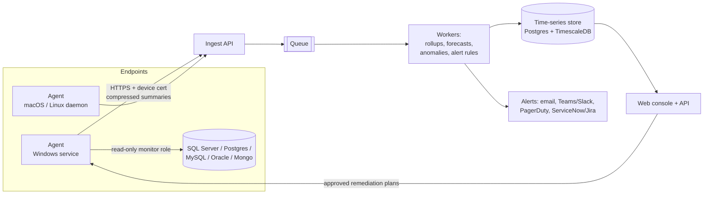

# Neural Storage Matrix: Current Build and Product Roadmap

## Status update

Phases 1-3 below are complete, including NTFS MFT fast scan (Turbo Scan),
except a handful of items explicitly scoped out along the way —
ransomware-style extension tracking, duplicate-count history, an in-app
auto-undo. Phase 4 is partially done: everything buildable without a
code-signing certificate is in place; signing itself is still open, but no
longer needs a purchased certificate (see backlog P1-9 below).

Turbo Scan (item 1 below) went from "not started" to fully built, unit- and
integration-tested, and validated across several real-hardware sessions —
correctness bugs (fragmented `$MFT`, hard-link dedup scope, `alloc_size`
rounding, non-resident `$ATTRIBUTE_LIST`, a chunk-cache perf bug, cloud-
placeholder false positives, a reparse-point-as-root gap), a persistent
cache with NTFS USN Journal incremental refresh, and a progress-reporting
bug caught by a real user report after initial release. It ships off by
default behind a "Turbo Scan (Experimental)" toggle — see the item's own
section below for current status and what's still open.

The app also gained a Linux port during this work (scan, Trash-based
delete, and its own elevated-scan flow — same three-platform pattern as
Windows/macOS), and a "Data Tools" menu (Compress CSV to Parquet, Convert
CSV to Excel), shipped only in a separate Windows "Data build" — see the
CSV-to-Parquet section near the end of this doc.

Gaps flagged in earlier passes here are now closed:
- **Naming consistency.** The in-app window title now reads "Storage
  Scanner" (matching the repo, README, and executable name) instead of
  the old "Neural Storage Matrix" — the P1 naming-consistency item below
  is fully resolved.
- **CI gates on tests.** `build.yml`'s `test` job (on `windows-latest`,
  since several tests exercise Windows-only code paths) now runs `ruff`,
  `black --check`, `mypy`, and `pytest` with a coverage floor, and the
  `build`/release jobs depend on it via `needs: test` — a lint, format,
  type or coverage regression now blocks the release. See item 10 below.
- **Dependency and secret scanning.** `.github/workflows/security.yml`
  adds CodeQL, `pip-audit`, and gitleaks (full history) on every push/PR
  and weekly; `.github/dependabot.yml` keeps the toolchain and the pinned
  Action SHAs current. See item 9 below.
- **16 correctness bugs across delete safety, Turbo Scan data integrity,
  and forecast/anomaly UI labels**, found via a full-codebase review and
  fixed with regression tests (2026-09-19) — see the git history around
  that date for the full list; several were silent data-loss/corruption
  risks (e.g. the Windows protected-path guard never actually matching,
  and a hardcoded sector size silently corrupting Turbo Scan on native
  4Kn drives).

See the phase checklists further down for what's done vs. not, item by item.

## Improvement backlog (review 2026-09-26)

A full review of main at 538db69 (v1.11.0): code read module by module,
suspected bugs reproduced with throwaway scripts on temp folders (real user
data only ever read from copies or opened read-only), and measurements on
this machine. Every item says what it rests on; anything not reproduced or
measured is marked [inference]. Ranked by impact × likelihood ÷ effort.
Sizes: S about a day or less, M a few days, L a week or more.

**Direction.** The plan says E1 (the agent service) is next. The evidence
says the desktop app should come first. The GitHub API on 2026-09-26 shows
38 releases, 86 downloads in total (45 of them `StorageScanner.exe`), 0
downloads of v1.9.0, v1.10.0 or v1.11.0 (all three published that day),
1 star, and no issue ever filed by anyone else (all 10 PRs are Dependabot's
or the owner's). On this machine's own history database the Audit Log and
Budgets tables are empty, so delete and budgets, the features E4 and E6
build on, have never been used for real. E1 can't ship anyway: its own
Deployment bullet says it's blocked on code signing, and its exit
criterion is a 100-machine pilot that doesn't exist. Meanwhile the P0 items
below show the delete path can lose data. The recommended order is
"Desktop 2.0": (1) P0 delete safety; (2) trust — signing, which a
$9.99/month service now makes possible without buying a certificate, plus
release notes; (3) make Turbo Scan correct and verified on real hardware,
then on by default (WizTree-class speed is the headline feature); (4) make
"what changed since the last scan" visible in the main tree and treemap,
the one thing TreeSize Free and WizTree don't do. Phase 5 stays planned but
gated on a demand signal (outside issues, downloads, or a named pilot); if
it starts, begin with the existing CLI plus scheduled task writing JSON to
a folder, not a Windows service.

### P0 — data safety — ✅ done (2026-09-29)

All five items below are fixed on `fix/p0-delete-safety`. Every window now
deletes through one service, `storage_scanner/delete_service.py`
(`audit.py` and `recycle_and_log` are gone):
- P0-1: `recycle_windows.bin_blockers` checks the volume (subst, network,
  removable, no bin, bin turned off), the path length (259 for the item,
  258 inside a folder, measured), and the bin's capacity before anything is
  touched; if the bin can't take it, nothing is deleted unless the user
  confirms a permanent delete. `FOF_WANTNUKEWARNING` is passed (without
  `FOF_NOCONFIRMATION`, which cancels it), `fAnyOperationsAborted` is
  checked, and a recycled item is looked up in the bin by its `$I` file
  afterwards.
- P0-2: the ledger records an outcome (`delete_outcome`: recycled, deleted
  permanently, refused, failed; older rows migrate to "not verified"), and
  the Audit window shows it.
- P0-3: names ending in a dot or space are refused with a rename hint and
  left out of duplicate matching.
- P0-4: `delete_guard` refuses volume roots, the scan root, Windows,
  Program Files, ProgramData, the profile and its known folders (via
  `SHGetKnownFolderPath`, so OneDrive-moved folders count), and anything
  containing them; folders of 10 GB or 50,000 files need their name typed.
- P0-5: after each delete the service tells the Cart, the duplicate cache
  and every open window; a copy deleted as a duplicate is only deleted if
  another copy of its group is still on disk; nested Cart items count once.

Verified by `tests/test_delete_service.py` (the four P0-5 scenarios, the
P0-3 repro), `tests/test_delete_guard.py`, and `tests/test_recycle_windows.py`
(a real `subst` drive and a 300-character path are refused and left on
disk; an ordinary file is found in the real Recycle Bin).

**P0-1. Recycle can delete permanently and still report success
(Windows).**
- Why: `file_ops.py:84-86` calls `SHFileOperationW` with
  `FOF_ALLOWUNDO | FOF_NOCONFIRMATION | FOF_SILENT | FOF_NOERRORUI` and
  without `FOF_WANTNUKEWARNING`, so when the Recycle Bin can't take an item
  the shell deletes it permanently without asking and returns success
  (Microsoft's SHFILEOPSTRUCTW docs). Reproduced 2026-09-26 with the real
  `audit.recycle_and_log` on temp files. A short path on C: (the control)
  landed in the Recycle Bin; each of these returned True, was gone, and
  was *not* in the Recycle Bin: a file on a `subst` drive, a file with a
  331-character path, and a folder with a short path that held one
  descendant over 260 characters. The same folder without the deep child
  went to the bin. [inference] The same applies to items bigger than the
  bin's maximum size and to network shares. README says "Nothing in this
  app permanently deletes a file."
- Do: pre-flight every target, and refuse (or ask with explicit "delete
  permanently" wording) when the volume has no Recycle Bin (`subst`,
  remote, `SHQueryRecycleBinW` fails on the root), when the path or any
  descendant is at or over MAX_PATH, or when the size exceeds the bin's
  capacity. Add `FOF_WANTNUKEWARNING` as a backstop and check
  `fAnyOperationsAborted`. Longer term, use `IFileOperation`, which handles
  long paths.
- Size: M. Verify: a Windows-only test that recycles a file on a temp
  `subst` drive and a 300-character path and expects a refusal; manually,
  delete a folder containing a deep `node_modules` and find it in the bin.

**P0-2. The Audit Log records those permanent deletes as successful
recycles.**
- Why: `audit.py:87-88` logs success whenever `recycle()` returns True. The
  P0-1 repro wrote `('recycle', 'Q:\tsreview-p0-subst.txt', success 1)`,
  and for the `subst` root `('recycle', 'Q:\', success 1)`, although
  neither is in the Recycle Bin. The Audit window and the Getting Started
  guide send the user to the Recycle Bin to get things back.
- Do: record the real outcome (recycled, deleted permanently, or refused)
  from P0-1's checks, and show it in the Audit window.
- Size: S once P0-1 exists. Verify: the P0-1 repros produce "refused" or
  "deleted permanently" rows.

**P0-3. Names ending in a dot or space make the app hash and delete the
wrong file.**
- Why: Win32 path normalization strips trailing dots and spaces, so `open`,
  `getsize` and `os.path.abspath` (`file_ops.py:82`) on `t.bin.` all act on
  the sibling `t.bin`. Reproduced with the real scanner, duplicate finder
  and `recycle_and_log`: `t.bin` (1,000 × `P`) and `t.bin.` (1,000 × `Q`,
  different content) were grouped as duplicates, `t.bin` was picked as the
  keeper, and deleting the non-keeper `t.bin.` sent the *keeper* `t.bin` to
  the Recycle Bin. `t.bin.` stayed on disk, and the Audit Log names
  `t.bin.`. Such names come from WSL, macOS/Linux tools, Samba shares and
  extracted archives.
- Do: stat, hash and delete scanned entries through `\\?\`-prefixed paths
  (which means `IFileOperation`, since `SHFileOperation` won't take them),
  or refuse such names with a clear message and leave them out of duplicate
  matching.
- Size: M. Verify: the repro as a Windows-only test.

**P0-4. Nothing stops deleting the scanned root, a drive root, or an OS or
profile folder.**
- Why: `_delete_selected` (`ui/main_window.py:1167-1190`) recycles whatever
  row has focus after a generic yes/no, including the root row, and
  neither `recycle_and_log` (`audit.py:64-116`) nor `recycle`
  (`file_ops.py:184-193`) checks the path. `is_protected_path` is only used
  to filter cleanup recommendations and duplicate scans. Reproduced:
  `recycle_and_log` on a scanned `subst` root `Q:\` returned True and
  permanently removed the mapped folder. [inference] Whether the shell would
  refuse a physical `C:\` wasn't tested.
- Do: one guard inside `recycle_and_log` that refuses volume roots, the
  current scan root, `%WINDIR%`, Program Files, the profile root and the
  known folders themselves (Desktop, Documents, Downloads…), and asks the
  user to type the folder's name before deleting a folder above a size or
  file-count threshold.
- Size: S. Verify: unit tests for each refused path; Delete on the root row
  shows the refusal.

**P0-5. The Cleanup Cart and Duplicates window can delete every copy of a
duplicate group.**
- Why: a delete from one window doesn't update the Cart or the other open
  windows. Reproduced by driving the real Duplicates window and Cart
  executor on temp files (recycle stubbed to a fake bin):
  - a copy deleted in Duplicates stays in the Cart; Execute then reports
    "Could not delete — it may be in use, protected, or require admin
    rights" and audits a failure (this is the known follow-up, confirmed);
  - a copy queued in the Cart plus the keeper deleted from Search leaves
    **0 copies** after Execute;
  - a Duplicates window left open after the keeper is deleted elsewhere
    still shows it as "Keeper" and deletes the last copy;
  - a folder and a file inside it both queued: the toolbar total counts 40
    bytes for a 30-byte folder, and the file stays in the Cart after
    Execute, then fails on the next run.
- Do: one delete service that every window calls. It removes the node from
  the Cart, the duplicate cache and open windows, and before deleting a
  duplicate re-checks on disk that another copy of the group still exists.
  Count nested Cart items once.
- Size: M. Verify: the four scenarios as tests.

### P1 — next release

**P1-1. Turbo Scan's elevated helper fails at random and falls back
silently — ✅ done (2026-09-29), real helper run pending (P1-3)**
- Why: the helper replaces its progress file with `os.replace`
  (`mft_scan_cli.py:60-67`) while the GUI has it open for reading
  (`file_ops.py:375`). Windows then raises PermissionError, nothing catches
  it, and the helper exits 1 (`mft_scan_cli.py:130-132`). One writer/reader
  pair at the real cadence for 60 s: 26 of 556 writes failed (4.7%). The
  real log shows both helper runs on 2026-09-25 (`C:\Battlestate Games` at
  20:34:49, `C:\` at 21:43:48) ending "Turbo Scan helper exited with code 1"
  and falling back to Compatible. The helper's own error text is lost
  because nothing captures its stderr under ShellExecuteEx.
- Do: retry the replace and never let progress reporting fail a scan; have
  the helper write its error into the output file so the GUI can log it.
- Size: S. Verify: the stress script shows 0 failures; one real helper scan
  (P1-3).
- Done: `mft_scan_cli._ProgressFileWriter` retries the replace (5 × 10 ms)
  and its `put` never raises: an update it still can't write is dropped
  (logged once), since the next follows within the reporting interval. A
  failed helper writes `{"error", "traceback"}` to its `--output` file and
  `file_ops._helper_failure` puts that text in the fallback reason and the
  log; the writer's leftover `.tmp` file is removed with the progress file.
- Verified: a throwaway stress script (reader process polling like
  `_relay_progress_file` at 5 Hz, writer at ~20 Hz, 30 s): main 6 of 583
  writes raised out of `put` (each one would end the helper with exit
  code 1); this branch 0 raised, 0 dropped of 582. Tests in
  `tests/test_mft_scan_cli.py` (a blocked replace is retried and lands; a
  progress write that can't land never fails the scan; a failed scan writes
  its error) and `tests/test_run_elevated_scan_windows.py` (the helper's
  error reaches the GUI).
- Not done: a real elevated helper scan; the shell here isn't elevated.

**P1-2. Turbo Scan shows wrong numbers without saying so — ✅ done
(2026-09-29), real-hardware comparison pending (P1-3).** Reproduced at
the logic level (synthetic MFT records built with the attributes measured
on this machine):
- On Disk for NTFS-compressed and sparse files comes from `allocated_size`
  (`mft_parser.py:505-507`), not the compressed size. A 4,000,000-byte
  compressed file reads 4,063,232 bytes against the 253,952 Compatible
  measures (16×). The 512 GiB sparse `userdata.img` reads 512 GiB instead of
  about 3.1 GiB.
- OneDrive folders carry the reparse bit in NTFS's own attributes (0x431
  with placeholders exposed; Compatible sees 0x31 because the cloud filter
  hides it), and `mft_scan.py:75` treats reparse directories as leaves.
  [inference: no real elevated scan above OneDrive was run] A Turbo scan of
  `C:\` or `C:\Users` shows OneDrive as a 0-byte link and still says
  Complete.
- A junction picked as the scan root gives an empty tree (Compatible:
  300,000 bytes in 3 files; Turbo: 0 and 0), because a junction's own
  directory index is always empty (setting a reparse point on a non-empty
  folder fails with error 145). [inference] A volume mount point behaves the
  same way.
- The journal cursor is taken *after* the full read and cache write
  (`turbo_read.py:237-242`), so a change made during the full read to a
  record already read never gets applied. Repro: full scan and the next
  incremental scan both report 1,000 bytes; the truth is 2,147,483,648.
- Do: use the compressed size when the attribute is compressed or sparse;
  traverse cloud-tagged reparse folders; follow a junction or mount-point
  root to its target or fall back to Compatible; take the cursor before
  reading the MFT. Add each case as a regression test.
- Size: M. Verify: `compare_scan_engines.py` on `C:\Users` (with OneDrive),
  a compressed folder and a junction; an incremental scan after a change
  made mid-scan.
- Done: `mft_parser` reads the CompressedSize field of compressed and
  sparse non-resident attributes and bills that as On Disk (plus a Compact
  OS/WOF file's `WofCompressedData` stream). It reads the reparse tag, and
  only name surrogates (junctions, symlinks, mount points) are links; the
  Cloud Files tags (`IO_REPARSE_TAG_CLOUD*`, `IO_REPARSE_TAG_ONEDRIVE`)
  are walked like any folder. A scan whose path is, or runs through, a
  junction, symlink or mount point goes to Compatible before Turbo starts
  (`turbo_scan._linked_path_reason`), and the MFT and cache paths refuse
  one too (`LinkedFolderError`) instead of rerooting to an empty record.
  The journal cursor is taken before the full read
  (`turbo_read._journal_position`), so changes made during it are replayed
  by the next incremental scan.
- Verified: regression tests with synthetic records: a 4,000,000-byte
  compressed file billed its compressed size, a 512 GiB sparse image its
  written clusters, a Compact OS file its compressed stream
  (`tests/test_mft_parser.py`); a OneDrive folder scanned with its file
  while a junction stays a leaf, and a junction asked for directly falls
  back to Compatible from both the MFT read and the cache; a change made
  during a full read reaches the next incremental scan
  (`tests/test_turbo_scan_integration.py`).
- Not done: `compare_scan_engines.py` on real volumes (needs elevation;
  folded into P1-3).

**P1-3. Verify Turbo Scan and its cache on real hardware, with a written
checklist.**
- Why: every Turbo-related section since the columnar cache (v1.8.0) lists
  a real Turbo Scan under "Not verified". The log does show one in-process
  elevated full scan on 2026-09-25 23:42 (1,478,444 records cached), but
  nothing was compared, and both helper runs that day failed (P1-1).
- Do: a script-driven checklist for the elevated GUI and the helper path.
  First full scan, then an incremental scan after known changes (create,
  grow, rename, delete, and a change during the scan), then
  `compare_scan_engines.py` against Compatible on `C:\Windows`, `C:\Users`,
  a compressed folder and a junction root. Record the results here.
- Size: M. Verify: the results section exists and matches.

**P1-4. Growth History opens as an empty window for noisy histories — ✅
done (2026-09-26)**
- Why: `forecasting.py:158` returns `days_optimistic=None` when the slow
  slope isn't positive, while `days_pessimistic` is set. Then
  `ui/history_window.py:130` sorts `[None, int]` and raises TypeError after
  the window has been created, and Tk callback errors are only logged
  (`app.py:131-132`). 304 of 1,792 random noisy but growing histories (17%)
  hit it. Driving the real window left "Storage Growth History" open with
  no widgets.
- Do: show an open-ended range ("at least N days"), build the window after
  computing, and see P2-6.
- Size: S. Verify: a test with daily sizes of 100, 80, 120, 85 and 105 GB.
- Done: "at least N days" when there's no upper bound; the window is built
  only after the forecast and anomalies are computed.
- Verified: the 100/80/120/85/105 GB test goes through `_format_forecast`
  (main's raises TypeError on it).
- Not done: P2-6's error dialog.

**P1-5. The forecast says the drive is already full when it isn't — ✅ done
(2026-09-29)**
- Why: `forecasting.py:131` compares the scanned path's logical total (the
  sum of file sizes) with drive capacity. This machine's last `C:\` scan
  totals 2,254,686,413,442 bytes against a 2,047,346,946,048-byte drive
  (sparse files), so the forecast returns 0 days, "drive is already full or
  over capacity" (`ui/history_window.py:123-124`), while `disk_usage` shows
  313,532,440,576 bytes free. For a subfolder it forecasts that folder
  filling the whole drive and ignores everything else on it.
- Do: store used and free space with each scan and forecast free space
  reaching 0 at the path's on-disk growth rate.
- Size: M (new `scans` columns). Verify: a copy of the real database gives a
  sensible range.
- Done: schema version 4 adds `scans.allocated_size`, `drive_used` and
  `drive_free` (`history_schema._add_scan_space_columns`; NULL on older
  scans), filled by `scan_history.record_scan` from `shutil.disk_usage`.
  `forecasting.forecast_days_until_full(history, free_bytes)` fits the
  path's growth rate (on-disk sizes once three scans have them, file sizes
  until then) and counts down the drive's free space, never the path's
  size against capacity. Unknown free space says so (`free_space_unknown`);
  a disconnected drive uses the free space its newest scan recorded, dated.
- Verified: Growth History for `c:\` in the real app on a copy of this
  machine's database (schema 2, 15 scans): main shows "drive is already
  full or over capacity"; this branch shows "296.1 GB free, used up in at
  least 4 days … (low confidence, 15 scans over 14 days, R²=0.01)", and
  after removing the two synthetic 94 GB scans (P1-12) "~150–623 days …
  1.2 GB/day in file sizes (low confidence, 13 scans, R²=0.20)".
  `tests/test_forecasting.py` covers the sparse-inflated `C:\` case, the
  on-disk vs file-size rate, and unknown and zero free space.
- Not done: this machine's existing scans have no on-disk sizes, so its
  rate stays on file sizes until three new scans are saved.

**P1-6. A damaged or newer history database stops the app from starting —
✅ done (2026-09-29)**
- Why: `app.py:81` calls `init_history_db()` unguarded. A junk file raises
  "file is not a database" and the window never opens. v1.8.0's code against
  today's schema-2 database fails at startup with "no such column:
  folder_path"; a scheduled task still pointing at an old exe exits 1 on
  every run. No backup is made before a migration.
- Do: on DatabaseError move the file aside with a timestamp, start fresh
  and say so; refuse to write when `schema_version` is newer than the code
  knows; copy the file before migrating.
- Size: S. Verify: tests with a junk file and a `schema_version` 3
  database.
- Done: `history.open_history_db()` (called by the app and `--cli`) moves a
  file SQLite can't read (SQLITE_NOTADB/CORRUPT only; a locked or full disk
  still raises) aside as `storage_history.damaged-<time>.db` with its
  `-wal`/`-shm` (`storage_scanner/history_files.py`), starts a new history
  and returns a message the app shows once. A `schema_version` above the
  code's raises `NewerDatabaseError` before anything is changed, and every
  write connection checks it again (`_connect_for_write`), so the newer
  database is read but never written. Before a migration the file is
  copied with SQLite's backup API to `storage_history.v<N>-backup-<time>.db`.
- Verified: `tests/test_history_recovery.py`: junk file and a wrecked
  schema page (moved aside, new history works, next start says nothing), a
  stale `-wal` not read into the new history, a locked database left alone,
  a newer database read but not written, a version 3 database backed up
  before migrating, a new one not. The real-app run above on a copy of the
  schema-2 database left `storage_history.v2-backup-<time>.db` beside it.

**P1-7. The main tree freezes on a column click or a delete in a big
folder — ✅ done (2026-09-29)**
- Why: `_sort_level` (`ui/main_window.py:1091-1099`) moves rows one
  `tree.move` at a time, which is quadratic in Tk. Measured on this machine
  (Tk 8.6.15), one folder of 35,000 files: sorting by name took 108 s and by
  size 51 s (10,000 files: 5.5 s). Deleting one row refreshes every sibling
  (`ui/main_window.py:1152-1155`): 2.7–3.5 s at 35,000.
- Do: one `Treeview.set_children` call per level, as the live tree already
  does (measured 0.03–0.13 s at 10,000 and 0.77 s at 35,000), restriping
  only the rows whose position changed; after a delete refresh only visible
  rows and ancestors.
- Size: S. Verify: under 1 s at 35,000, kept as a benchmark.
- Done: `_sort_level` puts a level in order with one
  `Treeview.set_children` call and retags only the rows that moved an odd
  number of places, through the new `_restripe` (Tk's `tag add`/`tag
  remove` over a list of rows: four Tk calls per level). After a delete,
  `_remove_main_tree_row` restripes only the rows below the deleted one,
  rewrites a sibling's "% of Parent" only when its text changed (new
  `live_tree_model.share`/`share_text`), and refreshes the ancestors as
  before. Sort semantics are unchanged (same keys, stable ties, the
  direction toggle, lazy placeholders left alone).
- Verified: `benchmarks/main_tree.py` (a real, shown Tk window, one folder
  of random files, Tk 8.6.15) before → after: at 10,000 files name sort
  0.85 → 0.04 s, size sort 0.66 → 0.04 s, deleting the first row 0.25 →
  0.07 s; at 35,000, 12.7 → 0.11 s, 7.1 → 0.11 s and 0.88 → 0.22 s; at
  100,000 after: 0.37, 0.32 and 0.60 s. This machine's "before" at 35,000
  was 12.7 s, not the 108 s measured above. `tests/test_main_tree_rows.py`
  checks order and stripes after each heading click and after deletes
  (first, middle, one level down), plus shares and ancestor sizes. Driving
  the real app on 4,000 scanned files: each heading click 0.04 s, order
  and stripes right; a delete through the service left no stale share.
- Not done: a delete of a node with no row here (from Search or
  Duplicates, under a folder never opened) still redraws every row
  (`delete_dialogs._remove_deleted_from_tree`); the heat colour of
  siblings still isn't recomputed after a delete (it never was).

**P1-8. `--cli` in the released exe crashes when typed in a console — ✅
done (2026-09-29)**
- Why: the exe is built `--windowed` (`build.yml:87`), so `sys.stdout` is
  None unless output is redirected, and `cli.py:127` then raises
  "'NoneType' object has no attribute 'write'" (reproduced with `pythonw`
  and no standard handles: exit 1). Messages printed to stderr vanish the
  same way. It works with pipes, which is why the smoke test passes. CSV
  written to stdout on Windows has `\r\r\n` line endings (`csv.reader` read
  10 rows for 5).
- Do: in `--cli` mode attach to the parent console (`AttachConsole`) or ship
  a small console build; fail with a message when there's nowhere to write;
  write CSV with `newline=""`.
- Size: S. Verify: run the exe from cmd.exe and PowerShell.
- Done: `run_cli` first calls `cli_streams.connect_std_streams`, which
  points a missing stdout/stderr at the starting shell's console
  (`AttachConsole` on the parent, or on the grandparent when the parent is
  the same exe: the one-file exe runs the app in a child of itself,
  measured). Redirected streams are kept. With no console, stderr's lines
  go to the app log, and JSON/CSV bound for stdout exits 1 before scanning
  ("Nowhere to write … Use --output FILE"). CSV on stdout uses
  `newline=""`. Also fixed: with only stdout redirected (`> out.json`),
  `print(file=None)` wrote the summary into the JSON file.
- Verified: an exe built from this branch (local PyInstaller 6.21
  `--onefile --windowed`, not the CI build) and `pythonw` (installed and
  venv), run in real cmd.exe and PowerShell consoles (windowless; the screen
  buffer read back): JSON, CSV, the summary and "Path does not exist" show
  up; `start /wait` sets ERRORLEVEL 0/1, `| Out-Host` sets `$LASTEXITCODE`
  0; `> out.json` is valid JSON. Before: nothing shown, ERRORLEVEL 1, an
  AttributeError in the log. Piped CSV: 6 rows, no `\r\r\n` (12 before).
  No handles and no console: JSON exits 1 with the log line, `--format
  none` exits 0. Four new tests in `tests/test_cli.py` fail on the old
  `cli.py`.
- Not done: an interactive prompt doesn't wait for a windowed exe
  (PowerShell measured: output after the prompt, `$LASTEXITCODE` empty;
  interactive cmd.exe [inference]), so the README says to use `start /wait`
  or `| Out-Host`; only a console build would change that.

**P1-9. Sign the Windows build; it no longer needs a purchased
certificate.**
- Why: Phase 4 item 1 and E0 wait on buying a certificate. Azure Artifact
  Signing (formerly Trusted Signing) costs $9.99/month and has been open to
  individual developers in the US and Canada since it became generally
  available in January 2026; it has a GitHub Action. SignPath Foundation
  signs open-source projects for free. README 28-35 already tells users to
  click past SmartScreen and warns that browsers block the download. Every
  unsigned build starts with no reputation, and ten tags shipped in three
  days.
- Do: sign the exe in `build.yml` (the MSI later), and check the signature
  in the smoke test.
- Size: M (identity validation). Verify: `Get-AuthenticodeSignature` says
  Valid on the release assets.

**P1-10. Release notes, a CHANGELOG, and fewer, bigger releases — ✅ done
(2026-09-29)**
- Why: every GitHub release body since v1.04 is empty; the notes exist only
  in tag messages. The update banner links to a page with no text.
- Do: `CHANGELOG.md` with a section per version, used as the release body
  (`body_path` in the release step, or `generate_release_notes: true` at
  least), and batch changes into releases.
- Size: S. Verify: the next release page has notes.
- Done: `CHANGELOG.md`, a section per tag from v1.04 to v1.11.0 (and
  data-v1.4.6) copied from the tag messages (a lightweight tag's commit
  message; merge-commit tags say there are no notes), plus `## Unreleased`
  with P0-1…P0-5, P1-4 and P1-12; the other P1 items get added when merged.
  `release_notes.py <tag>` prints that section; the new `release` job in
  `build.yml` passes it as `body_path` and fails if it's missing or empty.
- Verified: `release_notes.py v1.11.0 --output dist/release-notes.md` (the
  workflow's command, in a temp copy) wrote the v1.11.0 section; v1.12.0
  exited 1, "no '## v1.12.0' section", nothing written. A script checked
  every section against its tag's text: 35 tags, no mismatch.
  `tests/test_release_notes.py` covers v1.1.0 vs v1.10.0, `###`
  subheadings, missing vs empty.
- Not done: "the next release page has notes" shows only at the next tag.
  Batching releases is a practice, not code. `build-data.yml`'s data-v*
  pre-releases still have no notes (tags on the `data` branch use that
  branch's copy of the workflow).

**P1-11. CI: test pull requests, least privilege, cover `history.py` — ✅
done (2026-09-29)**
- Why: `build.yml` runs only on pushes to main and tags (lines 7-11), so
  pull requests, Dependabot's included, are never tested. `contents: write`
  at workflow level (lines 13-14) gives the test job a write token. mypy
  (line 46) and coverage (`pyproject.toml` addopts) cover only
  `storage_scanner/`, so `history.py` (823 lines, owns the database, 79%
  when measured separately) is in neither gate. Commit 32bbf60 went in with
  a NameError that ruff reports (fixed in 6d73e1b before the merge).
- Do: a `pull_request` trigger; `contents: read` by default and write only
  on release jobs; include `history.py` in mypy and coverage (or move it,
  P2-14); a pre-commit config running ruff and black.
- Size: S. Verify: a PR shows the test job.
- Done: `pull_request` into main; `contents: read` for the workflow and
  `contents: write` only on a new tag-only `release` job, which runs after
  all three builds, downloads their artifacts (`actions/download-artifact`,
  SHA-pinned v8) and publishes them (the build jobs no longer do, so a
  platform whose build fails no longer lets the others ship alone). mypy
  checks `storage_scanner/ history.py`; `--cov=history` is in addopts.
  `.pre-commit-config.yaml` runs ruff-check 0.16.9 and black 26.5.1, the
  newest releases (what CI installs today), pinned by SHA.
- Verified: `build.yml` parses with PyYAML and every `uses:` is a SHA;
  `mypy history.py` had 0 errors on main already, and `mypy
  storage_scanner/ history.py` is clean; coverage with `history.py` 56.1%
  (`history.py` 79%) against 55% without, floor 49 kept. `pre-commit run
  --all-files` passed in a temp venv, and ruff-check failed a probe file on
  F821.
- Not done: "a PR shows the test job" waits for this branch to be pushed.
  `build-data.yml` still has write access at workflow level (one job that
  builds and publishes, run from the `data` branch).

**P1-12. Benchmarks write into the real app log, and test data sits in the
real history — ✅ done (2026-09-26)**
- Why: the `benchmarks/scale.py` subprocesses redirect their databases but
  not the log, so this machine's log holds hundreds of "saved full scan of
  volume 379422" lines (2026-09-24 to 26), plus older lines for volumes
  123456789 and 1 from test runs up to 2026-09-24. `tests/conftest.py:13`
  redirects only the log; the databases depend on each test monkeypatching
  `history.DB_NAME`, with no safety net. The history database holds
  synthetic scans from earlier dev sessions (source not traced): four
  identical `c:\data` rows (123,456,789 bytes, capacity 0, 2026-09-15), two
  `c:\` rows of exactly 94,000,000,000 bytes (2026-09-17) and a temp-folder
  scan. The two 94 GB rows are what anomaly detection flags on `C:\`
  (±2.0 TB, z ±3.7).
- Do: `conftest.py` points LOCALAPPDATA, XDG_DATA_HOME, HOME and the log
  folder at a temp dir for the whole session and fails if `history.DB_NAME`
  is the real one; benchmarks do the same; add "Remove this scan" to Growth
  History so existing junk can go.
- Size: S. Verify: after a test run the real log and database mtimes are
  unchanged.
- Done: `conftest.py` sandboxes those variables and refuses a real DB or log
  path; `scale.py` children and `scan.py` log to a temp folder.
- Verified: real log and DB mtimes unchanged by pytest + `scale.py --check`.
- Done (2026-09-29): Growth History has a Scans tab
  (`ui/history_scans.py`) with "Remove this scan" (button, Delete key, row
  menu); `history.delete_scan` removes the scan, its folder rows and paths
  nothing else uses.
- Verified: removing the two 94 GB `c:\` scans from a copy of this
  machine's database in the real window (15 → 13 scans, none of 94 GB
  left); `tests/test_history.py::test_removing_a_scan_deletes_only_its_rows`.

**P1-13. Re-check files before deleting from lists that can be stale — ✅
done (2026-09-29)**
- Why: `check_stale` (`storage_scanner/delete_service.py`; this item first
  cited `audit.py:23-61`, where it used to live) compares size only and
  never checks folders; a same-size replacement passes (reproduced).
  Cold-start Cleanup rows come from `cleanup_cache.db` and can be days old.
  Search, Duplicates and Cleanup windows stay open and deletable across a
  rescan, while `_refuse_delete_during_scan` (`ui/live_tree.py`) is only
  called by the main tree and the Cart [code-traced, not reproduced].
- Do: compare size and mtime (and file ID where available); ask for a
  rescan before deleting folders from cached rows; close or disable those
  windows when a scan starts.
- Size: S. Verify: tests for the same-size replacement and for a Delete in a
  pre-rescan Search window.
- Done: `check_stale` compares size and modified time (read like the scan
  reads it, the link itself); `cleanup_cache.db` keeps each row's modified
  time (new `node_mtime` column, old caches read as unknown). A folder from
  a cached Cleanup row is refused, and that window offers to rescan instead.
  Starting a scan closes Search, Find Duplicate Files and Cleanup and stops
  a running duplicate search. The delete service refuses everything while a
  scan runs, and rows tied to a replaced tree (`DeleteRequest.tree`); the
  three windows also call `_refuse_delete_during_scan`.
- Verified: tests for the same-size replacement, a replaced cached file, a
  cached folder, and a pre-rescan Search delete (during and after the
  rescan). Driving the real app: all three windows closed when a rescan
  started; a Search window kept open through it deleted nothing, during or
  after; the cached folder asked to rescan and started one.
- Not done: file ID — nodes don't store one, so a replacement with the same
  size and modified time still passes. Turbo Scan's mtimes weren't compared
  on a real MFT read (needs admin).

### P2 — soon

**P2-1. The one-file exe takes 5–6 s to start.**
- Why: `dist\StorageScanner.exe` (the Sep 17 build, same flags as
  `build.yml:87`) running `--cli` on a one-file folder took 5.32–6.26 s over
  three runs; the same from source took 0.71–0.90 s. A one-file exe unpacks
  itself to `%TEMP%` on every launch. The "portable" ZIP is the same exe
  zipped (`build.yml:101`). Importing `storage_scanner.app` alone takes
  0.7–1.4 s.
- Do: put a `--onedir` build in the ZIP (and in a future installer), keep
  the one-file exe as the single download, and import the automation and
  audit windows, `urllib` and `webbrowser` lazily.
- Size: S–M. Verify: launch time for both builds.

**P2-2. The tree can't show very large folders.**
- Why: the finish rebuild of one level takes 2.1 s at 35,000 rows, 6.7 s at
  100,000 and 20.0 s at 250,000, at 1.75 KB of process memory per row,
  against about 120 bytes per file for the tree model itself.
- Do: insert the first N rows (say 1,000) plus a "N more files (X GB)…" row
  that loads the rest in pages.
- Size: M. Verify: a 250,000-file folder opens in under 1 s.

**P2-3. Folders cost six times what files do, and the benchmark doesn't
show it.**
- Why: tracemalloc on real scans: `C:\Windows\WinSxS` (124,809 files,
  128,573 folders) 878 B per file all-in; `C:\Program Files` 191 B. That
  works out to about 120 B per file plus 736 B per folder; a folder's first
  file allocates six containers. `benchmarks/scale.py` uses 50 files per
  folder, but this `C:\` has 4.4 (1,142,488 files, 260,518 folders), so real
  memory is about 2.5× the gated figure. [inference] About 2.9 GB at 10M
  files.
- Do: add a realistic-layout scenario that gates bytes per folder; pack a
  folder's file columns into one buffer, trim them after the scan, and
  derive a folder's path from its parent instead of storing it.
- Size: M. Verify: the new scale.py metric.

**P2-4. The Turbo cache file is 615 MB and 54% empty.**
- Why: `turbo_scan_cache.db` here: 150,319 pages of 4 KB, 80,987 of them on
  the free list, for 1,478,444 records, which is about 192 B per record live
  against `baseline.json`'s 128.1 (real names are longer, and the names
  index repeats them). It's never vacuumed, rows for volumes that are gone
  are never removed, and a generic DatabaseError in `get_cached_volume` or
  `init_cache_db` means full reads forever with no rebuild [code-traced].
- Do: write each full scan to a new file and swap it in; drop volumes not
  seen for N days; rebuild on any DatabaseError; show the cache size and a
  Clear button in Settings.
- Size: S–M. Verify: the file size stays near the live size after full
  rescans.

**P2-5. History edge cases give wrong answers — ✅ done (2026-09-29).**
Reproduced on synthetic
databases:
- The growth summary is built from the top 50 rows only (`history.py:442`):
  50 tracked folders when there are 202, and no "largest shrink" despite a
  39 GB drop.
- A deleted folder is never listed, so a 29.9 GB "drop" anomaly names no
  folder.
- A folder that crosses the 50 MB threshold between scans shows as "New".
- One save with the clock three years ahead thinned 96 scans to 3:
  retention is anchored on the newest `created_at`
  (`history_retention.py:84-86`).
- A perfectly steady folder flags a 4 KB change as "far outside its usual
  pattern" (`anomaly_detection.py:60-63`).
- A forecast over a very short span prints "999,000,000,000,000,000 days".
- Do: compute the summary and shrink in SQL over all rows, deleted folders
  included; skip pruning when the clock jumps; require a minimum absolute or
  relative change for an anomaly; cap long estimates.
- Size: M. Verify: each case as a test.
- Done: `history.get_folder_growth` also returns folders only the previous
  scan had (current size 0, percent None) and takes `limit=None`;
  `get_growth_summary` and the anomaly's folder lookup use every row.
  Growth History labels a folder only one scan has "New / was <50 MB" or
  "Gone / now <50 MB" (history keeps folders of 50 MB or more, so it can't
  tell appearing from crossing that size), and the summary says "New folders
  (or newly over 50 MB)". Retention prunes nothing on a save made more than
  a year after every other scan of its path (`_CLOCK_JUMP`). An anomaly
  must also differ from the usual rate by at least 10 MiB and 0.1% of the
  size before it. Forecasts past 36,500 days read "more than 100 years".
- Verified: tests for each: 202 tracked folders and the big shrink named
  (`test_history.py`), the jumped-clock save thinning nothing
  (`test_history_retention.py`), 4 KB on a steady 40 GB folder not flagged
  and a 30 GB drop still flagged (`test_anomaly_detection.py`, whose other
  cases now use MiB-sized numbers), the capped forecast
  (`test_forecasting.py`). The real Growth History window showed the new
  and gone labels.
- Cost: listing gone folders reads the previous scan's rows too, so
  `history_20k_growth_steps_per_row` went 21.8 → 45.9 (0.011 → 0.02 s for
  20,000 folder rows); `benchmarks/baseline.json` was updated for that
  metric only.

**P2-6. Errors in the window are invisible — ✅ done (2026-09-29)**
- Why: Tk callback exceptions are only logged (`app.py:131-132`), and the UI
  has no way to open the log folder, so a failing button does nothing
  (P1-4 leaves an empty window).
- Do: a short dialog, "Something went wrong — details are in the log", with
  an Open Log Folder button.
- Size: S. Verify: force an exception in a callback.
- Done: `ui/error_dialog.py` (`ErrorDialogMixin`) is the app's
  `report_callback_exception`: it logs the traceback as before, then shows
  "That didn't work." with the error's one-line summary, where the log is,
  and an Open Log Folder button (`logging_setup.log_dir`, the folder the
  log handler actually writes to). One dialog at a time, so an error that
  repeats doesn't stack windows.
- Verified: the real app with two exceptions forced in `after` callbacks:
  one dialog, both tracebacks in the log, Open Log Folder opened the log
  folder in use.

**P2-7. Closing during "Saving history" loses the scan — ✅ done
(2026-09-29)**
- Why: the save runs on a daemon thread (`ui/main_window.py:770-773`) and
  `_on_close` (`app.py:165-168`) destroys the window without waiting.
  During the save, deletes are allowed (`ui/live_tree.py:130` checks only
  the scan thread), so a delete can change the tree `record_scan` is
  reading [code-traced].
- Do: wait for the save on close with a "Finishing…" note, and block
  deletes until it's done.
- Size: S.
- Done: the save thread is kept (`_history_thread`); `_on_close` shows
  "Finishing saving this scan's history…" and closes when it ends (at most
  `CLOSE_WAIT_SECONDS`, 120). Deletes are refused while it runs, in every
  window (`_refuse_delete_during_scan`) and in the delete service
  (`scanning=self._deleting_blocked`).
- Verified: the real app with `record_scan` slowed by 2 s: a main-tree
  Delete during the save said "Deleting has to wait a moment, until this
  scan's history is saved" and left the file; closing kept the window open
  until the save ended, and the scan was in the history afterwards.

**P2-8. F5 can start a second scan before the first one finishes — ✅ done
(2026-09-29)**
- Why: F5 calls `start_scan` directly (`ui/main_window.py:292`), whose only
  guard is `scan_thread.is_alive()` (line 610). Between the worker exiting
  and `_poll_progress` handling "done", a second scan starts while the first
  result is still shown and saved [code-traced, not reproduced].
- Do: tag queue messages with a scan generation and ignore F5 until
  `_finish_scan` has run.
- Size: S.
- Done: `_scan_active` is set by `start_scan` (and the macOS/Linux
  elevated start) and cleared only in `_finish_scan`/`_finish_error`;
  `_scan_running()` and both start guards use it instead of the worker
  thread being alive. No generation tag was needed: a new scan can't start
  until the old one's "done" or "error" has been handled, so the queue
  never holds another scan's messages.
- Verified: the real app: after the worker thread had ended but before its
  result was handled, `start_scan()` (what F5 calls) started nothing.

**P2-9. Scheduled scans break quietly when the exe moves, runs from a ZIP,
or the path has a `%`.**
- Why: a task keeps the exe path it was saved with. Running the exe from
  inside the ZIP gives a path under `Temp\Temp1_StorageScanner-portable.zip`
  that disappears. Downloading a new version beside the old one leaves tasks
  on the old exe, which exits 1 against a newer database (P1-6).
  `cron_line` (`schedule.py:215-225`) doesn't escape `%`, which cron turns
  into a newline: `/home/u/100% done` runs `--cli /home/u/100` (reproduced
  with a cron-parsing script). Task Scheduler expands `%VAR%` in Arguments,
  so a folder literally named `%USERNAME%` is scanned under another name
  [inference]. Quoting of spaces, `&`, `^`, `;`, `$()`, backticks and
  Unicode round-trips correctly (checked).
- Do: refuse to schedule from a temp or ZIP path; flag tasks whose exe is
  older than the running app; escape `%` for cron and Task Scheduler.
- Size: S.

**P2-10. The update check and PRIVACY.md disagree — ✅ done (2026-09-29)**
- Why: PRIVACY.md line 5 calls the check "optional", but there is no
  setting. Line 60 says running from source never checks, but
  `check_for_update` (`update_check.py:90-97`) records the time and fetches
  whatever the version; this machine's database has `last_update_check_at`
  2026-09-26 from a `0.0.0-dev` run. Data-build users are never told about
  new Data builds, because those are pre-releases and `/releases/latest`
  skips them.
- Do: a setting and an environment variable to turn it off; no request when
  the version doesn't parse; fix the text; the Data build checks
  `/releases` for the newest `data-v` tag.
- Size: S.
- Done: `update_check.check_for_update` makes no request (and records no
  time) when the running version isn't a release tag, or when the check is
  off: Tools ▸ Settings ▸ "Check for Updates on Launch"
  (`update_check_enabled` in app_metadata) or `STORAGE_SCANNER_NO_UPDATE_CHECK`.
  A Data build (`data-vX.Y.Z`) reads `/releases` and compares with the
  newest `data-v` tag; the notice links to the new tag's page. PRIVACY.md
  says all of this.
- Verified: `tests/test_update_check.py` (no request from "0.0.0-dev" or
  "main"; none when off by setting or environment; a Data build told about
  the newest Data build; the newest `data-v` tag picked by version, drafts
  and malformed tags skipped). In the real app, unticking the menu item
  stored "0" and turned the check off; ticking it turned it back on.
- Not done: the Data build's own copy of the code arrives with the next
  merge into `data`.

**P2-11. Toast notifications: why none ever appeared here.**
- Why: notifications are turned off for this whole account
  (`GlobalToastEnabled=0`; PowerShell's ToastNotifier setting says
  DisabledForUser), so the "never visibly verified" follow-up can't be
  closed on this machine as it's set up. `notify.windows_toasts_enabled`
  (`notify.py:95`) reads that registry value only, which misses Group
  Policy and per-app blocks. Toasts show as coming from "Windows
  PowerShell".
- Do: use `ToastNotifier.Setting`; register an app ID with a Start-menu
  shortcut (needs an installer) so toasts carry the app's name; turn
  notifications on and verify once.
- Size: S to verify, M for the app ID.

**P2-12. Archiving blocks the window — ✅ done (2026-09-29)**
- Why: `archive_file` compresses at the highest level and verifies on the
  Tk thread: a 100 MB log took 6.2 s; [inference] a 2 GB file would freeze
  it for about two minutes.
- Do: run it on a worker thread with progress and cancel.
- Size: S.
- Done: `archive.write_verified_archive` streams the file into the zip and
  reads it back (the CRC check) in 1 MiB chunks, with a progress callback
  and a cancel event, at zipfile's default level instead of 9; a failed or
  cancelled archive is removed and the original never touched. The
  Cleanup window runs it on a worker thread behind an "Archiving" dialog
  (progress bar, Cancel), and removes each original on the Tk thread
  (`archive.finish_archive`), where the delete service can ask its
  questions. `archive_file` still does both in one call.
- Verified: the real Cleanup Recommendations window on a 150 MB,
  400-day-old log: Cancel at 30% left no .zip and the original intact
  (longest UI stall 13 ms); a full run wrote a 534 KB zip and removed the
  original (longest stall 51 ms). `tests/test_archive.py` covers a write
  failing part-way and a cancel.

**P2-13. Fold the Data build back into main.**
- Why: 17 of the `data` branch's 18 commits are "Merge branch 'main' into
  data"; the feature itself is two modules plus 75 lines in
  `ui/main_window.py`, the source of the merge conflict noted on
  2026-09-24. The branch's own `build-data.yml` test job pins
  `actions/checkout` v4 and `setup-python` v5 while main is on v7, because
  Dependabot only updates the default branch; the `csv_to_*` tests never run
  on main.
- Do: merge Data Tools into main behind the existing import guard (the menu
  appears only when pyarrow or openpyxl is present), build both variants
  from one tag, delete the branch.
- Size: S. Verify: one tag produces both builds.

**P2-14. Split `ui/main_window.py` and `ui/duplicate_window.py`.**
- Why: 1,284 and 912 lines against the 500-line rule, 14% and 39% covered.
  The duplicate engine (about 280 lines of hashing and matching) lives in a
  UI module, and the 370-line `_show_duplicates_window` of closures is where
  32bbf60's NameErrors hid. `mypy --check-untyped-defs` reports 345 errors
  in 28 files, mostly mixin attributes mypy can't see.
- Do: move the duplicate engine to a Tk-free `storage_scanner/duplicates.py`
  with tests; make the Duplicates window a class; split `main_window.py`
  into scan lifecycle, tree population and sorting, toolbar and menus, and
  drives and elevation; move `history.py` into the package; describe the
  shared app attributes in a Protocol.
- Size: L. Verify: every file under 500 lines; coverage of the moved logic.

**P2-15. Run the tests on Linux and macOS, and settle the Python range.**
- Why: CI tests only `windows-latest` on 3.12, yet Linux and macOS builds
  ship. Under WSL (Python 3.14.4): 569 passed and 55 failed, all of them
  Windows-only tests without a skip marker (`test_schedule.py` 22,
  `test_scheduled_tasks.py` 15, `test_turbo_scan_integration.py` 7,
  `test_mft_scan.py` 4, …); the suite has only 2 `skipif` markers. On
  Windows, 3.11 and 3.14 both pass (631 passed, 2 skipped). README line 278
  says 3.9+, which is past end of life and not installed or tested anywhere.
- Do: mark the Windows-only tests; add ubuntu and macOS test jobs; test 3.12
  and 3.13 (and 3.14); raise the floor to 3.11 in README and
  `pyproject.toml`.
- Size: S–M. Verify: green test jobs on all three OSes.

**P2-16. Build provenance and pinned build tools.**
- Why: there's no artifact attestation. `requirements-dev.txt` uses `>=`, so
  each release can bundle a different PyInstaller. Pushing a tag and main at
  the same commit builds everything twice. The smoke test never creates a Tk
  window, so a broken Tcl/Tk bundle would still pass.
- Do: `actions/attest-build-provenance`; a pinned lock file for build
  tools; a `--selftest-gui` flag that opens and closes a hidden window in
  the smoke test.
- Size: S.

**P2-17. The sampled-duplicate warning hard-codes "1 MB" — ✅ done
(2026-09-29)**
- Why: `ui/cart_window.py:186` and `ui/duplicate_window.py:760` hard-code
  "1 MB", while the same window formats `DUPLICATE_HASH_CHUNK_BYTES`
  elsewhere (`ui/duplicate_window.py:530`). The constant is 1 MiB
  (`settings.py:73`), so the text is right today but will drift (the known
  follow-up, confirmed).
- Do: format `human_size(DUPLICATE_HASH_CHUNK_BYTES)` in both places.
- Size: S.
- Done: both confirmations use `cleanup_recommendations.
  sampled_match_warning`, which formats the constant ("1.0 MB" today).

**P2-18. Show what changed since the last scan in the main tree — column ✅
done (2026-09-29); filter and treemap colour not yet.**
- Why: the main tree has Name, Size, On Disk, % of Parent and Files
  (`ui/main_window.py:239-243`). Growth against the previous scan exists
  only inside Growth History, and it's the thing TreeSize Free and WizTree
  can't do at all.
- Do: a sortable "Change since last scan" column (size and %) from
  `folder_snapshots` for folders over the 50 MB threshold, a "changed only"
  filter, and growth as a treemap colour (P2-19).
- Size: M. Verify: rescan after adding a file; the column shows it.
- Done: the main tree has a sortable "Change" column. When this scan's
  history is saved, `MainWindowMixin._show_changes` loads the previous
  scan's folder sizes (`history.get_folder_sizes`) and fills every folder
  row: "+10.0 MB (+16.7%)", "−500 B (…)", "no change", or "new / <50 MB"
  for a folder of 50 MB or more the last scan didn't keep; files and
  smaller folders stay blank. Rows opened later get it too, and it's
  cleared when a new scan starts. Sorting by it uses
  `live_tree_model.sort_key_function(key, change_of)`.
- Verified: the real app on its real mainloop: scan a 60 MB folder, add a
  10 MB file, rescan: the folder and its parent read "+10.0 MB (+16.7%)".
  `tests/test_main_tree_rows.py` checks the cells and the Change sort.
- Not done: the "changed only" filter; growth as a treemap colour (P2-19).

**P2-19. Treemap: nested, in the main window, coloured by type, age or
growth.**
- Why: `ui/treemap_window.py` draws one level at a time in a separate
  window, coloured by size relative to the largest sibling, which repeats
  what the area already shows (lines 3-6, 121-126). Clicking a label does
  nothing, since only rectangles are bound. Double-clicking a folder drills
  in and then reveals whatever file lands under the pointer (reproduced).
  It isn't synced with the tree, and its area is logical size.
  WinDirStat and WizTree show the whole hierarchy with shading and file-type
  colours.
- Do: an embedded pane with 2–3 nested levels, colour modes (type, age,
  growth), selection synced with the tree, labels bound, click and
  double-click kept apart, and area from on-disk size.
- Size: L.

**P2-20. Everyday table stakes in the main window.**
- Why:
  - one selection at a time (`selectmode="browse"`, line 234);
  - the only keys are Delete, F5 and Return in the path box (lines 91,
    291-292): no Ctrl+F, Backspace or Alt+Up, Enter to open, Shift+F10 or
    the Menu key, or Ctrl+C;
  - the context menu is bound to `<Button-3>` only (line 288), so it doesn't
    open on macOS (the other windows handle `<Button-2>`);
  - there are no Modified, Accessed, Owner or Folders columns, though the
    model has mtime and atime;
  - "On Disk" sorts by logical size (line 241);
  - File Types can't drill into an extension, and Largest Files has no
    context menu;
  - CSV export writes mtime as an epoch number, leaves out atime, and
    writes names starting with `= + - @` unescaped, which Excel runs as
    formulas.
- Do: fix in that order; each is small.
- Size: M overall.

**P2-21. High DPI and a dark theme.**
- Why: nothing declares DPI awareness. The v1.11.0 exe's manifest has
  `longPathAware` but no `dpiAware`, the code never calls
  `SetProcessDpiAwareness`, and the venv's Python reports awareness 0, so
  [inference: this machine is at 100% and never shows it] Windows stretches
  the window as a bitmap at 125–150%, which blurs it. Row height is fixed in
  pixels. There's only the light theme (`settings.py:76`): no dark mode and
  no following the OS setting.
- Do: per-monitor DPI awareness with row height from font metrics; a dark
  palette that follows the OS.
- Size: M. Verify: screenshots at 150%.

**P2-22. Explorer integration and package managers.**
- Why: no "Scan with Storage Scanner" folder menu, no winget or Scoop
  manifest, no installer. A path passed on the command line only fills the
  path box (`app.py:203`); it doesn't start a scan.
- Do: an optional per-user context-menu entry from Settings;
  `StorageScanner.exe <folder>` scans right away; winget and Scoop manifests
  (easier once signed).
- Size: M.

### P3 — later or strategic

**P3-1. Phase 5 (E1–E6) behind a demand gate.** See Direction above. Keep
the plan; start it only on a real demand signal, and begin with the CLI and
scheduled JSON output before any service, ingest API or console. Size: L.

**P3-2. Repo housekeeping.**
- Why: `git branch -a --merged main` lists `feat/compact-tree`,
  `feat/live-tree-progress`, `fix/followups`, `new_visuals`,
  `wip/2026-09-25`, `origin/new_visuals` and `origin/wip/2026-09-25`; only
  `data` isn't merged (P2-13). `stash@{0}` (based on d79165f, 2026-09-19)
  holds the Cart and orphaned-install work that landed in 4c07691, plus
  `TURBO_SCAN_VALIDATION_STATUS.md`, deleted on purpose in c14d8e8. Ignored
  clutter: `TreeSize.spec` (its entry point `treesize.py` is gone),
  `dist\StorageScanner.exe` from Sep 17, root `__pycache__` for 3.11, 3.13
  and 3.14, and a 3.13 venv holding 3.14 build artifacts.
- Do: delete the merged branches locally and on origin, drop the stash after
  a last look, remove the stray files, recreate the venv.
- Size: S.

**P3-3. The `%TEMP%` folder in the repo root — ✅ done (2026-09-29)**
- Why: an empty folder created 2026-09-24 21:22:52 and last changed
  2026-09-25 20:30:05, the same second as commit 6d73e1b. No app code expands
  `%VAR%` strings: every path comes from `tempfile`, LOCALAPPDATA or
  XDG_DATA_HOME (`history.py:27-29`, `logging_setup.py:31`,
  `file_ops.py:427-429`; the benchmarks use `tempfile`). A literal `%TEMP%`
  is what a bash shell leaves from a cmd-style path; [inference] here most
  likely a commit-message file written and removed around 6d73e1b. It's a
  dev-shell artifact, not a bug users can hit.
- Do: delete it; use `$TEMP` or `tempfile` in dev scripts.
- Size: S.
- Done: deleted (it had also caught a stray file from a bash command using
  `%TEMP%` during the v1.12.0 release; `$TEMP` is used now).

**P3-4. The Obsidian project note is out of date.**
- Why: its overview still describes a single `treesize.py`, its feature list
  is June's, and its notes stop at v1.8.0.
- Do: rewrite it from this backlog.
- Size: S.

**P3-5. The log loses lines when the app and a scheduled scan overlap — ✅
done (2026-09-29)**
- Why: `RotatingFileHandler` (`logging_setup.py:34-38`) can't rename a file
  another process has open (WinError 32): 3,362 of 30,000 lines were lost in
  a two-process repro. The log runs at DEBUG and holds full paths.
- Do: one log file per process, or a handler that doesn't rename; INFO by
  default.
- Size: S.
- Done: the log is rotated only when a process starts
  (`logging_setup._rotate_at_start`; skipped if another process has the
  file open), and written through a plain StreamHandler on a stream that
  only appends: on Windows a handle opened for `FILE_APPEND_DATA` alone
  (`_append_stream`), because "a" mode there only seeks to the end before
  each write and two processes overwrote each other's lines even with no
  rotation. INFO by default; `STORAGE_SCANNER_LOG_LEVEL=DEBUG` for a
  diagnosis.
- Verified: a two-process repro (15,000 lines each into one log folder):
  main kept 27,407 of 30,000; with rotation removed but "a" mode, 28,222;
  now 30,000 of 30,000. `tests/test_logging_setup.py` covers rotation at
  start, an open log left alone, and two open append streams.
- Not done: a single process writing more than 2 MB grows the file past
  that until the next start.

**P3-6. The "journal wrapped" check uses the wrong field — ✅ done
(2026-09-29)**
- Why: `turbo_read.py:277` and `usn_journal.py:225` compare the saved
  cursor with `LowestValidUsn` rather than `FirstUsn`, so the "USN journal
  wrapped" reason almost never shows; the journal read fails instead, which
  is still safe.
- Do: compare with `first_usn`.
- Size: S.
- Done: `turbo_read` and `usn_journal.read_journal_changes` (parameter now
  `first_usn`) compare the saved cursor with FirstUsn.
- Verified: `tests/test_turbo_read.py`'s wrap case now has FirstUsn above
  the cursor and LowestValidUsn 0, which the old check let through.

**P3-7. Harden the elevated helper's output file.**
- Why: the unelevated app picks a path in `%TEMP%` (`file_ops.py:427-429`)
  and the elevated helper writes to it. [inference] Another process running
  as the same user could swap it for a link and make the helper overwrite a
  different file; Microsoft doesn't treat UAC as a security boundary, so the
  risk is low. The result is trusted as-is. Argument quoting was checked and
  is correct for 8 awkward paths (spaces, `%`, `&`, `^`, Unicode, a trailing
  backslash, an embedded `--output`).
- Do: open the output without following links (or hand over an inherited
  handle), and check that result paths are under the requested root.
- Size: S.

**P3-8. Orphaned-install detection trusts a registry read that can fail —
✅ done (2026-09-29)**
- Why: if a registry hive can't be read, every install location seen before
  counts as orphaned (reproduced with an empty snapshot); a nested install
  location (`Vendor\ProductB`) flags its parent folder.
- Do: skip the category when far fewer apps come back than last time;
  ignore folders that contain an installed app.
- Size: S.
- Done: `cleanup_recommendations.registry_read_looks_short` (under half of
  the apps the last snapshot saw installed, of at least 5): the read isn't
  recorded, no orphan rows are shown, and the summary says detection was
  skipped. `find_orphaned_install_folders` never flags a folder that
  contains a still-installed app's location
  (`history.get_installed_install_locations`).
- Verified: tests for both; the real Cleanup Recommendations window over a
  sandbox history that knew 1,000 installed apps, against this machine's
  real read of 56: "orphaned-install detection skipped: the installed-apps
  list came back incomplete", and the 1,000 rows were left as they were.

**P3-9. Accessibility.**
- Why: `ttk.Treeview` exposes nothing to Windows screen readers.
- Do: finish keyboard-only flows (P2-20), state the limit in README, and
  count accessibility in any future UI-toolkit decision.
- Size: M.

**P3-10. A cheap route to bug reports.**
- Why: no outside issue has ever been filed, crash-report opt-in (item 9) is
  not started, and there are no issue templates or `SECURITY.md`.
- Do: a "Copy diagnostic info" button, issue templates, and `SECURITY.md`
  before anything automatic.
- Size: S.

**P3-11. Dead code and stale instructions — ✅ done (2026-09-29)**
- Why: `history.py:759-823` (`format_bytes`, `create_usage_history_chart`,
  `print_growth_report`) has no callers, yet it keeps matplotlib listed as
  an optional "growth-history charts" dependency (PRIVACY.md line 74, the
  `requirements-dev.txt` comment) that the GUI never uses. README 42-45
  gives the Control-click → Open route past Gatekeeper, which [inference,
  not tested here] macOS 15 removed.
- Do: delete the dead code and the matplotlib mentions; update the macOS
  instructions.
- Size: S.
- Done: `format_bytes`, `create_usage_history_chart`, `print_growth_report`
  and the optional matplotlib import are gone from `history.py`; matplotlib
  is no longer listed in README, PRIVACY, BUILD_PROVENANCE,
  `requirements-dev.txt` or `make_sbom.py`. README's macOS steps give the
  Privacy & Security → Open Anyway route for macOS 15 and later [not
  tested here: no Mac], and Control-click → Open for 14 and earlier.

Checked and fine: scheduled-task XML argument quoting; the elevated
helper's command line; case-insensitive nesting in the Cart; recycling a
junction removes only the link; a folder with a locked file fails as a
whole (nothing half-deleted); history migration run by the GUI and the CLI
at the same moment (WAL); `is_newer` version comparison (data-v tags and
pre-release suffixes are never "newer"). Reading the scheduled-task list
works against real system tasks, but this machine has no task registered by
the app, so that follow-up stays open until one is.

## Executive assessment

The project is already beyond a basic disk-usage viewer. It combines concurrent scanning, sortable storage analysis, duplicate detection, safe deletion, historical snapshots, growth comparison, capacity forecasting, a custom Tkinter interface, standalone Windows packaging, and automated GitHub releases.

The uncomfortable truth is that feature count alone will not beat mature tools. The winning direction is **faster scans, safer cleanup decisions, clearer visual exploration, and IT-grade automation**. The product should help users decide what is safe and valuable to remove, not merely show large files.

## What has been built

### Core storage engine

- Recursive scanning of drives, folders, and individual files.
- A shared work queue with multiple background worker threads for directory enumeration.
- Cancellation support through thread events.
- Iterative post-order rollup of directory sizes and file counts, avoiding recursion-depth failures on deep folder trees.
- Error tracking for unreadable or protected paths.
- Automatic drive discovery for available Windows drive letters.
- Human-readable file size formatting from bytes through terabytes.

### Main interface

- A light "Structural Light" theme (`storage_scanner/settings.py`): hairline borders and one accent blue. The earlier dark cyber-terminal theme and animated radar header are gone, and there is no dark mode (backlog P2-21).
- Drive and folder selection.
- Scan and cancel controls.
- Sortable columns for name, size, on-disk size, parent percentage, and file count.
- Lazy population of child rows so large result trees are not rendered all at once.
- Percentage bars and heat coloring to make large consumers stand out.
- Alternating row colors and distinct directory, file, warning, and placeholder treatments.
- Status messages, and live scan progress: an overall bar measured against the last scan (or the drive's used space), live counters and the folder being read under the tree, while the tree itself fills in with each folder's running totals (see "Live scan progress" and "The tree fills in while it scans" below).
- Keyboard shortcuts including F5 to rescan and Delete to recycle a selected item.

### File operations

- Open directories and reveal files in Windows Explorer.
- Copy a selected path to the clipboard.
- Send selected items to the Recycle Bin rather than permanently deleting them.
- Update in-memory size totals after deletion.
- Confirmation and error dialogs around destructive actions.

### Analysis tools

- Largest-files view with configurable top 25, 50, or 100 results.
- File-type aggregation by extension with total size, percentage, and file count.
- Duplicate detection using a staged pipeline:
  1. Group candidates by exact file size.
  2. Hash the first and last 1 MB with BLAKE2b.
  3. For survivors larger than 2 MB, hash the middle 1 MB (centered on the file's midpoint). A file over 3 MB is never read in full.
  4. Group matches on (size, first+last digest, middle digest) and rank groups by potential recoverable space.
- Tradeoff: files up to 3 MB are fully covered by the three windows, so those matches are byte-exact. Above 3 MB a match is sampled: files identical in size and in those three windows are grouped even if they differ elsewhere. The Duplicate Files window counts such groups and explains each such row; Cleanup Recommendations rates them medium rather than low risk. Window offsets come from the size the scan recorded, so a file whose size has changed since is left out rather than compared on the wrong windows.
- Parallel head/tail and middle hashing.
- Default exclusions for sensitive or low-value Windows/system paths.
- Duplicate-scan statistics for checked, skipped, head/tail-hashed, and middle-hashed files.
- Multi-selection deletion from duplicate results.

### Historical intelligence

- SQLite-backed scan history.
- Scan records containing path, total size, drive capacity, file count, folder count, and timestamp.
- Folder snapshots with indexes for scan and path lookup.
- Comparison with the previous scan of the same normalized path.
- Folder growth in bytes and percentage.
- Growing, shrinking, unchanged, and newly observed folder classification.
- Summary metrics for current and previous sizes and file counts.
- Largest growth and shrink identification.
- Estimated days until full based on historical growth.
- Optional history chart generation through Matplotlib.
- Background persistence so the interface remains responsive while history is saved.

### Packaging and delivery

- Custom PNG-to-ICO generation with multiple embedded Windows icon sizes.
- PyInstaller one-file, windowed executable packaging.
- Bundled application icon for executable and Tkinter windows.
- GitHub Actions workflow that builds on pushes and manual runs.
- Build artifact upload for testing.
- Version-tag-triggered GitHub Release creation and EXE attachment.
- Semantic-style version tags such as `v1.1.0`.

## Important defects and technical debt to fix first

All four P0 items below are resolved (see Phase 1 checklist further down)
— kept here for historical context on what the original problems were.

### P0: Correct duplicate root insertion — ✅ done

`_finish_scan()` currently inserts and populates the root node twice. Remove the repeated block. This can create duplicate rows, unnecessary UI work, and confusing state.

### P0: Fix persistent database location — ✅ done

`history.py` places `storage_history.db` beside `__file__`. In a PyInstaller one-file build, application resources are extracted to a temporary directory. Store writable user data under `%LOCALAPPDATA%\\NeuralStorageMatrix\\` instead. Add a schema version and migrations.

### P0: Fix `print_growth_report()` — ✅ done

`percent_text` is calculated before `growth_percent` exists and is then reused for every row. Calculate it inside the loop and handle `None` for new folders.

### P0: Stop swallowing icon and runtime errors silently — ✅ done

Several broad `except Exception: pass` blocks hide packaging and UI failures. Log diagnostic details to a rotating file in `%LOCALAPPDATA%` while keeping user-facing messages concise.

### P1: Resolve naming consistency — ✅ done (as "Storage Scanner", not "Neural Storage Matrix")

Use one canonical entry point and product name everywhere. Recommended:

- Source entry point: `storage_scanner.py`
- Executable: `NeuralStorageMatrix.exe` or `StorageScanner.exe`
- Display name: `Neural Storage Matrix`

Update module docstrings, build scripts, workflow commands, README instructions, icon metadata, and release names together.

The project settled on **"Storage Scanner"** as the canonical name instead —
repo, README, executable (`StorageScanner.exe`), and now the in-app window
title all agree. "Neural Storage Matrix" survives only as this document's
own title/filename, a relic of the earlier "cyber terminal" theme this app
no longer has.

### P1: Split the monolith

The main source file is carrying scanning, hashing, Windows shell operations, state, persistence orchestration, and multiple UI windows. Refactor toward:

```text
storage_scanner/
  app.py
  models.py
  scanner.py
  duplicates.py
  history.py
  file_ops.py
  settings.py
  ui/
    main_window.py
    duplicate_window.py
    history_window.py
    visualizations.py
```

This will make testing and performance work much easier.

### P1: Improve scan correctness — ✅ mostly done

- ✅ Symbolic links, junctions, and mount points — recorded as leaves, never traversed.
- ✅ Sparse files and compressed files — allocated size tracked separately from logical size.
- ✅ Logical size versus allocated size.
- ✅ Hard links — deduplicated so a file linked into multiple folders counts once.
- ✅ Inaccessible folders — flagged (`Node.error`), and as of 2026-09-19 the
  flag propagates to every ancestor too, so a permission-denied subfolder
  no longer leaves a parent's total silently understated with no indicator.
- ⏭️ Long paths (beyond `MAX_PATH`) — not explicitly handled; not yet
  reported as an issue.
- ⏭️ Files changing or disappearing mid-scan — a vanishing file is caught
  (`OSError` → `Node.error`), but there's no detection of a file that's
  merely *modified* between being enumerated and being acted on later. A
  narrower version of this — a file changing between being reviewed in a
  Cleanup/Duplicates list and actually being deleted — was closed on
  2026-09-19 (the delete service, now `delete_service.check_stale`, refuses
  to delete a file whose size no longer matches what was scanned).

## Market-leading product roadmap

### 1. Add an NTFS Master File Table fast path — ✅ done, ships as "Turbo Scan (Experimental)"

Built as originally scoped: two engines — **Turbo Scan** (raw MFT parsing,
NTFS-only, `storage_scanner/mft_*.py`/`turbo_scan.py`) with automatic
fallback to **Compatible Scan** (the existing directory-walking engine) for
network shares, removable media, non-NTFS filesystems, or any Turbo Scan
failure. A persistent on-disk cache plus NTFS USN Journal incremental
refresh (`turbo_cache.py`/`usn_journal.py`) means a repeat scan of an
unchanged volume reaches parity with Compatible's own speed instead of
re-reading the whole MFT every time.

**✅ Done: scan details strip.** After every scan, a strip above the status
bar shows the engine that ran (including "Turbo Scan fell back"), elapsed
time, throughput in files/s, the unreadable-path count with a **View**
button, and a Complete/Incomplete result (`turbo_scan.scan_indicators`).
It stays until the next scan starts. The status bar alone couldn't do this:
the history save overwrites it about a second after the scan finishes. A
Turbo Scan never returns a partial tree, so unreadable paths are the only
thing that marks a finished scan incomplete. macOS/Linux elevated-helper
scans return no timing, so they show "—" for elapsed and throughput.

**✅ Done (2026-09-24): how a Turbo Scan read the MFT.** The strip now adds
an **MFT read** field after a Turbo Scan: "Incremental (USN journal)" when
the cache was refreshed from the journal, or "Full (…)" with why, such as
first scan of this drive, USN journal wrapped since last scan, USN journal
was recreated, cache was corrupt, or cache unavailable. That makes a slow
repeat scan explainable at a glance. `turbo_read.scan_subtree_using_cache`
returns `(node, MftRead)`, `ScanReport.mft_read` carries it, and the elevated
helper's `--output` JSON is now `{"node": …, "mft_read": …}`, so it crosses
the process boundary too. The helper is always the same build as the GUI
that launches it, so there's no older format to support. The reasons are
fixed short phrases, and the underlying exception text still goes to the
log. The strip is now two rows, how the scan ran and then what it found:
one row already needed 989 px against the 960 px default window whenever
the View button showed, which clipped the Result field. The widest case
now measures 774 px. Verified by unit tests for every full-read reason, the
helper envelope from both sides, the real cache/USN orchestration on a
faked NTFS volume (first scan full, second incremental), and headless
measurement of the real strip widgets. Not verified: a Turbo Scan on real
hardware showing the field, which needs admin rights and a UAC prompt.

Off by default behind a "Turbo Scan (Experimental)" toggle (Tools ▸
Settings) pending more real-world mileage before it's recommended broadly —
see the "Status update" section above for what's been validated so far. The
small-folder rescan performance follow-up that used to be open here is done;
see "Scale benchmarks and folder rescans from the cache" at the end.

### 2. Build a synchronized treemap and sunburst explorer

Add an interactive treemap where rectangle area represents allocated size and color represents file type, age, growth, or cleanup confidence. Synchronize selection among the treemap, folder tree, and details panel. Add breadcrumb navigation, zoom, hover details, keyboard navigation, and image export.

A second sunburst or radial hierarchy view would differentiate the product visually, but the treemap should come first because it is immediately understandable.

### 3. Create a review-first cleanup system

Do not market automatic deletion as intelligence. Build explainable recommendations with categories such as:

- Safe candidate: old installer already represented by a newer version.
- Review candidate: large, old media file with no recent access.
- Duplicate candidate: content match (byte-exact up to 3 MB, sampled above) with a clearly identified keeper.
- Protected: operating-system, application, cloud-placeholder, or policy-sensitive content.

Every recommendation should show **why it was flagged**, estimated recoverable space, risk level, dependencies, and proposed action. Default to review queues, Recycle Bin, quarantine, or archive. Never silently delete user content.

**✅ Done: persist recommendations across restarts.** Cleanup Recommendations now shows full cold-start recall: `storage_scanner/cleanup_cache.py` persists the last *computed* set of Protected/Review/Duplicate recommendations to SQLite (`cleanup_cache.db`, same `%LOCALAPPDATA%` convention as `history.py`/`turbo_cache.py`), keyed by scan path, each save fully replacing the previous one. Opening the app fresh and going straight to Tools ▸ Clean Up ▸ Cleanup Recommendations — with zero scans this session — shows the most recently cached run immediately, labeled with when it was computed and for which path, plus a **Rescan** button to refresh it for real. Deleting or archiving a row updates the persisted cache too, so a stale row for an already-removed file doesn't linger into the next cold start. Simpler than originally scoped here: rather than persisting the full per-file metadata needed to recompute recommendations from scratch, it persists the already-computed recommendation rows themselves — smaller, and a more direct match for "show me what I found last time," with Rescan covering the "get a truly fresh answer" case.

**✅ Done: Orphaned install category (Windows).** A fourth recommendation category flags folders that exactly match an `InstallLocation` this app previously saw registered in the uninstall registry (HKLM native + WOW6432Node, HKCU; `storage_scanner/installed_apps.py`) whose owning app is no longer installed. `history.py`'s `known_install_locations` table keeps the snapshot across runs, since a single registry read can only say what's installed *now*. Exact path match only — no fuzzy/name heuristics — so the first run on a machine only learns (the window says so) and finds nothing until a later run sees an app disappear. Anything nested under an orphan folder is dropped from the list so the same bytes aren't counted twice. Risk is Medium: an uninstalled app's folder can still hold user data.

**✅ Done: Cleanup Cart.** A cross-window queue (`storage_scanner/cart.py`, `ui/cart_window.py`): add items from the main tree, Duplicate Files, or Cleanup Recommendations, review them in one place (toolbar shows count + reclaimable size), and send them to the Recycle Bin in one batch. Items nested under another cart item collapse into it. Each item goes through `delete_service.DeleteService` like every other delete, and anything refused (e.g. the file changed size since the scan, via `delete_service.check_stale`) is listed with its reason; items deleted from another window drop out of the Cart. Session-only by design: cleared on every rescan, since cart entries point at nodes in the replaced tree.

### 4. Make duplicate cleanup genuinely safer

Improve duplicate handling with:

- Automatic keeper recommendations based on path, modification time, naming conventions, and protected folders.
- A rule that prevents deletion of every copy in a group.
- Preview support for images and documents where practical.
- Side-by-side metadata comparison.
- Hard-link replacement as an advanced, opt-in space-saving action.
- Ignore rules and saved decisions.
- An undo ledger recording every move, recycle, archive, or hard-link action.

### 5. Turn history into anomaly detection

The existing SQLite foundation can become a major differentiator:

- Multi-point charts instead of only previous-versus-current comparison.
- Folder-level growth velocity and acceleration.
- Confidence bands for capacity forecasts.
- Anomaly alerts for sudden spikes, mass deletions, ransomware-like extension growth, or unexpected duplicate explosions.
- Calendar heatmaps and change timelines.
- Snapshot labels before and after upgrades, migrations, and cleanups.
- Compare any two snapshots, not only the latest two.

Forecasting should require adequate data and display uncertainty. A single straight-line estimate should never be presented as certainty.

### 6. Add enterprise and technician mode

A clear IT-focused edition could support:

- UNC and network-share scanning with credential-safe access.
- Remote inventory through an optional signed agent.
- Scheduled headless scans.
- CLI and PowerShell-friendly JSON output.
- CSV, JSON, HTML, and PDF reports.
- Exit codes for automation.
- Centralized policy files for exclusions and retention rules.
- Machine comparison dashboards.
- Audit logs, role separation, and exportable remediation evidence.

This direction aligns especially well with real help-desk and endpoint-management workflows.
Scheduled headless scans, JSON output and exit codes are already built. The full plan to take
the rest to thousands of machines, and to add database storage monitoring, is **Phase 5:
Enterprise scale** under "Recommended delivery sequence" below.

### 7. Improve the everyday experience

Add saved scan profiles, recent locations, global result search, advanced filters, bookmarks, pinned folders, column presets, and session restoration. Support filtering by size, age, extension, owner, path, attributes, and modified/accessed date. Let users save and combine filters.

Add a first-run explanation of safe deletion, permission limitations, cloud placeholders, and Windows-protected locations. The interface should communicate what is happening instead of merely displaying activity.

**✅ Done: first-run guide.** `storage_scanner/onboarding.py` (the text and the show-once decision, no Tk) and `ui/onboarding_window.py` (the dialog). It opens by itself shortly after the first launch and can be reopened from Tools ▸ Help ▸ Getting Started…. Closing it by any route records `onboarding_seen` in `history.py`'s `app_metadata` table. If that table can't be read, the guide shows again rather than staying hidden. It has four sections, worded for the running OS (and for whether the app is already elevated), each describing what the code actually does: safe deletion (Recycle Bin/Trash, Audit Log, the protected duplicate keeper), permission limits (⚠ folders, Run as Admin), cloud placeholders (recognized only on Windows, where Find Duplicate Files skips them), and protected locations (skipped by Find Duplicate Files and listed as Protected in Cleanup Recommendations, but not checked by Delete in the main tree or in Search & Filter).

### 8. Add cloud-awareness without causing hydration

OneDrive and similar placeholders must be distinguished from fully local files. Show logical size, local allocated size, online-only state, and sync state when Windows exposes those attributes. Avoid accidentally downloading online-only content during hashing or preview. Offer safe actions such as “Free up local space” separately from deletion.

### 9a. Ship packaged builds for macOS and Linux, not just Windows — ✅ done

**Done (verified 2026-09-23):** `build.yml` now has `build-macos` (a
`StorageScanner.dmg` from a `--windowed --onedir` `.app`) and `build-linux`
(`StorageScanner-linux-x86_64.tar.gz`) jobs alongside Windows, each with its
own SBOM and SHA-256 checksums. The v1.5.0 release carries all three, and
the README's download badges link each platform's own file, so a Mac user no
longer gets a Windows `.exe`. The in-app update notice links the Releases
page, not a specific file, so it can't hand anyone the wrong platform's
build either. Everything below is the original problem statement, kept for
reference.

**Not yet built (original note).** The app itself already runs cross-platform — `platform_support.py`'s
`IS_MACOS`/`IS_LINUX` branches cover trash/recycle, elevated scanning, and
drive listing on both — but `build.yml` only ever runs on `windows-latest`,
so the only downloadable artifact anywhere is `StorageScanner.exe`. A macOS
or Linux user who clicks the README's download button gets a Windows PE
binary their OS categorically cannot run: macOS's Gatekeeper refuses it
outright with an explicit "Microsoft Windows applications are not
supported on macOS" dialog; Linux has no equivalent friendly message at
all — depending on the desktop environment, double-clicking it typically
does nothing (no application associated with a foreign PE binary), or
running it from a terminal surfaces a bare kernel `Exec format error`.
Today's README callout (see the "On macOS?" note near the top) papers
over this by warning people before they click, but a warning isn't the
same as a working download.

To actually fix it:

- Add a `macos-latest` job to `build.yml` that runs PyInstaller
  (`--windowed --onedir`, since macOS `.app` bundles don't like
  `--onefile`) to produce `StorageScanner.app`, then wraps it in a `.dmg`
  (`hdiutil create` — stdlib-adjacent, no extra dependency) for release.
  Unsigned/unnotarized, it'll hit Gatekeeper's "unidentified developer"
  prompt (right-click → Open bypasses it) — the same class of trust
  friction Windows SmartScreen already causes today, not a new problem,
  and notarization has the same certificate/Apple Developer Program cost
  blocker as Windows code-signing (see item 9 below).
- Add a `ubuntu-latest` job producing a plain PyInstaller `--onefile`
  binary (or an AppImage for a nicer double-click experience across
  distros without a system Python/Tkinter already present).
- Update the README's download section to link all three artifacts, and
  update the "On macOS?" callout once a real macOS build exists — it
  should point people at a `.dmg`, not just at running from source.
- Extend `make_sbom.py`/checksum generation to cover both new artifacts,
  matching what Windows already gets.

### 9. Treat trust as a product feature

- ❌ Code-sign Windows releases — not done; no longer needs a purchased certificate (backlog P1-9).
- ✅ Publish checksums for every release.
- ✅ Generate an SBOM.
- ✅ Pin GitHub Action versions to immutable commit SHAs.
- ✅ Run dependency and secret scanning — `.github/workflows/security.yml`
  (2026-09-23): CodeQL `security-extended` on the Python source, `pip-audit
  --strict` against `requirements-dev.txt` (the entire dependency surface,
  and PyInstaller bundles whatever is installed at build time), and
  gitleaks over the full commit history — on every push/PR to `main` plus a
  weekly cron, so a newly published CVE against an unchanged dependency is
  still caught. `.github/dependabot.yml` raises weekly updates for the
  pip toolchain and the pinned Action SHAs. It is a separate workflow from
  `build.yml` on purpose: a CodeQL queue backlog must never hold up
  shipping a binary. Verified locally: `pip-audit --strict -r
  requirements-dev.txt` → "No known vulnerabilities found"; `gitleaks git`
  → "34 commits scanned … no leaks found". CodeQL ran green on GitHub on
  the next push (`80220b7`), along with the rest of the security workflow.
- ✅ Add reproducible build notes — `BUILD_PROVENANCE.md`, including an
  explicit "this is *not* a reproducible build" section.
- ✅ Publish a privacy statement stating that scanning is local unless the user opts into remote features.
- ❌ Add crash-report opt-in rather than silent telemetry — not started;
  `logging_setup.py` writes local rotating logs and nothing leaves the machine.

Unsigned executables face reputation warnings. Packaging alone will not solve this. Signing, transparent builds, and a stable release process are the long-term answer.

### 10. Add automated quality gates

Build tests for:

- Rollup accuracy.
- Permission failures.
- Cancellation behavior.
- Symlink, junction, sparse-file, hard-link, and long-path handling.
- Duplicate detection correctness and false-positive prevention.
- Database migration and corruption recovery.
- Deletion safeguards.
- Packaging smoke tests on a clean Windows runner.

Add Ruff, Black, mypy, pytest, coverage thresholds, and a GitHub Actions test job that must pass before release. Create generated test trees so correctness and performance can be benchmarked across versions.

**Done (2026-09-23).** `pyproject.toml` now configures all four tools, and
`build.yml`'s `test` job runs them in cheapest-first order — `ruff check .`,
`black --check .`, `mypy storage_scanner/`, then `pytest tests/` — with
`build`/`build-macos`/`build-linux` gated on it via `needs: test`.

- **Ruff** replaces pyflakes: `E,W,F,I,UP,B,C4,SIM,RET` at line length 100,
  `target-version = "py39"` (the oldest interpreter this runs on locally).
  `PTH` is deliberately off — the scan hot loop uses `os.scandir`/`os.path`
  on purpose, and a `Path` object per directory entry is exactly the
  allocation a disk scanner cannot afford. Tests are exempt from `E402`
  because each one bootstraps `sys.path` before importing the package.
- **Black** at the same line length; the adoption reformatted 78 files. The
  full suite was run before and after: 396 passed / 36 failed on macOS both
  times (the 36 are the Windows-only NTFS, schedule and drive-letter suites,
  which cannot pass off Windows — CI runs them on `windows-latest`).
- **mypy** (not `--strict`, on an unannotated Tkinter codebase) is clean
  across all 45 modules after five real fixes: a `dict[str, Optional[int]]`
  cluster-size cache that genuinely caches `None`, `ScanReport.fallback_reason`
  typed `Optional[str]` instead of `str = None`, and loose `tuple`
  annotations for the per-platform font specs and duplicate-exclude lists,
  whose branches have different shapes.
- **Coverage** is enforced by `--cov-fail-under` in `pyproject.toml`. The
  floor started at 45% (a macOS run measured 49% with the 36 Windows-only
  tests failing), then went up to 49% (2026-09-24) after a full Windows run
  — 430 passed, 2 platform skips — measured 49.7%. The UI modules
  (`ui/main_window.py`, `ui/history_window.py` and the other Tk windows) are
  most of the uncovered code.
- **mypy with matplotlib installed.** `history.py`'s optional-import
  fallback (`plt = None`) failed mypy whenever matplotlib was actually
  installed; CI only passed because its runner doesn't install it. Fixed
  with a scoped `type: ignore[assignment]`.

Generated test trees for cross-version benchmarking are done (2026-09-24),
as two complementary tools:

- `benchmarks/scale.py`, gated in CI, builds synthetic volumes to measure
  how memory, the history database, the Turbo cache and folder rescans grow
  with file count. See "Scale benchmarks and folder rescans from the cache"
  at the end.
- `benchmarks/scan.py` (with the tree generator and checker in
  `benchmarks/generated_tree.py`) checks on-disk correctness on edge cases
  and times real scans, as described below.

**`benchmarks/scan.py`: on-disk edge-case correctness and timing.**
`benchmarks/scan.py` builds a folder tree from a seed (`small`/`medium`/`large`
profiles, about 2k/20k/100k files), so the same seed always produces the same
files, names and sizes. The tree includes a random nested tree, empty folders, a
deep chain, hard links, a symlink and a junction pointing at a folder with files
in it, and Unicode, space, leading-dot and 100-character names. The script
scans the tree with the Compatible engine and checks the scan against what it
generated: totals, folder count, hard-link duplicates, per-top-level-folder
rollups, and that each link stayed a leaf. It then times several warm-cache
scans and measures peak memory in a separate tracemalloc run. `--output`
writes a JSON result stamped with the app version and git revision.
`--baseline` compares against an earlier result. It refuses a file that isn't
a usable result, or one from a different profile/seed, before generating
anything, and one from a different tree after the run. It warns when the
machine or Python differs, and exits 3 when the median is more than
`--max-slowdown` (default 25%) slower.

- `tests/test_benchmark_scan.py` runs the real scanner against a small
  generated tree on every CI run, so the same checks gate releases.
  Recreating the old Windows hard-link dedup bug (fixed in `0b955bc`) in a
  throwaway run was caught: `hardlinks/ size: scanned 199922, expected
  99961`.
- First measurements on this dev machine (Windows, Python 3.13, not
  elevated, so the symlinks were skipped and only the junction was created):
  `medium`, 20,213 files and 2,069 folders, median 0.82 s (about 24.5k
  files/s), 12.3 MiB peak traced memory. `small`, 0.08 s and 1.2 MiB.
- Turbo Scan isn't covered: it reads the whole volume rather than the
  generated folder and needs elevation. `compare_scan_engines.py` remains
  its correctness check.

**Packaging smoke tests are done (2026-09-23).** `smoke_test_build.py` launches
the real frozen binary in headless `--cli --save-history` mode against a small
folder of known files, with the app-data folder redirected to a temp
directory, and checks the exit code, the JSON totals, and that exactly one
history row was saved to a newly created database. It runs right after
PyInstaller in every build job (`build`, `build-macos`, `build-linux`, and
`build-data.yml`), before anything is uploaded or released, and in `build.bat`
for local builds. It goes through Python's `subprocess` rather than calling
the binary from the CI shell because PowerShell doesn't wait for a windowed
`.exe`, so a direct call would always pass. Verified locally against a real
PyInstaller build of the `.exe` (passes in about 15 s), and against a
non-app binary and a missing one (both fail, exit 1). The macOS and Linux
steps have since run green too (`build-macos`/`build-linux` on `80220b7`).

## Recommended delivery sequence

### Phase 1: Reliability foundation — ✅ done

1. ✅ Remove duplicate root insertion.
2. ✅ Move the database and logs to `%LOCALAPPDATA%` (and macOS's `~/Library/Application Support`).
3. ✅ Fix growth-report bugs and missing-data handling.
4. ✅ Refactor the code into modules (`storage_scanner/` package, 8 mixins under `ui/`).
5. ✅ Add unit tests (544 and counting), and `build.yml` runs them — plus `ruff`, `black --check` and `mypy`, with a coverage floor — in a `test` job the release build depends on; see Status update above and item 10. Every build job also smoke-tests the packaged binary before release, and `benchmarks/scan.py` checks the scanner against generated trees across versions.
6. ✅ Add structured logging and crash diagnostics (`logging_setup.py`).

### Phase 2: Competitive core — ✅ done

1. ✅ Add treemap visualization.
2. ✅ Add search and advanced filters.
3. ✅ Add allocated-size, hard-link, junction, and cloud-placeholder correctness.
4. ✅ Add MFT fast scan with fallback — built and real-hardware validated as Turbo Scan; see item 1 above.
5. ✅ Add snapshot comparison between arbitrary dates.

### Phase 3: Differentiation — ✅ done

1. ✅ Build review-first cleanup recommendations (Protected / Review / Duplicate candidates, plus an Archive-to-.zip action added afterward).
2. ✅ Add a protected keeper workflow for duplicate groups (auto keeper pick + reasoning + manual override; the keeper can't be deleted even via select-all).
3. ✅ Add anomaly detection and forecast confidence (regression-based range + confidence level; spike/drop detection).
4. ✅ Add reversible cleanup plans and audit history (every delete/recycle/archive logged; no auto-undo — see Status update above for why).
5. ✅ Add CLI, scheduling, and export features — CLI mode with JSON/CSV output and exit codes; `--save-history` so a headless scan lands in scan history like a GUI scan; **Schedule Scans…** (Tools ▸ History & Trust) creating a Windows Task Scheduler task, or giving the crontab line on macOS/Linux; and **Export Results…** (Tools) writing the current scan as CSV or JSON with the same writers as the CLI (`storage_scanner/export.py`). See "Scheduled scans and export" below.

### Phase 4: Distribution and trust — 🚧 partial, signing not done

1. ❌ Sign the executable and installer — not done. A $9.99/month signing service now covers individual developers without a purchased certificate; see backlog P1-9.
2. 🚧 Produce an installer plus portable ZIP — portable ZIP done; no MSI/installer built.
3. ✅ Publish SHA-256 checksums and an SBOM.
4. 🚧 Create polished onboarding, documentation, screenshots, and benchmark results — onboarding done (the first-run guide; see item 7 above) and benchmark tooling done (`benchmarks/scan.py`, see item 10); no published benchmark results or screenshots yet.
5. 🚧 Add an update checker that verifies signatures before installation — the update checker exists (version check + dismissible notice, no auto-download/auto-run), but there's nothing signed yet for it to verify.
6. ✅ Ship packaged macOS (`.dmg`) and Linux builds — see item 9a above; v1.5.0 ships all three platforms.

### Phase 5: Enterprise scale — fleet and database storage monitoring — 📋 planned

**Goal:** one console that shows storage across thousands of computers
*and* the databases running on them: what's filling up, how fast, when it
will run out, and why. It alerts before an outage and turns cleanup into
an approved, audited action. The desktop app stays free and local-first;
the fleet parts are separate components that reuse its engine.

**Ground rules**, carried over from the desktop app:

- **Read-only by default.** Agents and database connectors observe; nothing
  is deleted or changed without an explicit, approved, audited remediation
  (E6).
- **Least privilege.** Agents run as a service account that can read
  metadata, not file contents. Database connectors use monitoring roles
  that can't read table data.
- **Summaries, not trees.** A machine sends folder roll-ups, top files and
  file-type totals, never its full file list. That keeps payloads small and
  limits what a central server knows.
- **Uncertainty shown, never hidden.** Forecasts keep their ranges and
  confidence levels at fleet scale too.

**Already built** (the reason this is realistic): headless `--cli` with
JSON/CSV output and exit codes; `--save-history`, scheduling, budgets and
`--notify`; Turbo Scan with USN-journal incremental refresh and
folder-only rescans; forecasting with confidence levels; anomaly detection;
an audit log; and `benchmarks/scale.py` gated in CI.


```mermaid
flowchart LR
    subgraph Endpoints
        A1[Agent<br/>Windows service]
        A2[Agent<br/>macOS / Linux daemon]
        DB[(SQL Server / Postgres /<br/>MySQL / Oracle / Mongo)]
        A1 -- read-only monitor role --> DB
    end
    A1 -- "HTTPS + device cert<br/>compressed summaries" --> I[Ingest API]
    A2 --> I
    I --> Q[[Queue]]
    Q --> W[Workers:<br/>rollups, forecasts,<br/>anomalies, alert rules]
    W --> S[(Time-series store<br/>Postgres + TimescaleDB)]
    S --> C[Web console + API]
    W --> N[Alerts: email, Teams/Slack,<br/>PagerDuty, ServiceNow/Jira]
    C -- approved remediation plans --> A1
```

#### E1 — Agent (headless, managed)

- A service/daemon wrapping today's scan engine: a Windows Service,
  launchd on macOS, systemd on Linux. It replaces per-user Task Scheduler
  and cron entries.
- **Central policy file:** which volumes and paths to scan and how often,
  exclusions, how much history to keep locally, and the CPU/IO limits
  below. Pushed from the console, with a local file as fallback.
- **Incremental by default:** on NTFS, Turbo Scan's USN refresh plus
  folder-only rescans, so a daily scan of a mostly unchanged drive costs
  seconds. Compatible scan elsewhere.
- **Small, low-impact scans:** low IO priority, a CPU cap, allowed time
  windows, and pausing on battery or when the user is active.
- **Payload:** folder roll-ups at or above a threshold, top-N files,
  file-type totals and volume capacity, and only folders that changed
  since the last upload. Measured: about 1,100 folder rows per scan on a
  real machine, about 100 bytes per row. That's about 110 KB raw per full
  scan and much less as a delta.
- **Offline queue** for laptops: store and forward, with idempotent upload
  IDs so retries never double-count.
- **Heartbeat and self-health:** version, last scan, errors, unreadable
  path count (the scan details strip, fleet-wide).
- **Deployment:** MSI for Intune, GPO and SCCM; a signed `.pkg` for Jamf;
  `.deb`/`.rpm` for Linux. Auto-update that verifies the signature before
  installing. Blocked on the code-signing certificate (Phase 4), which
  becomes mandatory at this stage.

#### E2 — Central ingest and storage

- **Ingest API:** HTTPS with mutual TLS or per-device certificates issued
  at enrollment. Schema-versioned payloads, rate limits, and backpressure
  through a queue so a Monday-morning burst doesn't drop data.
- **Store:** PostgreSQL with TimescaleDB. Hypertables partitioned by time,
  native compression for old chunks, and continuous aggregates (daily,
  weekly, monthly) so dashboards never scan raw rows. ClickHouse is the
  alternative if query volume outgrows it.
- **Data model:** tenant → site/group → machine → volume → scan →
  folder_snapshot. Folder paths are stored once in a path dictionary and
  referenced by id (the same fix planned for local history). Databases fit
  the same model (E3): instance → database → schema/table.
- **Sizing math, and why retention matters:** 10,000 machines × 1 scan a day
  × ~1,100 rows ≈ 11 million rows a day, or about 4 billion a year raw. Two
  things keep that manageable:
  1. **Delta storage:** only changed folders get a row; unchanged ones carry
     forward.
  2. **Downsampling:** raw rows for 30 days, daily for a year, weekly
     after that.

  Both must be in place before the first large pilot.
- **Multi-tenancy** for managed service providers: tenant isolation at
  the schema or row level, and per-tenant retention and encryption keys.

#### E3 — Database storage monitoring

A connector framework in the agent (or on a central poller, for managed
or cloud databases). Each connector reads **catalog and statistics views
only**, never table data.

| Engine | Reads (read-only) | Minimum role |
|---|---|---|
| SQL Server | `sys.master_files`, `sys.dm_db_file_space_usage`, `sys.dm_db_log_space_usage`, `sys.dm_db_partition_stats` | `VIEW SERVER STATE` + `VIEW ANY DEFINITION` |
| PostgreSQL | `pg_database_size`, `pg_total_relation_size`, `pg_stat_user_tables` (dead tuples → bloat), `pg_ls_waldir()` | `pg_monitor` |
| MySQL / MariaDB | `information_schema.TABLES` (data, index, `DATA_FREE`), `SHOW BINARY LOGS`; or, from a local agent, the `.ibd` file sizes in the data directory | `REPLICATION CLIENT` for binary logs. `TABLES` only lists tables the account holds a privilege on, so the least-privilege route is the local file sizes |
| Oracle | `DBA_DATA_FILES`, `DBA_SEGMENTS`, `DBA_FREE_SPACE`, `V$RECOVERY_FILE_DEST` | `SELECT_CATALOG_ROLE` |
| MongoDB | `dbStats`, `collStats` | `clusterMonitor` |
| SQLite / file-based | file size plus page/freelist counts | file read |

- **What it tracks:** data vs. index vs. log vs. free/reclaimable space;
  per-database and per-table growth; data files approaching their
  autogrowth limit or the disk they sit on; top tables by growth; and
  bloat or reclaimable space (Postgres dead tuples, MySQL `DATA_FREE`).
- **Database-specific alerts:**
  - A transaction log that keeps growing because it never truncates,
    usually a failing log backup.
  - WAL piling up behind a stalled replication slot.
  - A table that grew 10× overnight.
  - A data file that hits its maximum size before the disk fills.
- **Correlation:** show a database's files next to the disk they live on,
  so "D: fills in 12 days" and "the Sales DB log grows 8 GB a day" appear
  as one finding, not two.
- **Secrets:** credentials live in the OS vault (Windows Credential
  Manager, macOS Keychain, libsecret) or a central store (Azure Key Vault,
  HashiCorp Vault). They are never kept in the policy file or logs.

#### E4 — Console, alerting and reporting

- **Fleet dashboard:** fullest volumes, fastest growers, soonest to fill
  (forecast range plus confidence), unhealthy agents, and database hot
  spots. Drill down from fleet to site to machine to folder, or to
  instance, database and table.
- **Alert rules** generalize today's budgets:
  - % full;
  - bytes free;
  - days until full below N, only above a minimum confidence;
  - growth anomaly;
  - database-specific rules (E3).

  With deduplication, quiet hours and escalation.
- **Integrations:** email, Teams/Slack webhooks, PagerDuty/Opsgenie,
  ServiceNow/Jira ticket creation, and a REST API plus a PowerShell module
  for scripting.
- **Reports:** scheduled CSV, JSON, HTML and PDF (capacity planning,
  top growers, reclaimable space), and machine-to-machine comparisons.

#### E5 — Security and compliance

- **Identity:** SSO through OIDC/SAML (Entra ID, Okta, Google). RBAC
  roles (viewer, operator, approver, admin) scoped by site or group.
- **Audit trail** for every login, policy change, alert acknowledgement
  and remediation. Exportable as evidence (extends today's local audit
  log).
- **Data minimization:** an option to hash or truncate user-profile paths,
  and to exclude paths entirely. Per-tenant retention; encryption in
  transit (TLS 1.2+) and at rest.
- **Trust:** signed binaries (Phase 4), the SBOM and checksums already
  published, dependency and secret scanning already in CI, an external
  penetration test before general availability, and SOC 2 readiness if
  sold as a hosted service.

#### E6 — Approved remote remediation (opt-in)

- The console builds a **cleanup plan** from the review-first
  recommendations the desktop app already makes: duplicates with a
  protected keeper, old installers, orphaned install folders, and
  cache/temp folders.
- **Checks before anything runs:**
  - a dry run on the agent;
  - approval by a second person for anything above a size or risk
    threshold;
  - execution only to the Recycle Bin/Trash or a quarantine, never a
    permanent delete;
  - `delete_service.check_stale` refusing any file that changed since the plan was
    built;
  - a full audit record of every item.
- **Databases stay alert-only.** No automatic shrink, purge or truncate.
  At most a suggested, reviewed runbook step.

#### How scale gets proven (extends `benchmarks/scale.py`)

- **Agent:** payload bytes per scan, incremental scan time and peak memory
  on a 1M-file volume; gated in CI like today's metrics.
- **Ingest:** a load test replaying synthetic agents at 1k, 10k and 50k
  machines. Target: at least 10,000 uploads a minute sustained with p95
  ingest under 1 s.
- **Queries:** dashboard p95 under 2 s over a year of downsampled data for
  10,000 machines.
- **Before the first pilot, the in-memory tree had to get smaller** (394
  bytes per file, measured). ✅ Done: 117 bytes per file after the
  compact-tree step of the scale plan (see "Compact in-memory tree"
  below). At the benchmark's rate a 10M-file server volume's tree is
  ~1.2 GB instead of ~3.9 GB (projected, not measured at 10M).

#### Suggested order and exit criteria

| Step | Delivers | Done when |
|---|---|---|
| E0 | Local history retention and compact schema (✅ 2026-09-25); compact in-memory tree (✅ 2026-09-25); code signing | Benchmarks show bounded history growth (✅ 145 scans kept of 800 daily) and < 150 bytes per file (✅ 117); signed builds ship |
| E1 | Agent service, policy file, delta payloads, offline queue, MSI/pkg | 100-machine internal pilot runs 30 days with no data loss |
| E2 | Ingest API, Timescale store, retention and downsampling | Load test passes at 10k synthetic machines |
| E3 | SQL Server + PostgreSQL connectors first, then MySQL, Oracle, Mongo | Log-growth and bloat alerts fire correctly against test instances |
| E4 | Console, alert rules, integrations, reports | A pilot customer's on-call team runs on it for a quarter |
| E5 | SSO, RBAC, audit export, pen test | Findings closed; audit export accepted by a compliance reviewer |
| E6 | Approved remote remediation | 0 irreversible actions; every action traceable end to end |

**Risks to decide early:**

1. **Path privacy:** user folder names can be sensitive, so decide the
   default hashing policy before the first pilot.
2. **Agent impact on laptops:** it must be invisible, or it gets
   uninstalled.
3. **Cloud placeholders:** OneDrive "online-only" files must never be
   downloaded by a scan (already handled locally; must stay true in the
   agent).
4. **Database permissions:** some DBAs won't grant server-level views, so
   each connector must degrade gracefully to what it can see.
5. **Hosted vs. self-hosted:** self-hosted first fits the local-first
   promise and avoids running customers' data.

## Product positioning

Recommended one-line positioning:

> A Windows storage intelligence tool that combines fast analysis, explainable cleanup, historical growth tracking, and reversible remediation for users and IT teams.

The differentiator should not be “another TreeSize clone.” The differentiator should be:

> **See what changed, understand why it matters, and reclaim space without guessing.**

## Success metrics

Track these during development:

- Scan completion time and files processed per second.
- Peak memory during large scans.
- Number and size of unreadable paths.
- Duplicate false-positive rate, which should be zero for confirmed results.
- Percentage of cleanup actions that remain reversible.
- Forecast error over time.
- Crash-free launches and successful release smoke tests.
- Time from scan completion to a confident cleanup decision.

## Definition of a strong next release

A compelling next release would include:

- The critical bug fixes above.
- Persistent app data under `%LOCALAPPDATA%`.
- Interactive treemap synchronized with the tree.
- Search and compound filters.
- Safer duplicate keeper recommendations.
- Arbitrary snapshot comparison and improved history charts.
- Automated tests, signed or checksum-verified release assets, and a portable ZIP.

That release would materially improve reliability, usability, visual clarity, and trust instead of merely adding more menu items.


## Compressing chosen csv files to parquet — ✅ done

Shipped as a "Data Tools" menu (Tools ▸ Data Tools) with two actions:
**Compress CSV to Parquet…** (`storage_scanner/csv_to_parquet.py`, using
`pyarrow` as sketched below) and, added alongside it, **Convert CSV to
Excel (.xlsx)…** (`storage_scanner/csv_to_xlsx.py`, using `openpyxl`).
Both file pickers work on any CSV on disk, not just this app's own
exports. Both packages are optional, lazily-imported runtime dependencies
(same pattern as the existing optional `matplotlib` growth-history charts)
— which is why they ship only in a separate Windows "Data build"
(`.github/workflows/build-data.yml`, tagged `data-v…`, published as a
pre-release), not in the standard `.exe`, since `pyarrow` alone adds well
over 100 MB.

Original note this was built from, kept for reference:

2. Using PyArrow (Fastest & Memory Efficient)If you are dealing with larger datasets and want to bypass the overhead of creating a Pandas DataFrame, you can use pyarrow directly. It is highly optimized for the Apache Arrow format. [1] (https://www.confessionsofadataguy.com/converting-csvs-to-parquets-with-python-and-scala/)pythonimport pyarrow.csv as pv
import pyarrow.parquet as pq

# Read the CSV file into an Arrow Table
table = pv.read_csv('input.csv')

# Write the Table to a Parquet file with specified compression
pq.write_table(table, 'output.parquet', compression='snappy')


## Scheduled scans and export — ✅ done (2026-09-23)

Closes out Phase 3 #5.

- **Shared history recording.** Saving a finished scan to history moved out
  of the Tk mixin into `storage_scanner/scan_history.py` (`record_scan()`),
  which the GUI and the CLI both call. It creates the history tables itself
  (idempotent), because `--cli` exits before the GUI's startup that normally
  does it; otherwise the very first scheduled scan on a fresh install would
  have failed with "no such table".
- **CLI.** `--save-history`, plus `--format none` for a scheduled run that
  only needs the history row.
- **Schedule Scans…** (`storage_scanner/schedule.py`, UI in
  `ui/automation_window.py`). On Windows the task is registered from a Task
  Scheduler XML definition (`schtasks /Create /XML`), not `/TR`: `/TR` caps
  the whole command at 261 characters, and a source checkout under a
  OneDrive folder was already at 279 before any long folder path. The XML
  also sets "run a missed scan when the PC is back on" and "don't skip on
  battery". Runs as the current user without elevation. One task per folder
  (named after the folder plus a short path fingerprint), so scheduling a
  folder again replaces its task. macOS/Linux get a crontab line to copy.
- **Export Results…** writes the current scan as CSV or JSON through
  `storage_scanner/export.py`, the same writers the CLI uses.

Verified: unit tests for every command and XML field; the real CLI run twice
with `--save-history` against a brand-new app-data folder (two history rows,
exit 0); the Schedule and Export windows opened in the real app. **Not yet
verified:** registering a real task with `schtasks` on this machine (it
would create a real scheduled task, so left for a deliberate manual test),
and whether FortiClient objects to task creation or to the scheduled run.

Not built: scheduling elevated scans (a scheduled scan never runs as admin).
The in-app list of existing scheduled scans is done; see below.

## Over-budget notifications from scheduled scans — ✅ done (2026-09-24)

Before this, a scheduled scan that found its folder over budget only printed
"Over budget" to stderr, which nobody sees when the scan runs from Task
Scheduler, so you found out the next time you opened the app.

- **`--notify`** (CLI, with `--save-history`): shows a desktop notification
  if the scanned folder is over its budget. `schedule.scan_command` now
  always passes it. Existing tasks keep their old command until the
  schedule is saved again.
- **`storage_scanner/notify.py`**, standard library only:
  - Windows: a toast through Windows PowerShell 5.1's WinRT bridge. It
    shows as coming from "Windows PowerShell", since an unpackaged app has
    no AppUserModelID of its own.
  - macOS: `osascript`.
  - Linux: `notify-send`.
  - Folder paths are passed as data, never as code: the toast XML is
    escaped and goes in an environment variable, and osascript/notify-send
    get the text as separate arguments.
- **Failure is reported, not hidden.** Windows accepts a toast and silently
  drops it when notifications are turned off for the account
  (`HKCU\...\PushNotifications\ToastEnabled = 0`), so that's checked first.
  Any failure goes to stderr and the app log; the exit code stays 0, since
  the scan and history save succeeded. The launch-time budget banner still
  shows the breach the next time the app opens.
- **Budget matching is unchanged:** exact path only. A scheduled scan of
  `C:\` doesn't check a budget on `C:\Users\me\Downloads`. The GUI and the
  launch-time check behave the same way.

Verified: unit tests for the message, escaping, the macOS/Linux command
builders, and the CLI calling or not calling notify. The real scheduled argv
was run end-to-end against an isolated history DB with an over-budget folder
named `Tom & Jerry's Downloads`. On the dev machine Windows notifications are
turned off, and the run correctly reported that instead of claiming
success. The PowerShell toast script itself, run directly with that check
skipped, loads the WinRT types, parses the escaped XML and posts the toast
with exit code 0 and no stderr. **Not yet verified:** a toast visibly
appearing with notifications turned on.

## Scheduled scans list in the app — ✅ done (2026-09-24)

Closes the "Not built: a list of existing scheduled scans" gap above. On
Windows, Schedule Scans now lists every registered "Storage Scanner scan -
…" task: folder, schedule, last run, result, next run, and anything that
needs attention. The flags are:

- saved before over-budget notifications existed (no `--notify`);
- the app has moved since the task was saved (the `.exe`, or from source
  the interpreter or `Storage-Scanner.py`, no longer exists);
- disabled in Task Scheduler;
- not a scan this app created (edited by hand in Task Scheduler, say).

Results read as plain words ("Succeeded", "Hasn't run yet", "Failed: program
not found", or the exit code or HRESULT). Selecting a row loads it into the
form, so saving it again fixes the first three flags. **Remove Selected**
deletes the task by its registered name. That replaces "Remove for This
Folder", which rebuilt the name from the form and so could miss a task.

- **`storage_scanner/scheduled_tasks.py`** reads tasks back through
  PowerShell's `Get-ScheduledTask`/`Export-ScheduledTask`, not `schtasks
  /Query`. `schtasks` prints in the console's 8-bit code page (non-ASCII
  folder names come back mangled), and its CSV headers and dates are
  localized. Each task's own XML is parsed back into a `ScheduledScan`,
  with a Windows command-line splitter that inverts
  `subprocess.list2cmdline`. It takes about 3 s (the ScheduledTasks module
  loads slowly), so the window loads it on a background thread.
- `schedule.py` stays the writer; `delete_windows_task` now takes a task
  name.

Verified: unit tests for the splitter (round-trips through `list2cmdline`,
including trailing backslashes, embedded quotes, UNC and non-ASCII paths),
saved-schedule round trips, each flag, the result wording, and PowerShell
failure and unreadable output. The real `list_windows_tasks()` on this
machine returns an empty list in 3 s. The same pipeline pointed at three
real third-party tasks parsed their exported XML, timestamps and results
correctly and flagged them as not created by this app. The real window,
fed three synthetic tasks, listed and flagged them, and selecting one
filled the form. **Not verified:** a screenshot of the window, since a
full-screen app was in the foreground during the test run, and the list
against a task actually registered by this app, since that still needs the
deliberate manual `schtasks` test noted above.

## Saved data usable at launch, without a rescan — ✅ done (2026-09-24)

Reported: after installing a new version, nothing history-related worked
until a fresh scan, even though every version shares the same
`%LOCALAPPDATA%` databases. The data was always there. The UI just wouldn't
reach it:

- **The whole Tools button started disabled** and was only enabled when a
  scan finished. So Growth History, Audit Log, Storage Budgets, Schedule
  Scans and the cold-start Cleanup Recommendations were unreachable at
  launch. It also stayed disabled after a failed or cancelled scan. Now
  Tools is enabled from launch and after every scan outcome. Only the items
  that genuinely need this session's tree (Explore ▸ all four, Find
  Duplicate Files, Export Results…) are greyed out until a scan exists.
- **Growth History returned silently without a scan** (`if not
  self.root_node: return`) and used only this session's scan ids. Now it
  opens on the latest two saved snapshots of the path in the path box, or
  the most recently scanned path if that one has no history. Its header
  shows the size at the last scan and when that scan was taken. With no
  history at all it says so instead of doing nothing.

Verified: tests for the path choice (typed path with history wins, typed
differently from how it was stored; otherwise the newest scan of anything;
none before any scan). The real app, hidden, was run against a copy of a
real 23-scan history database. At launch Tools was enabled and exactly the
six scan-only items were greyed out. Growth History opened on `C:\` with its
forecast and growth tables, fell back correctly for a path with no history,
and explained an empty database. A cancelled scan re-enabled Tools.

## Scale benchmarks and folder rescans from the cache — ✅ done (2026-09-24)

First step of the "scale to large drives and long histories" plan: measure,
then fix the biggest cost the measurements show.

**`benchmarks/scale.py`** builds one synthetic volume (a breadth-first tree
of folders holding 50 files each, sizes spread over 0–5 MB) and runs each
scenario in its own subprocess, so each reports its own peak memory:

- **tree_memory:** the scanned `Node` tree in memory.
- **history:** scan history after 30 repeat scans of one folder.
- **turbo_rescan:** Turbo Scan cache size per record, and what rescanning
  the whole volume vs. one 50-file folder has to load and build.
- **compatible_scan:** a real directory tree on disk (`--disk-files N`;
  creating the files is slow, so it's opt-in and cached in `%TEMP%`).

Sizes and counts are reproducible, so CI's `test` job gates them
(`python benchmarks/scale.py --check`, 20k files, 15% tolerance) against
`benchmarks/baseline.json`. Timings and peak memory are reported only;
shared runners are too noisy to fail a build on. After an intended change,
run `--write-baseline`.

**What it found at 20k files (before this change):**

| | Value |
|---|---|
| Tree memory | 394 bytes per file (every file `Node` also carries its own empty `children` list, 56 bytes) |
| History | 40,960 bytes per scan for 401 folder rows (~100 bytes per row) |
| Turbo cache | 402.8 bytes per record (one pickled `ParsedRecord` each) |
| Rescanning one 50-file folder | loaded all 20,401 records, about as slow as rescanning the whole volume |

**The fix: folder rescans cost the folder, not the drive.**

- `turbo_cache` stores records as plain columns (`cached_records`) plus one
  row per hard-link name keyed by parent (`cached_names`). There's no
  pickle, so nothing is deserialized and the cache no longer loads code
  from a user-writable file.
- After the USN refresh, `find_record_by_path` resolves the requested
  folder component by component (case-insensitive, as `find_subtree_node`
  does; blocked by files and by reparse points, which a scan never enters).
  `load_subtree_records` then collects just that subtree with one recursive
  query. Only the requested folder is followed if it's a reparse point, and
  hard-link names outside the subtree are dropped so they aren't counted as
  orphans.
- The recursive query pins its join order with `CROSS JOIN`. Left to
  itself, SQLite scanned every name on the volume once per folder, which
  made whole-volume rescans 15× slower (caught by the benchmark before it
  shipped).
- A damaged cache database raises `TurboCacheCorruptError`, which
  invalidates the cache and falls back to a full read, as a stale journal
  does. A locked database is not treated as corruption.
- New module `storage_scanner/turbo_read.py` holds the volume-reading path
  (`scan_subtree_using_cache`), now shared by the in-process scan and the
  elevated helper, which each used to have their own copy of build → find →
  reroot → finalize. `turbo_scan.py` keeps engine choice and fallback.
- The old pickle/JSON cache is dropped on first start, so the first Turbo
  Scan after upgrading reads the whole MFT once.

**After, same 20k-file volume:**

| | Before | After |
|---|---|---|
| Turbo cache bytes per record | 402.8 | **128.1** (3.1× smaller) |
| Records loaded to rescan one small folder | 20,401 | **51** |
| Small-folder rescan time | 0.26–0.41 s | **0.004 s** |
| Whole-volume rescan time | 0.28–0.70 s | **0.15 s** |

"Before" timings are the range over every run of the old load-everything
rescan: in this checkout before the change, and against a checkout of the
previous commit. Timings are local and indicative only; the sizes and
record counts are exact.

**At 1,000,000 files / 20,000 folders** (same benchmark, `--files 1000000`):

| | Before | After |
|---|---|---|
| Cache bytes per record | 405.3 | **130.3** |
| Records loaded to rescan one 50-file folder | 1,020,001 | **51** |
| One-folder rescan time | 11.5 s | **0.004 s** |
| Whole-volume rescan time | 11.4 s | **10.6 s** |
| Peak memory (turbo scenario) | 1.78 GB | **1.19 GB** |

The same 1M run exposed the next bottleneck: saving one scan to history
took 38 s at 20,001 folder rows, and each of the 30 scheduled scans stored
2.5 MB. Fixed in the next section.

Verified: `test_turbo_cache.py` covers the round trip of every field,
subtree-only loading, reparse-point expansion, case-insensitive path lookup
that stops at files and links, rename and delete, old-cache migration and
damaged-database detection. `test_turbo_read.py` covers every path choice
and failure reason. A new integration test on the faked NTFS volume scans
the drive, then rescans one folder typed in a different case: it comes back
incremental, with the on-disk spelling and the same contents as a full read.
**Not verified:** a Turbo Scan on real hardware with the new cache (needs
admin rights and a UAC prompt).

## History retention and a compact schema — ✅ done (2026-09-25)

Second step of the scale plan, and E0's "bounded history growth".

**What was slow.** Not the save itself: one transaction, 0.17 s for 20,001
folder rows. The time went into the comparison `record_scan` runs right
after it, against the previous scan. That joined the two scans' rows on
folder path text with only single-column indexes, and SQLite compared
every folder of one scan with every folder of the other: about 120,000
VM steps per folder row, 69–77 s on this machine (the 38 s above was an
earlier run). And nothing was ever deleted: each row repeated the full
path and the scan's `created_at`, so a 20k-folder scan added 2.45 MB,
forever.

**Compact schema** (version 2, `storage_scanner/history_schema.py`):

- `folder_paths(id, path UNIQUE)` stores each folder path once.
- `folder_snapshots(scan_id, path_id, size_bytes, file_count)` is a
  `WITHOUT ROWID` table keyed `(scan_id, path_id)`. One scan's rows are one
  primary-key range, and "the same folder in the previous scan" is a
  primary-key lookup on two integers. `created_at` lives on `scans` only.
- Growth joins on those integers. Equal growth is now ordered by path; it
  used to be arbitrary.
- A save stages its folders in a temp table, adds new paths, then inserts
  its rows with one join, in path-id order.
- **Migration:** `init_history_db()` does it once, automatically, in one
  `BEGIN IMMEDIATE` transaction, from `app_metadata`'s `schema_version`
  (1 → 2). A database from before `app_metadata` is recognised by its
  `folder_path` column. A failure rolls back to the untouched version 1
  tables. Rows of scans that no longer exist are dropped. A one-off
  `VACUUM` afterwards gives back the old layout's pages.

**Retention** (`storage_scanner/history_retention.py`), per scan path, in
the same transaction as each save:

- every scan from the last 30 days is kept;
- older ones keep the newest scan of each day until 90 days old, of each
  ISO week until a year, of each month until two years, then of each year;
- a path's first scan is always kept.

Keeping the newest of each bucket means the scan a new save is compared
with is never the one pruned. Folder paths that no kept scan uses any more
are deleted too: only the pruned scans' paths that the new scan doesn't
have are checked, with one primary-key probe per kept scan. The window is
`app_metadata` key `history_keep_all_days` (days, or `forever` to never
thin), set from Tools ▸ Settings ▸ Keep Every Saved Scan For. The Settings
menu now shows on every OS, not just Windows. There's no routine `VACUUM`:
in steady state each prune frees about what the next save needs, and
SQLite reuses free pages.

**What forecasting and anomaly detection needed.** The forecast fits
every kept point. Thinning leaves its line where it was, and keeping the
first scan keeps the time span its confidence depends on. Anomaly
detection compared raw scan-to-scan changes, so on a thinned history a
month-long gap looked like a spike: a test reproduces the old detector
flagging five week- and month-long gaps in a thinned 500-day history. It
now judges growth per day, a k-day gap counting as k days of growth with
k days of variance. With evenly spaced scans that's exactly the old
z-score, and gaps under a day still count as one day.

**Benchmarks.** Two new `benchmarks/scale.py` scenarios, every new metric
gated. `history_20k` saves a 20,001-folder scan twice and compares them,
whatever `--files` is. It's gated on SQLite VM steps per folder row
(counted with a progress handler), because the regression to catch is a
slow query and step counts repeat where timings don't: identical on SQLite
3.45.1, 3.45.3 and 3.50.4. `history_retention` saves daily for 800 days on
a simulated clock. The history scenarios moved to `scale_history.py` and
the synthetic volume to `scale_volume.py`, keeping each file under 500
lines.

| | Before | After |
|---|---|---|
| Comparing two 20,001-folder scans | 68.8–77.0 s | **0.02–0.03 s** |
| VM steps per folder row for that comparison | 120,025 | **21.8** |
| Saving a 20,001-folder scan | 0.17–0.24 s | **0.08–0.13 s** |
| Bytes added by each further 20k-folder scan | 2,451,456 | **~368,000** (plus 1.66 MB once for the paths) |
| History bytes per scan (CI volume: 401 rows, 30 scans) | 40,960 | **10,103** |
| After 800 daily scans (401 rows each): scans kept | 800 | **145** |
| ...database size | 32,964,608 | **1,335,296** |
| Migrating 60 scans × 20,001 folders (1.2M rows) | — | **4.9 s**, 149.2 MB → 20.9 MB |

"Before" is the previous commit running the same scenarios; timings are
local and indicative, sizes and counts exact.

**On a copy of this machine's real history** (23 scans, 25,846 folder
rows, 6.2 MB; read-only copy, the original untouched): migration took
0.16 s including the `VACUUM`. Scans, folder rows (25,846) and distinct
paths (2,846) are the same before and after; the file went from 6,180,864
to 1,011,712 bytes. `get_scan_history`, `list_scans_for_path`,
`get_scan_ids_by_created_at`, `get_latest_scan_snapshot` and the forecast
return the same as the old code on the unmigrated copy, and the complete
growth of all 17 consecutive scan pairs (23,197 rows) is identical. The
top-50 lists differ only in which unchanged folders fill the last places,
which used to be arbitrary. The same two anomalies are flagged on `C:\`,
at z = ±3.47 instead of ±3.62. Nothing would be pruned yet; after 30 days
the twelve test scans taken within 40 minutes on 2026-09-17 thin to the
last one.

Verified: `test_history_migration.py` migrates version 1 databases built
from the literal old DDL (with and without `app_metadata`), reproducing the
old growth query's results; a second start changes nothing; a failed
migration leaves version 1 as it was; the file shrinks.
`test_history_retention.py` checks every tier boundary to the second, the
first-scan rule, the setting, path cleanup, other paths untouched, growth
after a pruning save, and anomalies and forecast on thinned vs. full
history. `test_history.py` covers growth for new, grown, unchanged, shrunk
and deleted folders and the tie order under a limit. The CLI
(`--cli <folder> --save-history`) run twice against a temporary app-data
folder reported the new folder and the growth, and the real main window
wrote and restored the setting from its menu. **Not verified:** macOS or
Linux (CI tests Windows only).

Next in the plan: a compact in-memory tree (the benchmark's
`tree_bytes_per_file` is the number to move) — ✅ done, see "Compact
in-memory tree" below.

## Live scan progress — ✅ done (2026-09-25)

Reported: a scan "feels stuck". Measured first, by running the real app on
`C:\Windows` (175,932 files, 27.2 GB) and on a user profile (818,460 files,
827 GB) and sampling what the window showed every 50 ms:

- The only progress was a "N files counted" status line and an animated
  bar with no total: no percentage, no current folder, nothing per folder.
- **One big folder froze the count for seconds at a time.** A directory was
  counted only after it was fully listed and stat-ed, so
  `C:\Windows\WinSxS\Manifests` (35,822 files: 8.4 s just to enumerate,
  then ~0.28 ms per `os.stat`) left the count stuck for up to 6.7 s, crawled
  from 129k to 140k over 30 s, then jumped by 35,822 at the very end.
- **The window itself stalled** for 0.25–1.3 s at a time during scans
  (12 stalls over 250 ms on `C:\Windows`, up to 1.3 s on the profile): every
  directory posted two queue messages and each one set the status text.
- Silent steps: the final roll-up, "Saving history..." with the bar already
  stopped (38 s at 20k folder rows in the scale benchmark), and in Turbo
  Scan everything after the MFT read — building the tree, writing the cache
  (the elevated helper also relayed only a bare number, so its cache and
  journal steps never reached the window), reading its result back.

**What changed:**

- `storage_scanner/scan_progress.py`: the Compatible engine keeps running
  totals per top-level folder (queued → scanning → done, done only once its
  whole subtree is read) in a thread-safe `WalkTracker`, and a reporter
  thread posts a snapshot ten times a second instead of two messages per
  directory. A directory reports every 1,000 entries while it's still being
  read, and is iterated as the listing arrives instead of `list()`-ed
  first, so a huge folder keeps the counts moving. The snapshot also names
  the folder that has been read the longest, with its time and item count.
- Turbo Scan posts named steps with counts: MFT records read out of the
  total (known up front), journal changes applied out of the total, and
  the cache save, tree build, journal read and result load as their own
  steps. The elevated helper's progress file now carries the whole step as
  JSON, so the helper path shows exactly what the in-process path does.
- `storage_scanner/scan_progress_model.py` (no Tk, fully tested) turns
  those into what's shown. The overall bar is measured against the last
  scan of the same path (files, from scan history), else the drive's used
  space for a volume root, else it animates with live counters; it never
  fills on an estimate alone (capped at 99%). Folder bars fill against each
  folder's file count in the last scan, or against the busiest folder so
  far. The estimate is read from history on a background thread through
  `get_folder_growth(scan, None)`, so it doesn't depend on the table layout.
- `storage_scanner/ui/scan_progress_panel.py` (`ScanProgressMixin`): the
  panel above the status bar, refreshed on the existing 100 ms poll, only
  redrawing what changed. It stays up, animated, through "Saving history",
  and cancel freezes it where it was. The status bar is now packed ahead of
  the tree so a small window shrinks the tree, not the panel.

**Result**, same machine: on `C:\Windows` with an estimate, the bar went
15% → 97% steadily and the file count, size or percentage never stood
still longer than 0.6 s (the WinSxS\Manifests stretch now shows e.g.
"43 s in this folder, 34,000 items so far"); UI stalls over 250 ms dropped
from 12 to 2 (0.25 s each). Scan time, engine only, interleaved runs on
the same folder: `C:\Program Files` (49,342 files, 7 runs each) median
6.42 s before, 5.52 s after (the queue now carries ~55 messages per scan
instead of ~7,900); `benchmarks/scan.py --profile medium` 2.345 s before,
2.383 s after (+1.6%, inside its own 2.19–2.91 s run-to-run spread).

Verified: `tests/test_scan_progress.py` (per-folder accounting, a subfolder
found mid-listing can't finish its folder early, the aggregate past 200
folders, the final snapshot equals the rolled-up tree, cancel) and
`tests/test_scan_progress_model.py` (estimate choice, bar clamping, folder
bars, cancelled/failed/finished states), plus the Turbo step tests in
`test_turbo_read.py` and the helper relay tests. **Not verified:** a real
Turbo Scan (needs admin rights and a UAC prompt); its panel was exercised
in the real window against a simulated 400,000-record MFT.

## Compact in-memory tree — ✅ done (2026-09-25)

Third step of the scale plan, and E0's "< 150 bytes per file".

**What was costly.** Every file was a full `Node` object. Measured with
`sys.getsizeof` on the benchmark's own tree (a file like
`C:\dir_7\dir_7\file_0000.dat`): the object with its 13 slots, 136 bytes;
its own empty `children` list, 56; its path string, 69; its name string,
54; a boxed size, 28, and a boxed modified time, 24 (the benchmark shares
one int and one float per file; a real scan's `alloc_size` and `atime` are
separate objects too); plus its slot in the parent's `children` list.
That's 394 bytes per file on the benchmark and more on a real disk, where
every file also repeated its folder's whole path.

**What changed** (`storage_scanner/models.py`):

- A folder is still a `Node`, with `dirs` for its subfolders, but the
  files directly inside it are rows of six parallel columns on that
  folder: `file_names` (a list) and packed `array`s for size, allocated
  size, modified and accessed time, plus a `bytearray` of flag bits
  (error, link, hard-link duplicate, cloud placeholder, removed). A row
  costs its name string plus 33 bytes. A file's path isn't stored at all:
  it's its folder's path joined with its name.
- A folder with no files shares empty sentinel columns until its first
  `add_file()`; six empty containers of its own would cost 432 bytes.
- `FileNode` is a two-slot view (folder, row index) made only when
  something asks for one: `node.children`, a search result, a duplicate
  group, the main tree's rows. It reads through the same attributes a
  `Node` has, so code that only reads a node's fields (export, the cart,
  audit, archive, the cleanup window) didn't change. Two views of the same
  row are equal and hash alike, so the same file added to the cart from
  Search and from the main tree is still one entry.
- Code that walks every file reads the columns directly (`iter_file_rows`)
  and makes a `FileNode` only for a row it keeps: roll-up, search, top
  files, file types, duplicate collection, cleanup recommendations,
  inaccessible paths. Scan history walks folders only (`iter_folders`).
- Deleting a file flags its row removed instead of shifting the columns, so
  every `FileNode` held anywhere keeps meaning the same file.
  `remove_from_tree` takes a deleted file or folder's size and count out of
  every folder above it; Search, Cleanup and Duplicates now share it (the
  duplicate window's own recursive copy is gone), and it leaves the tree
  alone for a cached Cleanup row from an earlier session.
- Both engines build rows directly: `scanner.scan` appends a row per file
  (names last, so the live preview never sees a half-written row), and
  `mft_scan.build_tree` does the same, returning `row_frns` (folder → the
  rows whose record is a hard link or reparse point) in place of an FRN
  per node; that's all hard-link dedup and following a reparse-point root
  need. A scan of a single file returns a `FileNode` on a holder folder.
- The elevated helper's JSON keeps its shape (one dict per file), and so
  do the JSON and CSV exports, except that a folder's subfolders now come
  before its files instead of in directory-listing order.

**At 20,000 files** (the CI gate, `benchmarks/baseline.json` rewritten):

| | Before | After |
|---|---|---|
| Tree bytes per file | 393.9 | **117.0** (3.4× smaller) |

**At 1,000,000 files / 20,000 folders** (`--files 1000000`):

| | Before | After |
|---|---|---|
| Tree bytes per file | 404.0 | **115.5** (3.5× smaller) |
| Peak memory, building the tree | 1.11 GB | **0.30 GB** |
| Building the tree (under `tracemalloc`) | 54.0 s | **19.2 s** |
| Peak memory, history scenarios (they build the tree too) | 480–485 MB | **162–166 MB** |
| Peak memory, Turbo rescan (cache + tree) | 1.19 GB | **0.83 GB** |
| Whole-volume Turbo rescan | 25.5–27.0 s | **16.4–21.7 s** |

The rescan times are three runs each: the full benchmark plus two
isolated, interleaved reruns of that scenario. The full "after" run also
logged 28.6 s, but it shared the machine with a 24 s real-folder scan, so
it's left out of the range. Every other gated metric is unchanged.

**On real folders** (a Compatible scan of the folder, everything
`tracemalloc` still holds afterwards, folders included, per file):

| | Before | After |
|---|---|---|
| `C:\Python314` (5,444 files) | 504.8 | **190.9** |
| `C:\Program Files` (49,342 files) | 535.8 | **194.6** |

"Before" is the previous commit (4f5b8c0) on the same machine and Python
(3.13); byte counts are exact, timings local and indicative.

Verified: `tests/test_models.py` covers a held `FileNode` still reading the
right file after an earlier file in its folder is deleted, deleting twice,
deleting a folder, two views being one dict key, per-folder columns, a
detached file's path and a cached Cleanup row being ignored;
`test_mft_scan.py` covers what `row_frns` tracks; the serialization round
trip covers a nested folder and a single-file scan. Every other suite that
built trees by hand now builds them the new way (611 passed, 2 skipped;
ruff, black and mypy clean). The `--cli` JSON of `C:\Python314`,
`C:\ProgramData` (543 unreadable entries, 5 links), `C:\Windows\Fonts` and a
OneDrive folder is field-for-field identical to the previous commit's,
except folders' access times (each scan's own listing updates them); a
single-file scan's JSON and CSV are identical. `smoke_test_build.py`
passes against the source with `--save-history` into a temporary app-data
folder. The real main window, driven by a script on a temporary folder
with duplicates and a hard link, next to the previous commit: the same
totals and duplicate groups, and the same rows except which of the two
hard-linked names is billed (whichever scan thread stats it first, before
and after); deleting a file from the main tree and a file and a folder
from Search took the same sizes out of every ancestor; the same file added
from Search and the main tree was one cart entry; top files, file types,
treemap, search, cart and cleanup windows and the live preview of a
growing folder opened without errors. **Not verified:** a Turbo Scan on
real hardware (needs admin rights and a UAC prompt; the faked-volume
integration tests pass), the macOS elevated helper, symlinks in the
Compatible scan tests (this account can't create them, so that test
skips), and Python 3.12 (CI's version; everything here ran on 3.13).

Next: see "Improvement backlog (review 2026-09-26)" near the top. It puts
the P0 delete-safety fixes, signing (P1-9) and Turbo Scan correctness ahead
of E1.

## The tree fills in while it scans — ✅ done (2026-09-26)

Asked for: the live numbers in the main tree, like TreeSize, instead of a
per-folder table under it. Before this, the tree showed the target with
"…(loading)" and every folder greyed with "…" until the scan ended, while a
separate "Top-level folders: N of M done" table carried the live numbers.

**What changed:**

- `storage_scanner/scan_progress.py`: `WalkTracker` keeps running totals for
  *every* folder, not 200 top-level slots. `record()` adds a directory's
  counts (size, on disk, files) to its own `Node` and to each folder above it
  under the lock it already took once per directory, and keeps per folder the
  number of unread directories in its subtree (a dict that only holds folders
  still in progress), so any folder is queued → scanning → done. The scan
  posts `("live_tree", tracker)` once; the UI reads the rows it shows through
  `tracker.folders()`. `_rollup()` then recomputes every total from the file
  rows, so the finished tree never depends on the running totals (a test
  checks they end identical).
- `storage_scanner/live_tree_model.py` (no Tk): what a row shows —
  shared by finished rows and live ones (queued ◌ greyed with no numbers,
  scanning ⏳ with totals so far, done identical to the finished row) — and
  a stable re-sort. `storage_scanner/ui/live_tree.py` (`LiveTreeMixin`) puts
  it on screen on the existing 100 ms poll: new rows are appended for at most
  30 ms a tick, only rows in the viewport are recomputed and only changed ones
  redrawn (the viewport is walked from one Tk call, since under a running scan
  every Tk call waits for the GIL), open levels re-sort with
  `Treeview.set_children` (keeps selection and open folders) when rows arrive
  and every 0.5 s, never while a mouse button is held, and the focused row
  stays on its line. Deeper levels come for free from the same totals: a
  folder opened mid-scan fills in its subfolders' live sizes too.
- Turbo Scan and the elevated helpers have no tree until they finish, so the
  target's row names the step ("⏳ C:\ — Reading the MFT — 45%"); a Turbo
  fallback swaps in the live tree. Cancel freezes the rows. Finish rebuilds
  the tree exactly as before, then reopens the folders opened during the scan,
  reselects the focused row and restores the top row.
- The per-folder table is gone. The progress line under the tree is two
  lines: headline, bar, percentage and counters; then the estimate and a
  shortened "Now: …\folder — 43 s, 34,000 items".
- Deleting (main tree or cart) waits until the scan ends: a folder deleted
  mid-read left its totals undefined. `_refresh_row` (after a delete) had
  been writing three values into four columns; it now shares the row code.

**Found along the way:**

- *The "Expecting about 1,142,488 files, 2.1 TB" estimate for `C:\`.* It was
  the last scan's total from history (scan 26: 2,254,686,413,442 bytes,
  reproduced from a copy of the real database) — the sum of *logical* file
  sizes, not a double count: hard links are counted once and reparse points
  aren't followed. It exceeds the whole drive (2,047,346,946,048 bytes, 1.73
  TB used) because of sparse files; one Google Play Games emulator image,
  `userdata.img`, is 512 GiB logical and 3.3 GiB on disk. The estimate now
  quotes only the file count it measures against; the drive-used fallback
  compares bytes on disk with used space (it compared logical bytes, so
  sparse files filled the bar early).
- *On Disk was wrong for every file over 4 GiB.* `GetCompressedFileSizeW`'s
  high DWORD was dropped: a 9,048,948,736-byte game archive read as
  459,014,144 bytes on disk. `C:\Program Files` went from 99.9 GB to 130.0 GB
  on disk (logical 129.9 GB, unchanged). Only files of 4 GiB or more ask for
  the high part, so the fix costs nothing on the rest.
- *Every scan leaked its worker threads,* each blocked on the queue forever.
  With the tracker holding the tree, that would have kept every scan's tree
  alive (measured: 135k → 271k → 406k folders after three `C:\Windows`
  scans); workers now exit and are joined, and the count stays at 135k.

**Measured** (same machine, warm cache, the real window driven by a script
that times a 50 ms heartbeat and counts queue messages; "before" is
234963e):

| | Before | After |
|---|---|---|
| `C:\Program Files` (49,343 files, 4 runs): messages, stalls > 250 ms | 22–24, 0 | 21–23, 0 |
| `C:\Windows` (175,888 files, 3 runs): messages, stalls > 250 ms | 160–191, 0 (max 0.21 s) | 155–167, 1–2 (0.25–0.33 s) |
| `C:\Windows\WinSxS` (23,525 folders in one level, 2 runs): worst stall | 45.9 s, 24.9 s | 0.87 s, 0.82 s |
| `C:\Windows\WinSxS\Manifests` (35,822 files, 2 runs): worst stall | 49.7 s, 81.0 s | 0.88 s, 0.94 s |

The old live preview re-listed a level's names and asked Tk for its child
count for every row it added, O(n²) on a big level. The remaining stalls:
the finish rebuild of a 23,525- or 35,822-row level (0.6–0.8 s, the same code
as before); on `C:\Windows`, the finish also reopening the 5,007-row
`System32` the script had expanded, and one mid-scan stall that coincides
with a 0.2–0.36 s generation-2 garbage collection (the old build pays the
same collections, just with less tick work on top). Engine only, interleaved
fresh processes on `C:\Program Files`: 1.75 s median before, 1.77 s with the
tracker change alone.

Verified: `tests/test_scan_progress.py` (states at any depth, a subfolder
found mid-listing can't finish its parents, part-way totals reaching every
ancestor, running totals ending equal to the roll-up, cancel, no leftover
threads), `tests/test_live_tree_model.py` (queued/scanning/done rows, a
done row identical to the finished one, a file's share of a growing folder,
error/cloud rows, stable re-sort), `tests/test_scan_progress_model.py`
(estimate choice, the C:\ estimate case, on-disk bar, the root row's step),
the >4 GiB on-disk test; ruff, black, mypy, full pytest with the coverage
floor, `benchmarks/scale.py --check`. The real window on `C:\Program Files`,
`C:\Windows` (with `System32` expanded and selected mid-scan), a cancel
mid-scan, `WinSxS` and `Manifests`; Turbo Scan, a Turbo fallback and the
elevated helper were driven in the real window with their real step labels
from a simulated engine. **Not verified:** a real Turbo Scan (needs admin
rights and a UAC prompt) and the macOS/Linux elevated helpers on their own
platforms.
