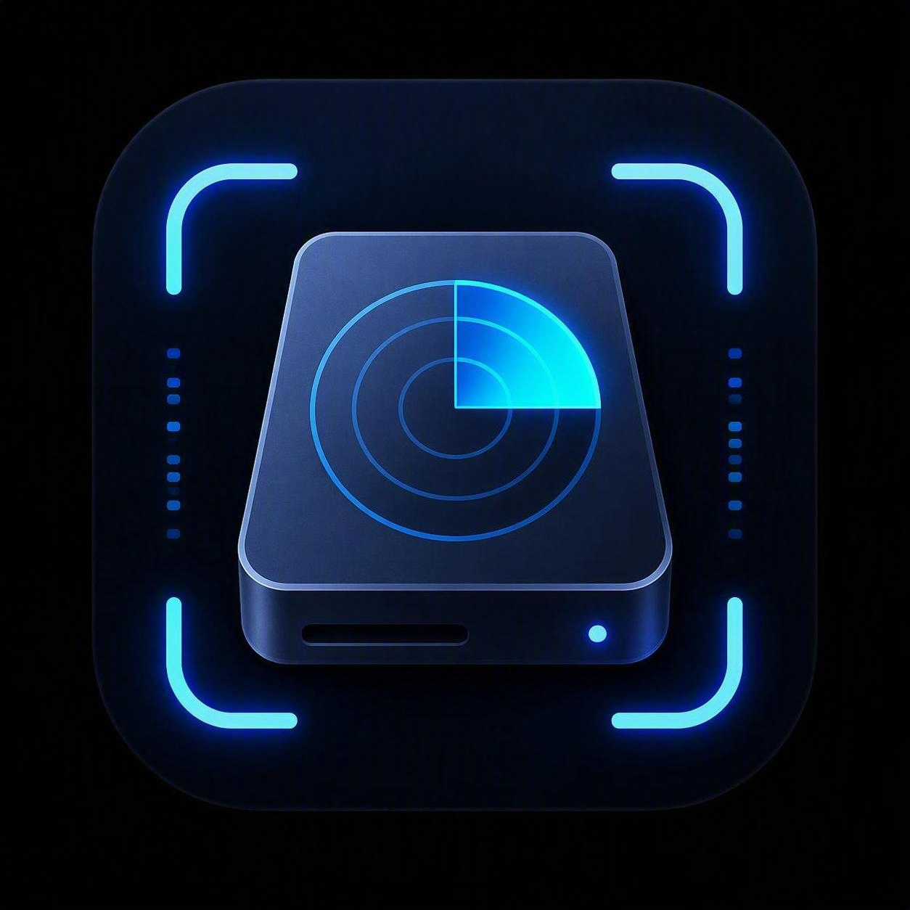

# Storage Scanner

A fast, free disk-usage analyzer for **Windows and macOS**. Pick a drive or
folder and Storage Scanner scans it concurrently, then shows every folder
and file in a tree **sorted by size**, with a percentage bar so the space
hogs jump right out — plus duplicate detection, review-first cleanup
recommendations, a treemap explorer, growth history with capacity
forecasting, and an audit log of everything it's ever deleted.

<br clear="left" />

### [⬇ Download StorageScanner.exe (Windows)](https://github.com/cwilson-111/Storage-Scanner/releases/latest/download/StorageScanner.exe)

[](https://github.com/cwilson-111/Storage-Scanner/releases/latest/download/StorageScanner.exe)
[](https://github.com/cwilson-111/Storage-Scanner/releases/latest)

## Download & run (Windows, no Python needed)

1. Click the **Download** button above (or grab it from the
   [Releases](https://github.com/cwilson-111/Storage-Scanner/releases/latest) page).
2. Double-click `StorageScanner.exe`. That's it — no installer, no dependencies.

> Windows SmartScreen may warn about an unsigned app the first time. Click
> **More info → Run anyway**. (The app is open source — you can read every line here.)

> Some browsers (Opera, Chrome, etc.) may block the `.exe` download itself,
> flagging it before SmartScreen ever gets a chance to — a reputation check
> against an unsigned, freshly-released, PyInstaller-built binary, not a
> real detection. If that happens, download **`StorageScanner-portable.zip`**
> instead (same binary, zipped — usually avoids the same trigger), or try a
> different browser. Verify against `SHA256SUMS.txt` either way.

### Verifying a release

Every release includes, alongside `StorageScanner.exe`:
- **`StorageScanner-portable.zip`** — the same executable zipped, if you'd
  rather not have anything auto-registered by an installer-style download.
- **`sbom.json`** — a software bill of materials (CycloneDX format) listing
  exactly what's bundled into the executable: the frozen Python interpreter
  and the Tcl/Tk library the GUI depends on. Storage Scanner itself imports
  no third-party runtime package.
- **`SHA256SUMS.txt`** — checksums for all of the above, so you can confirm
  what you downloaded matches what was actually built (`sha256sum -c
  SHA256SUMS.txt` on macOS/Linux, `Get-FileHash` on Windows).

The release isn't code-signed yet — checksums let you verify integrity, but
don't establish who built it, which is what signing is for. That's tracked
as future work. See [BUILD_PROVENANCE.md](BUILD_PROVENANCE.md) for exactly
how a release is built and what these guarantees do and don't cover, and
[PRIVACY.md](PRIVACY.md) for what the app does (and doesn't) do with your data.

## Running on macOS

There's no packaged macOS build yet — run it from source (see below). It's
fully supported: native Finder integration, Trash-based deletion, and its
own elevated-scan flow for folders your account can't fully read (see
**Admin/elevated scanning** below).

## Features

### Scanning
- **Concurrent scanning** — a small worker-thread pool walks directories in
  parallel, tuned by measurement rather than guesswork.
- **Correctness on real filesystems** — symlinks, junctions, and mount
  points are recorded but never traversed (no double-counting, no infinite
  loops); hard links are deduplicated so a file linked into multiple folders
  only counts once.
- **Logical vs. actual disk usage** — tracks allocated size separately from
  logical size, so sparse files, NTFS-compressed files, and OneDrive-style
  online-only placeholders don't inflate what's actually on disk.
- **Sorted, heat-colored tree** — every level sorted largest-first, with a
  percentage bar and heat coloring so big consumers stand out immediately.

### Admin/elevated scanning
- **Windows** — relaunches the whole app elevated via the standard UAC
  prompt, so folders your account can't open get scanned too.
- **macOS** — relaunching the entire GUI as root doesn't work on macOS
  (losing the window-server connection kills any window it tries to show),
  so instead only the *scan itself* runs elevated via the normal
  admin-password prompt — your window stays open and gets the results back
  directly, without restarting.

### Finding things
- **Search & Filter** — filter the current scan by name, extension, size
  range, and modified-date range, with sortable results.
- **Treemap explorer** — a drill-down, click-to-zoom treemap where
  rectangle area represents size and color represents relative heat, with
  breadcrumb navigation and hover details.
- **Largest Files** and **File Types Breakdown** views.

### Cleaning up safely
- **Duplicate file finder** — a staged pipeline (group by size → partial
  hash → full hash) finds exact-content duplicates with zero false
  positives. Each group gets an automatic **keeper recommendation** (prefers
  a copy outside Downloads/Desktop/Temp, then the oldest) with the reasoning
  shown — and the keeper is genuinely protected: it can never be deleted
  from that window, even via select-all, though you can manually override
  which copy is the keeper.
- **Cleanup Recommendations** — a review-first view across the whole scan:
  **Protected** paths (OS/app-managed locations, cloud placeholders — never
  suggested for deletion), **Review candidates** (large files untouched for
  a long time — a lead worth checking, not a verified-safe deletion), and
  **Duplicate candidates** (built from the same keeper logic above). Every
  row shows *why* it was flagged, an estimated recoverable size, a risk
  level, and a proposed action.
- **Archive instead of delete** — for Review candidates, compress to a
  `.zip` right next to the original instead of removing it outright.
  Nothing is lost, just shrunk; the original is only removed after the
  archive is written and verified. Works best on text/logs/uncompressed
  documents — already-compressed formats (video, photos, PDFs) won't
  shrink much, and the UI tells you that before you commit.
- **Everything goes through the Recycle Bin/Trash.** Nothing in this app
  permanently deletes a file.

### History and trust
- **Growth History** — compare any two saved snapshots of a path (not just
  the two most recent), with per-folder growth/shrink breakdowns.
- **Confidence-aware capacity forecasting** — fits a regression across your
  full scan history and reports a range and an explicit confidence level
  ("low"/"medium"/"high"), instead of a single number presented as certain.
- **Anomaly detection** — flags scan-to-scan size changes that are
  statistical outliers for that specific path (a sudden spike or a
  mass-deletion-shaped drop), based on that path's own history.
- **Audit Log** — every delete/recycle action the app has ever performed,
  from any window, with date, source, path, size, and result — a durable
  record of what to go look for in the Recycle Bin/Trash if you need it back.
- **Storage Budgets** — right-click any folder to set a size threshold, and
  get a dismissible alert when it's exceeded — checked right after you scan
  it, and again at launch using the last saved scan, so you can see a
  breach before you've rescanned anything. No background service: alerts
  only fire when you scan or open the app, never continuously.

### Automation
- **CLI mode** — `Storage-Scanner.py --cli <path> [--format json|csv]
  [--output FILE]` runs a headless scan and prints structured output with
  proper exit codes, for scripts, cron, or Task Scheduler.

### Staying current
- **Update notice** — on launch, a quiet check (at most once a day) for a
  newer release, shown as a small dismissible banner with a link — never
  an auto-download or auto-run of anything. See [PRIVACY.md](PRIVACY.md)
  for exactly what this does and doesn't send.

Pure Python standard library — **no third-party runtime dependencies**.

## Run from source

Requires Python 3.9+ (Tkinter ships with the standard Windows and macOS
Python installers).

```bash
python Storage-Scanner.py
```

## Build the Windows .exe yourself

```bash
pip install -r requirements-dev.txt
build.bat
```

The standalone executable, a portable ZIP, an SBOM, and a checksums file
all land in `dist/`.

Releases are also built automatically by GitHub Actions — push a tag like
`v1.0.0` and the `.exe` is attached to the release (see `.github/workflows/build.yml`).

## Running the test suite

```bash
pip install -r requirements-dev.txt
pytest tests/
python -m pyflakes storage_scanner/ tests/
```

## Privacy & trust

- [PRIVACY.md](PRIVACY.md) — what the app reads, stores, and (doesn't) send anywhere.
- [BUILD_PROVENANCE.md](BUILD_PROVENANCE.md) — exactly how a release binary is built, and what that does/doesn't guarantee.

## License

[MIT](LICENSE) — free to use, modify, and distribute.
